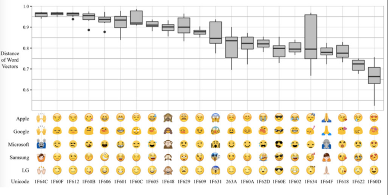

# all_development_notes_2015-2017
Archive of personal development notes on a variety of topics from the past few years.

<a name="371">

# _Programming Memorized < 2017

</a>

<a name="371"></a>

<a name="371">

**  
**

**Installing CouchDB on Ubuntu 14.04**

**  
**

**[Apache CouchDB](http://couchdb.apache.org/)****, like Redis, Cassandra, and MongoDB, is a _NoSQL database_**. CouchDB stores data as JSON documents which are non-relational in nature. This allows users of CouchDB to store data in ways that look very similar to their real world counterparts.

  

* * *

  

[Hyperpolyglot](http://hyperpolyglot.org/)

Programming Languages

commonly used features in a side-by-side format

<table style="font-family: &quot;lucida grande&quot;, helvetica, arial, san-serif; empty-cells: show; color: rgb(0, 0, 0); font-size: 13.12px; font-style: normal; font-variant-ligatures: normal; font-variant-caps: normal; font-weight: normal; letter-spacing: normal; orphans: 2; text-align: start; text-indent: 0px; text-transform: none; white-space: normal; widows: 2; word-spacing: 0px; -webkit-text-stroke-width: 0px;width:100%;">

<tbody style="font-family: &quot;lucida grande&quot;, helvetica, arial, san-serif;">

<tr style="font-family: &quot;lucida grande&quot;, helvetica, arial, san-serif;">

<td style="font-family: &quot;lucida grande&quot;, helvetica, arial, san-serif; text-align: left;">**Scripting Languages I:**</td>

<td style="font-family: &quot;lucida grande&quot;, helvetica, arial, san-serif; text-align: left;">[Node.js, PHP, Python, Ruby](http://hyperpolyglot.org/scripting)</td>

</tr>

<tr style="font-family: &quot;lucida grande&quot;, helvetica, arial, san-serif;">

<td style="font-family: &quot;lucida grande&quot;, helvetica, arial, san-serif; text-align: left;">**Scripting Languages II:**</td>

<td style="font-family: &quot;lucida grande&quot;, helvetica, arial, san-serif; text-align: left;">[Perl, Lua, Groovy](http://hyperpolyglot.org/more)</td>

</tr>

<tr style="font-family: &quot;lucida grande&quot;, helvetica, arial, san-serif;">

<td style="font-family: &quot;lucida grande&quot;, helvetica, arial, san-serif; text-align: left;">**GUI Scripting:**</td>

<td style="font-family: &quot;lucida grande&quot;, helvetica, arial, san-serif; text-align: left;">[JavaScript, Smalltalk, Tcl, AutoHotkey](http://hyperpolyglot.org/gui)</td>

</tr>

<tr style="font-family: &quot;lucida grande&quot;, helvetica, arial, san-serif;">

<td style="font-family: &quot;lucida grande&quot;, helvetica, arial, san-serif; text-align: left;">**Command Line Interpreters:**</td>

<td style="font-family: &quot;lucida grande&quot;, helvetica, arial, san-serif; text-align: left;">[POSIX Shell, Cmd.exe, PowerShell](http://hyperpolyglot.org/shell)</td>

</tr>

<tr style="font-family: &quot;lucida grande&quot;, helvetica, arial, san-serif;">

<td style="font-family: &quot;lucida grande&quot;, helvetica, arial, san-serif; text-align: left;">**Forth and PostScript:**</td>

<td style="font-family: &quot;lucida grande&quot;, helvetica, arial, san-serif; text-align: left;">[Forth, PostScript](http://hyperpolyglot.org/stack)</td>

</tr>

<tr style="font-family: &quot;lucida grande&quot;, helvetica, arial, san-serif;">

<td style="font-family: &quot;lucida grande&quot;, helvetica, arial, san-serif; text-align: left;">**Prolog, Erlang, Elixir:**</td>

<td style="font-family: &quot;lucida grande&quot;, helvetica, arial, san-serif; text-align: left;">[Prolog, Erlang, Elixir](http://hyperpolyglot.org/logic)</td>

</tr>

<tr style="font-family: &quot;lucida grande&quot;, helvetica, arial, san-serif;">

<td style="font-family: &quot;lucida grande&quot;, helvetica, arial, san-serif; text-align: left;">**Lisp Dialects:**</td>

<td style="font-family: &quot;lucida grande&quot;, helvetica, arial, san-serif; text-align: left;">[Common Lisp, Racket, Clojure, Emacs Lisp](http://hyperpolyglot.org/lisp)</td>

</tr>

<tr style="font-family: &quot;lucida grande&quot;, helvetica, arial, san-serif;">

<td style="font-family: &quot;lucida grande&quot;, helvetica, arial, san-serif; text-align: left;"></td>

</tr>

<tr style="font-family: &quot;lucida grande&quot;, helvetica, arial, san-serif;">

<td style="font-family: &quot;lucida grande&quot;, helvetica, arial, san-serif; text-align: left;">**C and Go:**</td>

<td style="font-family: &quot;lucida grande&quot;, helvetica, arial, san-serif; text-align: left;">[C, Go](http://hyperpolyglot.org/c)</td>

</tr>

<tr style="font-family: &quot;lucida grande&quot;, helvetica, arial, san-serif;">

<td style="font-family: &quot;lucida grande&quot;, helvetica, arial, san-serif; text-align: left;">**OO C Style Languages:**</td>

<td style="font-family: &quot;lucida grande&quot;, helvetica, arial, san-serif; text-align: left;">[C++, Objective-C, Java, C#](http://hyperpolyglot.org/cpp)</td>

</tr>

<tr style="font-family: &quot;lucida grande&quot;, helvetica, arial, san-serif;">

<td style="font-family: &quot;lucida grande&quot;, helvetica, arial, san-serif; text-align: left;">**Rust, Swift, Scala:**</td>

<td style="font-family: &quot;lucida grande&quot;, helvetica, arial, san-serif; text-align: left;">[Rust, Swift, Scala](http://hyperpolyglot.org/rust)</td>

</tr>

</tbody>

</table>

**TypeScript, Dart:**

<table style="font-family: &quot;lucida grande&quot;, helvetica, arial, san-serif; empty-cells: show; color: rgb(0, 0, 0); font-size: 13.12px; font-style: normal; font-variant-ligatures: normal; font-variant-caps: normal; font-weight: normal; letter-spacing: normal; orphans: 2; text-align: start; text-indent: 0px; text-transform: none; white-space: normal; widows: 2; word-spacing: 0px; -webkit-text-stroke-width: 0px;width:100%;">

<tbody style="font-family: &quot;lucida grande&quot;, helvetica, arial, san-serif;">

<tr style="font-family: &quot;lucida grande&quot;, helvetica, arial, san-serif;">

<td style="font-family: &quot;lucida grande&quot;, helvetica, arial, san-serif; text-align: left;"></td>

<td style="font-family: &quot;lucida grande&quot;, helvetica, arial, san-serif; text-align: left;">[TypeScript, Dart](http://hyperpolyglot.org/web)</td>

</tr>

<tr style="font-family: &quot;lucida grande&quot;, helvetica, arial, san-serif;">

<td style="font-family: &quot;lucida grande&quot;, helvetica, arial, san-serif; text-align: left;">**Pascal Style Languages:**</td>

<td style="font-family: &quot;lucida grande&quot;, helvetica, arial, san-serif; text-align: left;">[Pascal, Ada, PL/pgSQL](http://hyperpolyglot.org/pascal)</td>

</tr>

<tr style="font-family: &quot;lucida grande&quot;, helvetica, arial, san-serif;">

<td style="font-family: &quot;lucida grande&quot;, helvetica, arial, san-serif; text-align: left;">**ML Dialects and Haskell:**</td>

<td style="font-family: &quot;lucida grande&quot;, helvetica, arial, san-serif; text-align: left;">[SML, OCaml, F#, Haskell](http://hyperpolyglot.org/ml)</td>

</tr>

<tr style="font-family: &quot;lucida grande&quot;, helvetica, arial, san-serif;">

<td style="font-family: &quot;lucida grande&quot;, helvetica, arial, san-serif; text-align: left;"></td>

</tr>

<tr style="font-family: &quot;lucida grande&quot;, helvetica, arial, san-serif;">

<td style="font-family: &quot;lucida grande&quot;, helvetica, arial, san-serif; text-align: left;">**Numerical Analysis & Statistics:**</td>

<td style="font-family: &quot;lucida grande&quot;, helvetica, arial, san-serif; text-align: left;">[MATLAB, R, NumPy, Julia](http://hyperpolyglot.org/numerical-analysis)</td>

</tr>

<tr style="font-family: &quot;lucida grande&quot;, helvetica, arial, san-serif;">

<td style="font-family: &quot;lucida grande&quot;, helvetica, arial, san-serif; text-align: left;">**Computer Algebra Software I:**</td>

<td style="font-family: &quot;lucida grande&quot;, helvetica, arial, san-serif; text-align: left;">[Mathematica, Maple, Maxima, Sage, SymPy](http://hyperpolyglot.org/computer-algebra)</td>

</tr>

<tr style="font-family: &quot;lucida grande&quot;, helvetica, arial, san-serif;">

<td style="font-family: &quot;lucida grande&quot;, helvetica, arial, san-serif; text-align: left;">**Computer Algebra Software II:**</td>

<td style="font-family: &quot;lucida grande&quot;, helvetica, arial, san-serif; text-align: left;">[Magma, GAP, Singular, Pari/GP](http://hyperpolyglot.org/more-computer-algebra)</td>

</tr>

<tr style="font-family: &quot;lucida grande&quot;, helvetica, arial, san-serif;">

<td style="font-family: &quot;lucida grande&quot;, helvetica, arial, san-serif; text-align: left;">**Gnuplot and GLPK:**</td>

<td style="font-family: &quot;lucida grande&quot;, helvetica, arial, san-serif; text-align: left;">[Gnuplot, GLPK](http://hyperpolyglot.org/misc-math)</td>

</tr>

<tr style="font-family: &quot;lucida grande&quot;, helvetica, arial, san-serif;">

<td style="font-family: &quot;lucida grande&quot;, helvetica, arial, san-serif; text-align: left;">**Fortran and APL:**</td>

<td style="font-family: &quot;lucida grande&quot;, helvetica, arial, san-serif; text-align: left;">[Fortran, APL](http://hyperpolyglot.org/fortran)</td>

</tr>

</tbody>

</table>

# Programming Tools

<table style="font-family: &quot;lucida grande&quot;, helvetica, arial, san-serif; empty-cells: show; color: rgb(0, 0, 0); font-size: 13.12px; font-style: normal; font-variant-ligatures: normal; font-variant-caps: normal; font-weight: normal; letter-spacing: normal; orphans: 2; text-align: start; text-indent: 0px; text-transform: none; white-space: normal; widows: 2; word-spacing: 0px; -webkit-text-stroke-width: 0px;width:100%;">

<tbody style="font-family: &quot;lucida grande&quot;, helvetica, arial, san-serif;">

<tr style="font-family: &quot;lucida grande&quot;, helvetica, arial, san-serif;">

<td style="font-family: &quot;lucida grande&quot;, helvetica, arial, san-serif; text-align: left;">**Unix Shells:**</td>

<td style="font-family: &quot;lucida grande&quot;, helvetica, arial, san-serif; text-align: left;">[Bash, Fish, Ksh, Tcsh, Zsh](http://hyperpolyglot.org/unix-shells)</td>

</tr>

<tr style="font-family: &quot;lucida grande&quot;, helvetica, arial, san-serif;">

<td style="font-family: &quot;lucida grande&quot;, helvetica, arial, san-serif; text-align: left;">**Text Mode Editors:**</td>

<td style="font-family: &quot;lucida grande&quot;, helvetica, arial, san-serif; text-align: left;">[Vim, Emacs, Nano](http://hyperpolyglot.org/text-mode-editors)</td>

</tr>

<tr style="font-family: &quot;lucida grande&quot;, helvetica, arial, san-serif;">

<td style="font-family: &quot;lucida grande&quot;, helvetica, arial, san-serif; text-align: left;">**Version Control:**</td>

<td style="font-family: &quot;lucida grande&quot;, helvetica, arial, san-serif; text-align: left;">[Git, Mercurial](http://hyperpolyglot.org/version-control)</td>

</tr>

<tr style="font-family: &quot;lucida grande&quot;, helvetica, arial, san-serif;">

<td style="font-family: &quot;lucida grande&quot;, helvetica, arial, san-serif; text-align: left;">**Build Tools:**</td>

<td style="font-family: &quot;lucida grande&quot;, helvetica, arial, san-serif; text-align: left;">[Make, Rake, Ant, Sbt](http://hyperpolyglot.org/build)</td>

</tr>

<tr style="font-family: &quot;lucida grande&quot;, helvetica, arial, san-serif;">

<td style="font-family: &quot;lucida grande&quot;, helvetica, arial, san-serif; text-align: left;">**Terminal Multiplexers:**</td>

<td style="font-family: &quot;lucida grande&quot;, helvetica, arial, san-serif; text-align: left;">[Screen, Tmux](http://hyperpolyglot.org/multiplexers)</td>

</tr>

<tr style="font-family: &quot;lucida grande&quot;, helvetica, arial, san-serif;">

<td style="font-family: &quot;lucida grande&quot;, helvetica, arial, san-serif; text-align: left;">**Relational Databases:**</td>

<td style="font-family: &quot;lucida grande&quot;, helvetica, arial, san-serif; text-align: left;">[PostgreSQL, MySQL, SQLite](http://hyperpolyglot.org/db)</td>

</tr>

<tr style="font-family: &quot;lucida grande&quot;, helvetica, arial, san-serif;">

<td style="font-family: &quot;lucida grande&quot;, helvetica, arial, san-serif; text-align: left;">**Relational Data and JSON Tools:**</td>

<td style="font-family: &quot;lucida grande&quot;, helvetica, arial, san-serif; text-align: left;">[SQL, Awk, Pig](http://hyperpolyglot.org/data), [Jq](http://hyperpolyglot.org/json)</td>

</tr>

<tr style="font-family: &quot;lucida grande&quot;, helvetica, arial, san-serif;">

<td style="font-family: &quot;lucida grande&quot;, helvetica, arial, san-serif; text-align: left;">**Lightweight Markup:**</td>

<td style="font-family: &quot;lucida grande&quot;, helvetica, arial, san-serif; text-align: left;">[Markdown, reStructuredText, MediaWiki, AsciiDoc, Org-mode](http://hyperpolyglot.org/lightweight-markup)</td>

</tr>

<tr style="font-family: &quot;lucida grande&quot;, helvetica, arial, san-serif;">

<td style="font-family: &quot;lucida grande&quot;, helvetica, arial, san-serif; text-align: left;">**2D Vector Graphics:**</td>

<td style="font-family: &quot;lucida grande&quot;, helvetica, arial, san-serif; text-align: left;">[PostScript, Processing, SVG](http://hyperpolyglot.org/vector-graphics)</td>

</tr>

</tbody>

</table>

* * *

**Map vs Dictionary vs Associative Array vs Hash Map = SAME FUCKING THING**

Two terms for the same thing

_"Map"_ is used by Java, C++  
_"Dictionary"_ is used by .Net, Python  
_"Associative array"_ is used by Javascript, PHP

_"Map"_ is the correct mathematical term, but it is avoided because it has separate meaning in [functional programming](http://en.wikipedia.org/wiki/Map_%28higher-order_function%29).

</a>

<a name="371">In </a>[computer science](https://en.wikipedia.org/wiki/Computer_science "Computer science"), an **associative array**, **map**, **symbol table**, or **dictionary** is an [abstract data type](https://en.wikipedia.org/wiki/Abstract_data_type "Abstract data type") composed of a [collection](https://en.wikipedia.org/wiki/Collection_(computing) "Collection (computing)") of [(key, value)](https://en.wikipedia.org/wiki/Attribute%E2%80%93value_pair "Attribute–value pair") pairs, such that each possible key appears at most once in the collection.

  

* * *

In [mathematics](https://en.wikipedia.org/wiki/Mathematics "Mathematics") and [computer science](https://en.wikipedia.org/wiki/Computer_science "Computer science"), **currying** is the technique of translating the evaluation of a [function](https://en.wikipedia.org/wiki/Function_(mathematics) "Function (mathematics)") that takes multiple [arguments](https://en.wikipedia.org/wiki/Parameter_(computer_science) "Parameter (computer science)") (or a [tuple](https://en.wikipedia.org/wiki/Tuple "Tuple") of arguments) into evaluating a sequence of functions, each with a single argument. Currying is related to, but not the same as, [partial application](https://en.wikipedia.org/wiki/Partial_application "Partial application").

* * *

In [programming language theory](https://en.wikipedia.org/wiki/Programming_language_theory "Programming language theory"), **lazy evaluation**, or **call-by-need**[[1]](https://en.wikipedia.org/wiki/Lazy_evaluation#cite_note-1) is an [evaluation strategy](https://en.wikipedia.org/wiki/Evaluation_strategy "Evaluation strategy") which delays the evaluation of an [expression](https://en.wikipedia.org/wiki/Expression_(computer_science) "Expression (computer science)") until its value is needed ([non-strict evaluation](https://en.wikipedia.org/wiki/Non-strict_evaluation "Non-strict evaluation")) and which also avoids repeated evaluations ([sharing](https://en.wikipedia.org/wiki/Sharing_(computer_science) "Sharing (computer science)")).[[2]](https://en.wikipedia.org/wiki/Lazy_evaluation#cite_note-WattFindlay2004-2)[[3]](https://en.wikipedia.org/wiki/Lazy_evaluation#cite_note-3) The sharing can reduce the running time of certain functions by an exponential factor over other non-strict evaluation strategies, such as [call-by-name](https://en.wikipedia.org/wiki/Call-by-name "Call-by-name").[_[citation needed](https://en.wikipedia.org/wiki/Wikipedia:Citation_needed "Wikipedia:Citation needed")_]

  

* * *

In [computer science](https://en.wikipedia.org/wiki/Computer_science "Computer science"), **pattern matching** is the act of checking a given **sequence** of tokens for the presence of the constituents of some [pattern](https://en.wikipedia.org/wiki/Pattern "Pattern"). In contrast to [pattern recognition](https://en.wikipedia.org/wiki/Pattern_recognition "Pattern recognition"), the match usually has to be exact. The patterns generally have the form of either [sequences](https://en.wikipedia.org/wiki/String_(computer_science) "String (computer science)") or [tree structures](https://en.wikipedia.org/wiki/Tree_structure "Tree structure"). Uses of pattern matching include outputting the locations (if any) of a pattern within a token sequence, to output some component of the matched pattern, and to substitute the matching pattern with some other token sequence (i.e., [search and replace](https://en.wikipedia.org/wiki/Regular_expression "Regular expression")).

* * *

In [computer programming](https://en.wikipedia.org/wiki/Computer_programming "Computer programming"), more so [functional programming](https://en.wikipedia.org/wiki/Functional_programming "Functional programming") and [type theory](https://en.wikipedia.org/wiki/Type_theory "Type theory"), an **algebraic data type** is a kind of [composite type](https://en.wikipedia.org/wiki/Composite_type "Composite type"), i.e., a type formed by combining other types.

Two common classes of algebraic types are [product types](https://en.wikipedia.org/wiki/Product_type "Product type") (i.e., [tuples](https://en.wikipedia.org/wiki/Tuple "Tuple") and [records](https://en.wikipedia.org/wiki/Record_(computer_science) "Record (computer science)")) and [sum types](https://en.wikipedia.org/wiki/Sum_type "Sum type"), also called tagged or disjoint unions or _variant types_.[[1]](https://en.wikipedia.org/wiki/Algebraic_data_type#cite_note-1)

  

* * *

In [computer science](https://en.wikipedia.org/wiki/Computer_science "Computer science"), **syntactic sugar** is [syntax](https://en.wikipedia.org/wiki/Syntax_(programming_languages) "Syntax (programming languages)") within a [programming language](https://en.wikipedia.org/wiki/Programming_language "Programming language") that is designed to make things easier to read or to express. It makes the language "sweeter" for human use: things can be expressed more clearly, more concisely, or in an alternative style that some may prefer.

For example, many programming languages provide special syntax for referencing and updating [array](https://en.wikipedia.org/wiki/Array_data_type "Array data type") elements. Abstractly, an array reference is a procedure of two arguments: an array and a subscript vector, which could be expressed as `get_array(Array, vector(i,j))`. Instead, many languages provide syntax like `Array[i,j]`. Similarly an array element update is a procedure of three arguments, something like `set_array(Array, vector(i,j), value)`, but many languages provide syntax like `Array[i,j] = value`.

* * *

In programming, **operator overloading**, sometimes termed _operator [ad hoc polymorphism](https://en.wikipedia.org/wiki/Ad_hoc_polymorphism "Ad hoc polymorphism")_, is a specific case of [polymorphism](https://en.wikipedia.org/wiki/Polymorphism_(computer_science) "Polymorphism (computer science)"), where different [operators](https://en.wikipedia.org/wiki/Operator_(programming) "Operator (programming)") have different implementations depending on their arguments. Operator overloading is generally defined by a [programming language](https://en.wikipedia.org/wiki/Programming_language "Programming language"), a [programmer](https://en.wikipedia.org/wiki/Programmer "Programmer"), or both.

  

Operator overloading is [syntactic sugar](https://en.wikipedia.org/wiki/Syntactic_sugar "Syntactic sugar"), and is used because it allows programming using notation nearer to the target domain[[1]](https://en.wikipedia.org/wiki/Operator_overloading#cite_note-1) and allows user-defined types a similar level of syntactic support as types built into a language. It is common, for example, in scientific computing, where it allows computing representations of mathematical objects to be manipulated with the same syntax as on paper.

Operator overloading does not change the [expressive power](https://en.wikipedia.org/wiki/Expressive_power_(computer_science) "Expressive power (computer science)") of a language (with functions), as it can be emulated using function calls. For example, consider variables `a, b, c` of some user-defined type, such as [matrices](https://en.wikipedia.org/wiki/Matrix_(mathematics) "Matrix (mathematics)"):

`a + b * c`

  

* * *

## Multiline string literals[[edit](https://en.wikipedia.org/w/index.php?title=String_literal&action=edit&section=14 "Edit section: Multiline string literals")]

In many languages, string literals can contain literal newlines, spanning several lines. Alternatively, newlines can be escaped, most often as `\n`. For example:

<pre style="font-family: monospace, Courier; color: rgb(0, 0, 0); background-color: rgb(248, 249, 250); border: 1px solid rgb(234, 236, 240); padding: 1em; white-space: pre-wrap; tab-size: 4;">echo 'foo
bar'
</pre>

and

echo -e "foo\nbar"

**  
**

* * *

In [object-oriented programming](https://en.wikipedia.org/wiki/Object-oriented_programming "Object-oriented programming"), a **protocol** or **interface** is a common means for unrelated [objects](https://en.wikipedia.org/wiki/Object_(computer_science) "Object (computer science)") to communicate with each other. These are definitions of [methods](https://en.wikipedia.org/wiki/Method_(computer_science) "Method (computer science)") and values which the objects agree upon in order to co-operate.[[1]](https://en.wikipedia.org/wiki/Protocol_(object-oriented_programming)#cite_note-1)

For example, in [Java](https://en.wikipedia.org/wiki/Java_(programming_language) "Java (programming language)") (where protocols are termed _[interfaces](https://en.wikipedia.org/wiki/Interface_(Java) "Interface (Java)")_), the <tt style="font-family: monospace, Courier;">Comparable</tt> interface specifies a method <tt style="font-family: monospace, Courier;">compareTo()</tt> which implementing classes should implement. This means that a separate sorting method, for example, can sort any object which implements the Comparable interface, without having to know anything about the inner nature of the class (except that two of these objects can be compared by means of <tt style="font-family: monospace, Courier;">compareTo()</tt>).

* * *

## Exception handling in software[[edit](https://en.wikipedia.org/w/index.php?title=Exception_handling&action=edit&section=3 "Edit section: Exception handling in software")]

Software exception handling and the support provided by software tools differs somewhat from what is understood under exception in hardware, but similar concepts are involved. In programming language mechanisms for exception handling, the term _exception_ is typically used in a specific sense to denote a data structure storing information about an exceptional condition. One mechanism to transfer control, or _raise_ an exception, is known as a _throw_. The exception is said to be _thrown_. Execution is transferred to a "catch".

* * *

**Go**

(often referred to as **golang**) is a [free](https://en.wikipedia.org/wiki/Free_software "Free software") and [open source](https://en.wikipedia.org/wiki/Open-source "Open-source")[[12]](https://en.wikipedia.org/wiki/Go_(programming_language)#cite_note-12) [programming language](https://en.wikipedia.org/wiki/Programming_language "Programming language") created at [Google](https://en.wikipedia.org/wiki/Google "Google")[[13]](https://en.wikipedia.org/wiki/Go_(programming_language)#cite_note-13) in 2007 by Robert Griesemer, [Rob Pike](https://en.wikipedia.org/wiki/Rob_Pike "Rob Pike"), and [Ken Thompson](https://en.wikipedia.org/wiki/Ken_Thompson "Ken Thompson").[[10]](https://en.wikipedia.org/wiki/Go_(programming_language)#cite_note-langfaq-10) It is a [compiled](https://en.wikipedia.org/wiki/Compiler "Compiler"), [statically typed](https://en.wikipedia.org/wiki/Static_typing "Static typing") language in the tradition of [Algol](https://en.wikipedia.org/wiki/ALGOL "ALGOL") and [C](https://en.wikipedia.org/wiki/C_(programming_language) "C (programming language)"), with [garbage collection](https://en.wikipedia.org/wiki/Garbage_collection_(computer_science) "Garbage collection (computer science)"), limited [structural typing](https://en.wikipedia.org/wiki/Structural_type_system "Structural type system"),[[3]](https://en.wikipedia.org/wiki/Go_(programming_language)#cite_note-structural_typing-3) [memory safety](https://en.wikipedia.org/wiki/Memory_safety "Memory safety") features and [CSP](https://en.wikipedia.org/wiki/Communicating_sequential_processes "Communicating sequential processes")-style [concurrent programming](https://en.wikipedia.org/wiki/Concurrent_programming "Concurrent programming") features added.[[14]](https://en.wikipedia.org/wiki/Go_(programming_language)#cite_note-boldly-14)

  

**Dart**

is a [general-purpose programming language](https://en.wikipedia.org/wiki/General-purpose_programming_language "General-purpose programming language") originally developed by [Google](https://en.wikipedia.org/wiki/Google "Google") and later approved as a standard by [Ecma](https://en.wikipedia.org/wiki/Ecma "Ecma") (ECMA-408).[[4]](https://en.wikipedia.org/wiki/Dart_(programming_language)#cite_note-4) It is used to build web, server and mobile applications, and for [Internet of Things](https://en.wikipedia.org/wiki/Internet_of_Things "Internet of Things") (IoT) devices.[[5]](https://en.wikipedia.org/wiki/Dart_(programming_language)#cite_note-5) It is [open-source software](https://en.wikipedia.org/wiki/Open-source_software "Open-source software") under a [permissive free software license](https://en.wikipedia.org/wiki/Permissive_free_software_license "Permissive free software license") (modified [BSD license](https://en.wikipedia.org/wiki/BSD_licenses "BSD licenses")).

Dart is an [object-oriented](https://en.wikipedia.org/wiki/Object-oriented_programming "Object-oriented programming"), [class defined](https://en.wikipedia.org/wiki/Class-based_programming "Class-based programming"), [single inheritance](https://en.wikipedia.org/wiki/Single_inheritance "Single inheritance") language using [C#](https://en.wikipedia.org/wiki/C_Sharp_(programming_language) "C Sharp (programming language)") style [syntax](https://en.wikipedia.org/wiki/Syntax_(programming_languages) "Syntax (programming languages)") that [transcompiles](https://en.wikipedia.org/wiki/Transcompile "Transcompile") optionally into [JavaScript](https://en.wikipedia.org/wiki/JavaScript "JavaScript"). It supports [interfaces](https://en.wikipedia.org/wiki/Interface_(object-oriented_programming) "Interface (object-oriented programming)"), [mixins](https://en.wikipedia.org/wiki/Mixin "Mixin"), [abstract classes](https://en.wikipedia.org/wiki/Abstract_class "Abstract class"), [reified](https://en.wikipedia.org/wiki/Reification_(computer_science) "Reification (computer science)") [generics](https://en.wikipedia.org/wiki/Generic_programming "Generic programming"), and [optional typing](https://en.wikipedia.org/wiki/Optional_typing "Optional typing").

**Lisp**

(historically, **LISP**) is a family of [computer](https://en.wikipedia.org/wiki/Computer "Computer") [programming languages](https://en.wikipedia.org/wiki/Programming_language "Programming language") with a long history and a distinctive, fully [parenthesized](https://en.wikipedia.org/wiki/Parenthesized "Parenthesized") [prefix notation](https://en.wikipedia.org/wiki/Polish_notation#Computer_programming "Polish notation").[[3]](https://en.wikipedia.org/wiki/Lisp_(programming_language)#cite_note-3) Originally specified in 1958, Lisp is the second-oldest [high-level programming language](https://en.wikipedia.org/wiki/High-level_programming_language "High-level programming language") in widespread use today. Only [Fortran](https://en.wikipedia.org/wiki/Fortran "Fortran") is older, by one year.[[4]](https://en.wikipedia.org/wiki/Lisp_(programming_language)#cite_note-4)[[5]](https://en.wikipedia.org/wiki/Lisp_(programming_language)#cite_note-5) Lisp has changed since its early days, and many [dialects](https://en.wikipedia.org/wiki/Programming_language_dialect "Programming language dialect") have existed over its history. Today, the best known general-purpose [Lisp dialects](https://en.wikipedia.org/wiki/Lisp_dialects "Lisp dialects") are [Common Lisp](https://en.wikipedia.org/wiki/Common_Lisp "Common Lisp") and [Scheme](https://en.wikipedia.org/wiki/Scheme_(programming_language) "Scheme (programming language)").

Lisp was originally created as a practical [mathematical notation](https://en.wikipedia.org/wiki/Mathematical_notation "Mathematical notation") for [computer programs](https://en.wikipedia.org/wiki/Computer_programs "Computer programs"), influenced by the notation of [Alonzo Church](https://en.wikipedia.org/wiki/Alonzo_Church "Alonzo Church")'s [lambda calculus](https://en.wikipedia.org/wiki/Lambda_calculus "Lambda calculus"). It quickly became the favored programming language for [artificial intelligence](https://en.wikipedia.org/wiki/Artificial_intelligence "Artificial intelligence") (AI) research. As one of the earliest programming languages, Lisp pioneered many ideas in [computer science](https://en.wikipedia.org/wiki/Computer_science "Computer science"), including [tree data structures](https://en.wikipedia.org/wiki/Tree_data_structure "Tree data structure"), [automatic storage management](https://en.wikipedia.org/wiki/Garbage_collection_(computer_science) "Garbage collection (computer science)"), [dynamic typing](https://en.wikipedia.org/wiki/Dynamic_typing "Dynamic typing"), [conditionals](https://en.wikipedia.org/wiki/Conditional_(computer_programming) "Conditional (computer programming)"), [higher-order functions](https://en.wikipedia.org/wiki/Higher-order_function "Higher-order function"), [recursion](https://en.wikipedia.org/wiki/Recursion_(computer_science) "Recursion (computer science)"), and the [self-hosting](https://en.wikipedia.org/wiki/Self-hosting "Self-hosting") [compiler](https://en.wikipedia.org/wiki/Compiler "Compiler").[[6]](https://en.wikipedia.org/wiki/Lisp_(programming_language)#cite_note-Graham-6)

**Haskell**

[/ˈhæskəl/](https://en.wikipedia.org/wiki/Help:IPA_for_English "Help:IPA for English")[[26]](https://en.wikipedia.org/wiki/Haskell_(programming_language)#cite_note-26) is a standardized, [general-purpose](https://en.wikipedia.org/wiki/General-purpose_programming_language "General-purpose programming language") [purely functional programming](https://en.wikipedia.org/wiki/Purely_functional_programming "Purely functional programming") language, with [non-strict semantics](https://en.wikipedia.org/wiki/Non-strict_semantics "Non-strict semantics") and [strong](https://en.wikipedia.org/wiki/Strong_typing "Strong typing") [static typing](https://en.wikipedia.org/wiki/Static_typing "Static typing").[[27]](https://en.wikipedia.org/wiki/Haskell_(programming_language)#cite_note-FOOTNOTEPeyton_Jones2003-27) It is named after [logician](https://en.wikipedia.org/wiki/Logician "Logician") [Haskell Curry](https://en.wikipedia.org/wiki/Haskell_Curry "Haskell Curry").[[1]](https://en.wikipedia.org/wiki/Haskell_(programming_language)#cite_note-FOOTNOTEHudakHughesPeyton_JonesWadler2007-1) The latest standard of Haskell is Haskell 2010\. As of May 2016, a group is working on the next version, Haskell 2020.[[28]](https://en.wikipedia.org/wiki/Haskell_(programming_language)#cite_note-28)

Haskell features a [type system](https://en.wikipedia.org/wiki/Type_system "Type system") with [type inference](https://en.wikipedia.org/wiki/Type_inference "Type inference")[[29]](https://en.wikipedia.org/wiki/Haskell_(programming_language)#cite_note-29) and [lazy evaluation](https://en.wikipedia.org/wiki/Lazy_evaluation "Lazy evaluation").[[30]](https://en.wikipedia.org/wiki/Haskell_(programming_language)#cite_note-30) [Type classes](https://en.wikipedia.org/wiki/Type_classes "Type classes") first appeared in the Haskell programming language.[[31]](https://en.wikipedia.org/wiki/Haskell_(programming_language)#cite_note-31) Its main implementation is the [Glasgow Haskell Compiler](https://en.wikipedia.org/wiki/Glasgow_Haskell_Compiler "Glasgow Haskell Compiler").

Haskell is based on the [semantics](https://en.wikipedia.org/wiki/Semantics_of_programming_languages "Semantics of programming languages"), but not the syntax, of the language [Miranda](https://en.wikipedia.org/wiki/Miranda_(programming_language) "Miranda (programming language)"), which served to focus the efforts of the initial Haskell working group.[[32]](https://en.wikipedia.org/wiki/Haskell_(programming_language)#cite_note-32) Haskell is used widely in academia[[33]](https://en.wikipedia.org/wiki/Haskell_(programming_language)#cite_note-33)[[34]](https://en.wikipedia.org/wiki/Haskell_(programming_language)#cite_note-34) and also used in industry.[[35]](https://en.wikipedia.org/wiki/Haskell_(programming_language)#cite_note-35)

  

**Prolog**

is a general-purpose [logic programming](https://en.wikipedia.org/wiki/Logic_programming "Logic programming") language associated with [artificial intelligence](https://en.wikipedia.org/wiki/Artificial_intelligence "Artificial intelligence") and [computational linguistics](https://en.wikipedia.org/wiki/Computational_linguistics "Computational linguistics").[[1]](https://en.wikipedia.org/wiki/Prolog#cite_note-Clocksin2003-1)[[2]](https://en.wikipedia.org/wiki/Prolog#cite_note-Bratko2001-2)[[3]](https://en.wikipedia.org/wiki/Prolog#cite_note-Covington1994-3)

Prolog has its roots in [first-order logic](https://en.wikipedia.org/wiki/First-order_logic "First-order logic"), a [formal logic](https://en.wikipedia.org/wiki/Formal_logic "Formal logic"), and unlike many other [programming languages](https://en.wikipedia.org/wiki/Programming_language "Programming language"), Prolog is [declarative](https://en.wikipedia.org/wiki/Declarative_programming "Declarative programming"): the program logic is expressed in terms of relations, represented as facts and [rules](https://en.wikipedia.org/wiki/Rule_of_inference "Rule of inference"). A computation is initiated by running a _query_ over these relations.[[4]](https://en.wikipedia.org/wiki/Prolog#cite_note-lloyd84-4)

The language was first conceived by a group around [Alain Colmerauer](https://en.wikipedia.org/wiki/Alain_Colmerauer "Alain Colmerauer") in [Marseille](https://en.wikipedia.org/wiki/Marseille "Marseille"), [France](https://en.wikipedia.org/wiki/France "France"), in the early 1970s and the first Prolog system was developed in 1972 by Colmerauer with Philippe Roussel.[[5]](https://en.wikipedia.org/wiki/Prolog#cite_note-Kowalski-5)[[6]](https://en.wikipedia.org/wiki/Prolog#cite_note-6)

**Scala**

([/ˈskɑːlɑː/](https://en.wikipedia.org/wiki/Help:IPA_for_English "Help:IPA for English") [_**skah**-lah_](https://en.wikipedia.org/wiki/Help:Pronunciation_respelling_key "Help:Pronunciation respelling key"))[[9]](https://en.wikipedia.org/wiki/Scala_(programming_language)#cite_note-9) is a [general-purpose](https://en.wikipedia.org/wiki/General-purpose_programming_language "General-purpose programming language") [programming language](https://en.wikipedia.org/wiki/Programming_language "Programming language"). Scala has full support for [functional programming](https://en.wikipedia.org/wiki/Functional_programming "Functional programming") and a strong [static](https://en.wikipedia.org/wiki/Static_typing "Static typing") [type system](https://en.wikipedia.org/wiki/Type_system "Type system"). Designed to be concise,[[10]](https://en.wikipedia.org/wiki/Scala_(programming_language)#cite_note-10) many of Scala's design decisions were inspired by [criticism of Java](https://en.wikipedia.org/wiki/Criticism_of_Java "Criticism of Java")'s shortcomings.[[8]](https://en.wikipedia.org/wiki/Scala_(programming_language)#cite_note-overview-8)

Scala source code is intended to be compiled to [Java bytecode](https://en.wikipedia.org/wiki/Java_bytecode "Java bytecode"), so that the resulting executable code runs on a [Java virtual machine](https://en.wikipedia.org/wiki/Java_virtual_machine "Java virtual machine"). Java libraries may be used directly in Scala code and vice versa ([language interoperability](https://en.wikipedia.org/wiki/Language_interoperability "Language interoperability")).[[11]](https://en.wikipedia.org/wiki/Scala_(programming_language)#cite_note-11) Like Java, Scala is [object-oriented](https://en.wikipedia.org/wiki/Object-oriented_programming "Object-oriented programming"), and uses a curly-brace syntax reminiscent of the [C programming language](https://en.wikipedia.org/wiki/C_(programming_language) "C (programming language)"). Unlike Java, Scala has many features of [functional programming](https://en.wikipedia.org/wiki/Functional_programming "Functional programming") languages like [Scheme](https://en.wikipedia.org/wiki/Scheme_(programming_language) "Scheme (programming language)"), [Standard ML](https://en.wikipedia.org/wiki/Standard_ML "Standard ML") and [Haskell](https://en.wikipedia.org/wiki/Haskell_(programming_language) "Haskell (programming language)"), including [currying](https://en.wikipedia.org/wiki/Currying "Currying"), [type inference](https://en.wikipedia.org/wiki/Type_inference "Type inference"), [immutability](https://en.wikipedia.org/wiki/Immutability "Immutability"), [lazy evaluation](https://en.wikipedia.org/wiki/Lazy_evaluation "Lazy evaluation"), and [pattern matching](https://en.wikipedia.org/wiki/Pattern_matching "Pattern matching"). It also has an advanced type system supporting [algebraic data types](https://en.wikipedia.org/wiki/Algebraic_data_type "Algebraic data type"), [covariance and contravariance](https://en.wikipedia.org/wiki/Covariance_and_contravariance_(computer_science) "Covariance and contravariance (computer science)"), [higher-order types](https://en.wikipedia.org/wiki/Higher-order_type_operator "Higher-order type operator") (but not [higher-rank types](https://en.wikipedia.org/wiki/Parametric_polymorphism "Parametric polymorphism")), and [anonymous types](https://en.wikipedia.org/wiki/Anonymous_type "Anonymous type"). Other features of Scala not present in Java include [operator overloading](https://en.wikipedia.org/wiki/Operator_overloading "Operator overloading"), optional parameters, [named parameters](https://en.wikipedia.org/wiki/Named_parameter "Named parameter"), [raw strings](https://en.wikipedia.org/wiki/Raw_string "Raw string"), and no [checked exceptions](https://en.wikipedia.org/wiki/Checked_exception "Checked exception").

The name Scala is a [portmanteau](https://en.wikipedia.org/wiki/Portmanteau "Portmanteau") of _scalable_ and _language_, signifying that it is designed to grow with the demands of its users.[[12]](https://en.wikipedia.org/wiki/Scala_(programming_language)#cite_note-StepsInScala-12)

**Lua** ([/ˈluËÉ™/](https://en.wikipedia.org/wiki/Help:IPA_for_English "Help:IPA for English") [_**loo**-ə_](https://en.wikipedia.org/wiki/Help:Pronunciation_respelling_key "Help:Pronunciation respelling key"), from [Portuguese](https://en.wikipedia.org/wiki/Portuguese_language "Portuguese language"): _[lua](https://en.wiktionary.org/wiki/lua#Portuguese "wikt:lua")_ [[ˈlu.(w)ɐ]](https://en.wikipedia.org/wiki/Help:IPA_for_Portuguese "Help:IPA for Portuguese") meaning _[moon](https://en.wikipedia.org/wiki/Moon "Moon")_) is a lightweight [multi-paradigm](https://en.wikipedia.org/wiki/Multi-paradigm_programming_language "Multi-paradigm programming language") [programming language](https://en.wikipedia.org/wiki/Programming_language "Programming language") designed primarily for [embedded systems](https://en.wikipedia.org/wiki/Embedded_systems "Embedded systems") and clients.[[1]](https://en.wikipedia.org/wiki/Lua_(programming_language)#cite_note-luaspe-1) Lua is [cross-platform](https://en.wikipedia.org/wiki/Cross-platform "Cross-platform") since it is written in [ANSI C](https://en.wikipedia.org/wiki/ANSI_C "ANSI C"),[[2]](https://en.wikipedia.org/wiki/Lua_(programming_language)#cite_note-luaabout-2) and has a relatively simple [C](https://en.wikipedia.org/wiki/C_(programming_language) "C (programming language)") [API](https://en.wikipedia.org/wiki/Application_programming_interface "Application programming interface").[[3]](https://en.wikipedia.org/wiki/Lua_(programming_language)#cite_note-3)

Lua was originally designed in 1993 as a language for extending [software applications](https://en.wikipedia.org/wiki/Application_software "Application software") to meet the increasing demand for customization at the time. It provided the basic facilities of most [procedural](https://en.wikipedia.org/wiki/Procedural_programming "Procedural programming") programming languages, but more complicated or [domain-specific](https://en.wikipedia.org/wiki/Domain-specific_language "Domain-specific language") features were not included; rather, it included mechanisms for extending the language, allowing programmers to implement such features. As Lua was intended to be a general embeddable extension language, the designers of Lua focused on improving its speed, portability, extensibility, and ease-of-use in development.

* * *

**Programming Throwdown Summaries**

  

* * *

The **V8 JavaScript Engine** is an [open source](https://en.wikipedia.org/wiki/Open_source "Open source")  [JavaScript engine](https://en.wikipedia.org/wiki/JavaScript_engine "JavaScript engine") developed by The Chromium Project for the [Google Chrome](https://en.wikipedia.org/wiki/Google_Chrome "Google Chrome") web browser.[[5]](https://en.wikipedia.org/wiki/V8_(JavaScript_engine)#cite_note-comic-5) It has seen use in many other projects, such as [Couchbase](https://en.wikipedia.org/wiki/Couchbase "Couchbase"), [MongoDB](https://en.wikipedia.org/wiki/MongoDB "MongoDB") and [Node.js](https://en.wikipedia.org/wiki/Node.js "Node.js")that are used server side. As of 2012, the head programmer is [Lars Bak](https://en.wikipedia.org/wiki/Lars_Bak_(computer_programmer) "Lars Bak (computer programmer)").[[6]](https://en.wikipedia.org/wiki/V8_(JavaScript_engine)#cite_note-6) The first version of the V8 engine was released at the same time as the first version of Chrome, September 2, 2008.

* * *

**MIS (management information systems) i**s the department controlling hardware and software systems used for business-critical decision-making within an [enterprise](http://searchwindowsserver.techtarget.com/definition/enterprise).

**  
**

**Bitmasks**

By performing binary operations on the mask and the state one could achieve the following:

  

The AND operator extracts a subset of the bits in the state

*   The OR operator sets a subset of the bits in the state
*   The XOR operator toggles a subset of the bits in the state

If we want to set a particular value to true, we could do this by using the OR operator and the following bit mask:

    Mask:   10000000b
    Value:  00000101b
    ---- OR ---------
    Result: 10000101b

Or one could select a particular value from the state by using the AND operator:

    Mask:   00000100b
    Value:  00000101b
    ---- AND ---------
    Result: 00000100b

I suggest you to take some deeper look into it and get familiar with the jargon. A good start may be [this](http://codeforces.com/blog/entry/18169) link.

* * *

**S.O.L.I.D STANDS FOR:**

When expanded the acronyms might seem complicated, but they are pretty simple to grasp.

**S – Single-responsiblity principle**

A class should have one and only one reason to change, meaning that a class should have only one job.

Read: Linux commands do one job really well, then they are piped. Or, think Gulp.

**O – Open-closed principle**

Objects or entities should be open for extension, but closed for modification.

Think NPM... don't touch the packages... make calls to them... extend them.

**- L – Liskov substitution principle**

"Let q(x) be a property provable about objects of x of type T. Then q(y) should be provable for objects y of type S where S is a subtype of T."

_All this is stating is that every subclass/derived class should be substitutable for their base/parent class._

**- I – Interface segregation principle**

A client should never be forced to implement an interface that it doesn’t use or clients shouldn’t be forced to depend on methods they do not use.

Think MVC -- Very basic shit.

**- D – Dependency Inversion Principle**

Entities must depend on abstractions not on concretions. It states that the high level module must not depend on the low level module, but they should depend on abstractions.

  

* * *

**Counting sort**

is a very time-efficient (and somewhat space-inefficient) algorithm for sorting that avoids comparisons and exploits the O(1)O(1) time insertions and lookups in a list.

The idea is simple: if you're sorting integers and you know they all fall in the range 1..1001..100, you can generate a sorted list this way:

*   Allocate a list num_counts where the indices represent numbers from our input list and the values represent how many times the index number appears. Start each value at 0.
*   In one pass of the input list, update num_counts as you go, so that at the end the values in num_counts are correct.
*   Allocate a list sorted_list where we'll store our sorted numbers.
*   In one in-order pass of num_counts put each number, the correct number of times, into sorted_list.

* * *

A problem has **overlapping subproblems**

if finding its solution involves solving the _same_subproblem multiple times.

As an example, let's look at the fibonacci squence (the series where each number is the sum of the two previous ones—0,1,1,2,3,5,8...).

Our function ends up recursively calling fib(2)  **_three times_**. So the problem of finding the nnth fibonacci number has overlapping subproblems.

* * *

**Memoization**

ensures that a function doesn't run for the same inputs more than once by keeping a record of the results for given inputs (usually in a dictionary).

For example, a simple recursive function for computing the nnth fibonacci number:

* * *

**Big O notation**

**is the language we use for articulating how long an algorithm takes to run**. It's how we compare the efficiency of different approaches to a problem.

With big O notation we express the runtime in terms of—brace yourself—_how quickly it grows relative to the input, as the input gets arbitrarily large_. **how quickly the runtime grows**—, **relative to the input**—, **as the input gets arbitrarily large**—

Big O notation is like math except it's an awesome, not-boring kind of math where you get to wave your hands through the details and just focus on what's basically happening.

* * *

Going **bottom-up**

is a way to avoid recursion, saving the **memory cost** that recursion incurs when it builds up the **call stack**.

Put simply, a bottom-up algorithm "starts from the beginning," while a recursive algorithm often "starts from the end and works backwards."

For example, if we wanted to multiply all the numbers in the range 1...n1...n, we could use this cute, **top-down**, recursive one-liner:

<pre style="box-sizing: border-box; overflow: auto; font-family: Consolas, Monaco, &quot;Andale Mono&quot;, &quot;Ubuntu Mono&quot;, monospace; font-size: 0px; display: block; padding: 10px 18px; margin: 0.5em 0px; color: rgb(105, 104, 103); word-break: normal; word-wrap: break-word; background: transparent; border-width: 1px 1px 1px 5px; border-style: solid; border-color: rgb(91, 192, 222); border-image: initial; border-radius: 4px; white-space: pre; text-shadow: white 0px 1px; direction: ltr; text-align: left; word-spacing: normal; tab-size: 4; hyphens: none; width: 680px;">  `def product_1_to_n(n):
    # we assume n >= 1
    return n * product_1_to_n(n-1) if n > 1 else 1`</pre>

This approach has a problem: it builds up a **call stack** of size O(n)O(n), which makes our total memory cost O(n)O(n). This makes it vulnerable to a **stack overflow error**, where the call stack gets too big and runs out of space.

To avoid this, we can instead go **bottom-up**:

<pre style="box-sizing: border-box; overflow: auto; font-family: Consolas, Monaco, &quot;Andale Mono&quot;, &quot;Ubuntu Mono&quot;, monospace; font-size: 0px; display: block; padding: 10px 18px; margin: 0.5em 0px; color: rgb(105, 104, 103); word-break: normal; word-wrap: break-word; background: transparent; border-width: 1px 1px 1px 5px; border-style: solid; border-color: rgb(91, 192, 222); border-image: initial; border-radius: 4px; white-space: pre; text-shadow: white 0px 1px; direction: ltr; text-align: left; word-spacing: normal; tab-size: 4; hyphens: none; width: 680px;">  `def product_1_to_n(n):
    # we assume n >= 1

    result = 1
    for num in range(1, n+1):
        result *= num

    return result`</pre>

This approach uses O(1)O(1) space (O(n)O(n) time).

* * *

**A closure**

is a function that accesses a variable "outside" itself. For example:

<pre style="box-sizing: border-box; overflow: auto; font-family: Consolas, Monaco, &quot;Andale Mono&quot;, &quot;Ubuntu Mono&quot;, monospace; font-size: 0px; display: block; padding: 10px 18px; margin: 0.5em 0px; color: rgb(105, 104, 103); word-break: normal; word-wrap: break-word; background: transparent; border-width: 1px 1px 1px 5px; border-style: solid; border-color: rgb(91, 192, 222); border-image: initial; border-radius: 4px; white-space: pre; text-shadow: white 0px 1px; direction: ltr; text-align: left; word-spacing: normal; tab-size: 4; hyphens: none; width: 680px;">  `var message = 'The British are coming.';function sayMessage(){
    alert(message); // here we have access to message,
    // even though it's declared outside this function!}`</pre>

JavaScript

We'd say that message is "closed over" by sayMessage().

One useful thing to do with a closure is to create something like an "instance variable" that can change over time and can affect the behavior of a function.

<pre style="box-sizing: border-box; overflow: auto; font-family: Consolas, Monaco, &quot;Andale Mono&quot;, &quot;Ubuntu Mono&quot;, monospace; font-size: 0px; display: block; padding: 10px 18px; margin: 0.5em 0px; color: rgb(105, 104, 103); word-break: normal; word-wrap: break-word; background: transparent; border-width: 1px 1px 1px 5px; border-style: solid; border-color: rgb(91, 192, 222); border-image: initial; border-radius: 4px; white-space: pre; text-shadow: white 0px 1px; direction: ltr; text-align: left; word-spacing: normal; tab-size: 4; hyphens: none; width: 680px;">  `// function for getting the id of a dom element,// giving it a new, unique id if it doesn't have an id yetvar getUniqueId = (function(){
    var nextGeneratedId = 0;
    return function(element) {
        if (!element.id) {
            element.id = 'generated-uid-' + nextGeneratedId;
            nextGeneratedId++;
        }
        return element.id;
    };})();`</pre>

JavaScript

**Why did we put nextGeneratedId in an immediately-executed anonymous function?** It makes nextGeneratedId private, which prevents accidental changes from the outside world:

* * *

**Array slicing**

involves taking a subset from an array and **allocating a new array with those elements**.

In Python you can create a new list of the elements in my_list, from start_index to end_index(exclusive), like this:

<pre style="box-sizing: border-box; overflow: auto; font-family: Consolas, Monaco, &quot;Andale Mono&quot;, &quot;Ubuntu Mono&quot;, monospace; font-size: 0px; display: block; padding: 10px 18px; margin: 0.5em 0px; color: rgb(105, 104, 103); word-break: normal; word-wrap: break-word; background: transparent; border-width: 1px 1px 1px 5px; border-style: solid; border-color: rgb(91, 192, 222); border-image: initial; border-radius: 4px; white-space: pre; text-shadow: white 0px 1px; direction: ltr; text-align: left; word-spacing: normal; tab-size: 4; hyphens: none; width: 680px;">  `my_list[start_index:end_index]`</pre>

Python

You can also get everything _after_ start_index by just omitting end_index:

<pre style="box-sizing: border-box; overflow: auto; font-family: Consolas, Monaco, &quot;Andale Mono&quot;, &quot;Ubuntu Mono&quot;, monospace; font-size: 0px; display: block; padding: 10px 18px; margin: 0.5em 0px; color: rgb(105, 104, 103); word-break: normal; word-wrap: break-word; background: transparent; border-width: 1px 1px 1px 5px; border-style: solid; border-color: rgb(91, 192, 222); border-image: initial; border-radius: 4px; white-space: pre; text-shadow: white 0px 1px; direction: ltr; text-align: left; word-spacing: normal; tab-size: 4; hyphens: none; width: 680px;">  `my_list[start_index:]`</pre>

Python

**Careful: there's a hidden time and space cost here!** It's tempting to think of slicing as just "getting elements," but in reality you are:

1.  allocating a new list
2.  _copying_ the elements from the original list to the new list

This takes O(n)O(n) time and O(n)O(n) space, where nn is the number of elements in the _resulting_ list.

* * *

A **hash function**

takes data (like a string, or a file’s contents) and outputs a _hash_, a fixed-size string or number.

For example, here’s the MD5 hash (MD5 is a common hash function) for a file simply containing “cake”:

<pre style="box-sizing: border-box; overflow: auto; font-family: Consolas, Monaco, &quot;Andale Mono&quot;, &quot;Ubuntu Mono&quot;, monospace; font-size: 0px; display: block; padding: 10px 18px; margin: 0.5em 0px; color: rgb(105, 104, 103); word-break: normal; word-wrap: break-word; background: transparent; border-width: 1px 1px 1px 5px; border-style: solid; border-color: rgb(91, 192, 222); border-image: initial; border-radius: 4px; white-space: pre; text-shadow: white 0px 1px; direction: ltr; text-align: left; word-spacing: normal; tab-size: 4; hyphens: none; width: 680px;">  `DF7CE038E2FA96EDF39206F898DF134D`</pre>

And here’s the hash for the same file after it was edited to be “cakes”:

<pre style="box-sizing: border-box; overflow: auto; font-family: Consolas, Monaco, &quot;Andale Mono&quot;, &quot;Ubuntu Mono&quot;, monospace; font-size: 0px; display: block; padding: 10px 18px; margin: 0.5em 0px; color: rgb(105, 104, 103); word-break: normal; word-wrap: break-word; background: transparent; border-width: 1px 1px 1px 5px; border-style: solid; border-color: rgb(91, 192, 222); border-image: initial; border-radius: 4px; white-space: pre; text-shadow: white 0px 1px; direction: ltr; text-align: left; word-spacing: normal; tab-size: 4; hyphens: none; width: 680px;">  `0E9091167610558FDAE6F69BD6716771`</pre>

Notice the hash is _completely_ different, even though the files were similar. Here's the hash for a long film I have on my hard drive:

<pre style="box-sizing: border-box; overflow: auto; font-family: Consolas, Monaco, &quot;Andale Mono&quot;, &quot;Ubuntu Mono&quot;, monospace; font-size: 0px; display: block; padding: 10px 18px; margin: 0.5em 0px; color: rgb(105, 104, 103); word-break: normal; word-wrap: break-word; background: transparent; border-width: 1px 1px 1px 5px; border-style: solid; border-color: rgb(91, 192, 222); border-image: initial; border-radius: 4px; white-space: pre; text-shadow: white 0px 1px; direction: ltr; text-align: left; word-spacing: normal; tab-size: 4; hyphens: none; width: 680px;">  `664f67364296d08f31aec6fea4e9b83f`</pre>

The hash is the same length as my other hashes, but this time it represents a much bigger file—461Mb.

We can think of a hash as a "fingerprint." We can trust that a given file will always have the same hash, but we can't go from the hash back to the original file. Sometimes we have to worry about multiple files having the same hash value, which is called a **hash collision**.

Some uses for hashing:

1.  **Dictionaries**. Suppose we want a list-like data structure with constant-time lookups, but we want to look up values based on arbitrary "keys," not just sequential "indices." We could allocate a list, and use a hash function to translate keys into list indices. That's the basic idea behind a dictionary!
2.  **Preventing man-in-the-middle attacks**. Ever notice those things that say "hash" or "md5" or "sha1" on download sites? The site is telling you, "We hashed this file on our end and got this result. When you finish the download, try hashing the file and confirming you get the same result. If not, your internet service provider or someone else might have injected malware or tracking software into your download!"

  

* * *

A **mutable**

object can be changed after it's created, and an **immutable** object can't.

For example, let's look at **lists** and **tuples** in Python. Lists are mutable and tuples are immutable:

* * *

An **in-place**

algorithm operates _directly_ on its input and _changes_ it, instead of creating and returning a _new_ object. This is sometimes called **destructive**, since the original input is "destroyed" when it's edited to create the new output.

**Careful: "In-place" does _not_ mean "without creating any additional variables"!** Rather, it means "without creating a new copy of the input." In general, an in-place function will only create additional variables that are O(1)O(1) space.

* * *

A **triangular series**

is a series of numbers where each number could be the row of an equilateral triangle.

So 1, 2, 3, 4, 5 is a triangular series, because you could stack the numbers like this:

Their sum is 15, which makes 15 a **triangular number**

.A triangular series _always_ starts with 1 and increases by 1 with each number.

* * *

**A dynamic array automatically doubles its size when you try to make an insertion and there is no more space left.** It's a great data structure for implementing a stack, so let's do that. Let's say we have a dynamic array that has these functions:

*   pop(): return the last item in the dynamic array, and decrement the last counter to point to the previous index.
*   push(item): increment the last index, and put the item there. If there's no more space in our array, allocate a new array with double the size and copy over all of our elements.

* * *

A **hash table**

(also called a **hash**, **hash map**, **map**, **unordered map** or **dictionary**) is a data structure that pairs keys to values.

Hash tables can be thought of as arrays, if you think of array indices as keys!

  

Hash tables:

*   take _on average_ **O(1)O(1) time for insertions and lookups**
*   are **unordered** (the keys are not guaranteed to stay in the same order)
*   can use **many types of objects as keys** (commonly strings)

* * *

A **linked list**

is a low-level data structure. It stores an _ordered_ list of items in individual "node" objects that have pointers to other nodes.

In a **singly linked list**, the nodes each have one pointer to the next node.

Doubly linked lists allow us to traverse our list _backwards_. In a _singly_ linked list, if you just had a pointer to a node in the _middle_ of a list, there would be _no way_ to know what its previous node was. Not a problem in a doubly linked list.

* * *

A **binary tree**

is a **tree** where every node has two or fewer children. The children are usually called left and right.

That particular example is special because every level of the tree is completely full. There are no "gaps." We call this kind of tree "**perfect**."

* * *

**Diffie-Hellman public key cryptography**

is used by all major VPN gateway's today, supporting Diffie-Hellman groups 1,2 and 5\. DH group 1 consists of a 768 bit key,group 2 consists of 1024 bit key and group 5 comes with 1536 bit key. Group 5 is the strongest and most secure.

* * *

**Reflection**

is the ability of a [computer program](https://en.wikipedia.org/wiki/Computer_program "Computer program") to examine, [introspect](https://en.wikipedia.org/wiki/Introspection_(computer_science) "Introspection (computer science)"), and modify its own structure and behavior at [runtime](https://en.wikipedia.org/wiki/Run_time_(program_lifecycle_phase) "Run time (program lifecycle phase)").[[1](https://en.wikipedia.org/wiki/Reflection_(computer_programming)#cite_note-1)]

  

The earliest computers were programmed in their native [assembly language](https://en.wikipedia.org/wiki/Assembly_language "Assembly language"), which were inherently reflective as these original architectures could be programmed by defining instructions as data and using [self-modifying code](https://en.wikipedia.org/wiki/Self-modifying_code "Self-modifying code"). As programming moved to compiled higher-level languages such as [Algol](https://en.wikipedia.org/wiki/ALGOL "ALGOL"), [Cobol](https://en.wikipedia.org/wiki/Cobol "Cobol"), and [Fortran](https://en.wikipedia.org/wiki/Fortran "Fortran") (but also [Pascal](https://en.wikipedia.org/wiki/Pascal_(programming_language) "Pascal (programming language)") and [C](https://en.wikipedia.org/wiki/C_(programming_language) "C (programming language)") and many other languages), this reflective ability largely disappeared until programming languages with reflection built into their type systems appeared.[_[citation needed](https://en.wikipedia.org/wiki/Wikipedia:Citation_needed "Wikipedia:Citation needed")_]

  

Reflection can be used for observing and modifying program execution at runtime. A reflection-oriented program component can monitor the execution of an enclosure of code and can modify itself according to a desired goal related to that enclosure. This is typically accomplished by dynamically assigning program code at runtime.

  

In object-oriented programming languages such as [Java](https://en.wikipedia.org/wiki/Java_(programming_language) "Java (programming language)"), reflection allows _inspection_ of classes, interfaces, fields and methods at runtime without knowing the names of the interfaces, fields, methods at compile time. It also allows _instantiation_ of new objects and _invocation_ of methods.

* * *

**Unix command-line interface programs and shell builtins**

**File system**

cat | chmod | chown | chgrp | cksum | cmp | cp | dd | du | df | file | fsck | fuser | ln | ls | mkdir | mount | mv | pax | pwd | rm | rmdir | split | tee | touch | type | umask

**Processes**

at | bg | chroot | cron | fg | kill | killall | nice | pgrep | pkill | ps | pstree | time | top

**User environment**

clear | env | exit | finger | history | logname | mesg | passwd | su | sudo | uptime | talk | tput | uname | w | wall | who | whoami | write

**Text processing**

awk | banner | basename | comm | csplit | cut | diff | dirname | ed | ex | fmt | fold | head | iconv | join | less | more | nl | paste | printf | sed | sort | spell | strings | tail | tr | uniq | vi | wc | xargs | yes

**Shell builtins**

alias | cd | echo | test | unset | wait

**Networking**

dig | host | ifconfig | inetd | netcat | netstat | nslookup | ping | rdate | rlogin | route | ssh | traceroute

**Searching**

find | grep | locate | whatis | whereis

**Documentation**

apropos | help | man

**Miscellaneous**

bc | dc | cal | expr | lp | od | sleep | true | and | false

In computing, a **shell builtin** is a [command](https://en.wikipedia.org/wiki/Command_(computing) "Command (computing)") or a [function](https://en.wikipedia.org/wiki/Subroutine "Subroutine"), called from a [shell](https://en.wikipedia.org/wiki/Shell_(computing) "Shell (computing)"), that is executed directly in the shell itself, instead of an external executable [program](https://en.wikipedia.org/wiki/Computer_program "Computer program") which the shell would load and execute.[[1]](https://en.wikipedia.org/wiki/Shell_builtin#cite_note-1)

* * *

**WHICH CLI COMMAND**

For example to find the location of the Firefox web browser use the following command:

**which firefox**

The output will be something like this:

**/usr/bin/firefox**

* * *

**Atom: CTRL - M**

GO TO MATCHING BRACKET

* * *

**Why put jQuery in the footer?**

Event Listeners should go in the footer! Otherwise, the target is not loaded on the page! Obviously... the listener can't find the element!

* * *

**COMPLEXITY THEORY**

**<u style="margin: 0px; padding: 0px; border: 0px; outline: 0px; vertical-align: baseline; background: transparent;">git reset</u>**

As with all things in git, git reset can be used in a number of ways. So here is the most common usage in day to day usage:

**git reset** : Clears your index, leaves your working directory untouched. (simply unstaging everything)

**git reset --hard** : Clears your index, reverts all changes in your working directory to the last commit. (the same thing as svn revert would do)

  

`$ git log --oneline`

* * *

**The Transmission Control Protocol (TCP)** is one of the main protocols of the Internet protocol suite. It originated in the initial network implementation in which it complemented the Internet Protocol (IP). Therefore, the entire suite is commonly referred to as TCP/IP.

* * *

**Chai**

is a BDD / TDD assertion library for node and the browser that can be delightfully paired with any javascript testing framework.

**Jasmine**

is a behavior-driven development framework for testing JavaScript code. It does not depend on any other JavaScript frameworks. It does not require a DOM. And it has a clean, obvious syntax so that you can easily write tests.

**Mocha**

is a feature-rich JavaScript test framework running on Node.js and in the browser, making asynchronous testing simple and fun. Mocha tests run serially, allowing for flexible and accurate reporting, while mapping uncaught exceptions to the correct test cases. Hosted on GitHub.

**behavior-driven development (BDD)**

is a software development process that emerged from test-driven development (TDD).

* * *

**Asynchronous module definition (AMD)** is a specification for the programming language JavaScript. It defines an application programming interface (API) that defines code modules and their dependencies, and loads them asynchronously if desired.

Sometimes we might have a number that does fit in 32 or 64 bits, but if we add to it (or multiply it by something, or do another operation) the result might not fit in the original 32 or 64 bits. This is called an integer overflow.

* * *

**Bitwise Comparison**

The NOT bitwise operation takes one set of bits, and for each bit returns 00 if the bit is 11, and 11 if the bit is 00.

~ 1 # 0~ 0 # 1

The XOR bitwise operation (or exclusive or) takes two sets of bits, and for each pair (the two bits at the same index in each bit set) returns 11 only if one but not both of the bits is 11\. Otherwise, it returns 00.

1 ^ 1 # 01 ^ 0 # 10 ^ 1 # 10 ^ 0 # 0

The AND bitwise operation takes two sets of bits and for each pair of bits (the two bits at the same index in each set) returns 11 if both bits are 11\. Otherwise, it returns 00.

1 & 1 # 11 & 0 # 00 & 1 # 00 & 0 # 0

The OR bitwise operation takes two sets of bits and for each pair of bits (the two bits at the same index in each set) returns 11 if either of the bits are 11\. Otherwise, it returns 00.

1 | 1 # 11 | 0 # 10 | 1 # 10 | 0 # 0

* * *

**Noto Sans**

Beautiful and free fonts for all languages

When text is rendered by a computer, sometimes characters are displayed as “tofu”. They are little boxes to indicate your device doesn’t have a font to display the text.

Google has been developing a font family called Noto, which aims to support all languages with a harmonious look and feel. Noto is Google’s answer to tofu. The name noto is to convey the idea that Google’s goal is to see “no more tofu”. Noto has multiple styles and weights, and is freely available to all. The comprehensive set of fonts and tools used in our development is available in our GitHub repositories.

* * *

**A dynamic array**

automatically doubles its size when you try to make an insertion and there is no more space left. It's a great data structure for implementing a stack, so let's do that. Let's say we have a dynamic array that has these functions:

- pop(): return the last item in the dynamic array, and decrement the last counter to point to the previous index.

- push(item): increment the last index, and put the item there. If there's no more space in our array, allocate a new array with double the size and copy over all of our elements.

What is the time cost of mm calls to push() and pop() on our stack?

**Stack Data Structure**

A stack is like a stack of plates. It's "last in, first out" (LIFO), which means the item that was put in the stack most recently is the first item that comes out.

Stacks have two main methods:

- push() : adds an item

- pop() : removes and returns the top item

They can also include some utility methods:

- peek() : returns the item on the top of the stack, without removing it.

- is_empty() : returns True if the stack is empty, False otherwise

**Queue Data Structure**

A queue is like a line at the movie theater. It's "first in, first out" (FIFO), which means that the item that was put in the queue longest ago is the first item that comes out. "First come, first served."

Queues have two main methods:

- enqueue() : adds an item

- dequeue() : removes and returns the next item in line

They can also include some utility methods:

- peek() : returns the item at the front of the queue, without removing it.

- is_empty() : returns True if the queue is empty, False otherwise

* * *

**What is Eclipse? Tools and IDEs**

Eclipse provides IDEs and platforms for nearly every language and architecture. We are famous for our Java IDE, C/C++, JavaScript and PHP IDEs built on extensible platforms for creating desktop, Web and cloud IDEs. These platforms deliver the most extensive collection of add-on tools available for software developers.

* * *

**In information technology, SOHO** is a term for the small office or home office environment and business culture. A number of organizations, businesses, and publications now exist to support people who work or have businesses in this environment. The term "virtual office" is sometimes used as a synonym. (

**IPSec** is an **Internet Engineering Task Force (IETF)** standard suite of protocols that provides data authentication, integrity, and confidentiality as data is transferred between communication points across IP networks. IPSec provides data security at the IP packet level.

* * *

**About TensorFlow**

TensorFlow™ is an open source software library for numerical computation using data flow graphs. Nodes in the graph represent mathematical operations, while the graph edges represent the multidimensional data arrays (tensors) communicated between them. The flexible architecture allows you to deploy computation to one or more CPUs or GPUs in a desktop, server, or mobile device with a single API. TensorFlow was originally developed by researchers and engineers working on the Google Brain Team within Google's Machine Intelligence research organization for the purposes of conducting machine learning and deep neural networks research, but the system is general enough to be applicable in a wide variety of other domains as well.

* * *

div p:only-child {

color: red;

}

* * *

**13\. X[href^="http"]**

a[href^="http"] {

background: url(path/to/external/icon.png) no-repeat;

padding-left: 10px;

}

Ever wonder how some websites are able to display a little icon next to the links which are external? I'm sure you've seen these before; they're nice reminders that the link will direct you to an entirely different website. This is a cinch with the carat symbol. It's most commonly used in regular expressions to designate the beginning of a string. If we want to target all anchor tags that have a href which begins with http, we could use a selector similar to the snippet shown above.

Notice that we're not searching for http://; that's unnecessary, and doesn't account for the urls that begin with https://.

* * *

**20\. X:not(selector)**

div:not(#container) {

color: blue;

}

* * *

A script that will be run asynchronously as soon as it is available:

<script src="demo_async.js" async></script>

* * *

**Postman**

Postman is the most efficient way to test, develop and document APIs. Now available on Mac too!

Postman lets you create complex requests, go back in time and view results in a beautiful way.

Faster, easier API development

A Complete Toolchain for API Development

Mirrors Your Existing API Development Workflow

* * *

IntelliJ IDEA (pronounced /ɪnˈtɛlɪdʒeɪ aɪˈdɪə/) is a Java integrated development environment (IDE) for developing computer software. It is developed by JetBrains (formerly known as IntelliJ), and is available as an Apache 2 Licensed community edition,[2] and in a proprietary commercial edition. Both can be used for commercial development.[3]

* * *

**What is Chocolatey?**

Chocolatey is kind of like apt-get, but for Windows (with Windows comes limitations). It is a machine level package manager that is built on top of nuget command line and the nuget infrastructure.

More behind the name

"Okay, machine package manager, that's nice. What does that mean though?" It means you can simply install software with a few keystrokes and go get coffee while your co-workers are downloading and running an install manually (and I do mean something like an MSI).

How about updates? Wouldn't it be nice to update nearly everything on your machine with a few simple keystrokes? We think so, too. Chocolatey does that. **choco upgrade all -y**

**What is NuGet?**

NuGet is the package manager for the Microsoft development platform including .NET. The NuGet client tools provide the ability to produce and consume packages. The NuGet Gallery is the central package repository used by all package authors and consumers.

* * *

**Yarn Package Manager: An Improvement over npm**

Yarn is the newest package manager on the block with speed and improvements over npm.

Tech giants like facebook and google decided to team up and make a better package management tool, they called it Yarn. This tool will take packages from NpmJS or Bower registries, it also **runs dependency installs parallel** to each other.

If you've installed a package before, **yarn creates a cached copy** which facilitates offline package installs.

Out of the box, **yarn offers flat dependency structure** as compared to npm's nested structure.

* * *

**SEE ALL ACTIVE PORTS**

netstat -a -b

* * *

**APK**

Android Application Package

**ENUM**

In computer programming, an **enumerated type** (also called **enumeration**, **enum**, or factor in the R programming language, and a categorical variable in statistics) is a data type consisting of a set of named values called elements, members, enumeral, or enumerators of the type.

Java Enum. Enum in java is **a data type that contains fixed set of constants**. It can be used for days of the week (SUNDAY, MONDAY, TUESDAY, WEDNESDAY, THURSDAY, FRIDAY and SATURDAY) , directions (NORTH, SOUTH, EAST and WEST) etc. The java enum constants are static and final implicitly. It is available from JDK 1.5.

* * *

**Google Web Fundamentals**

**Getting Started**

_Your First Progressive Web App_

Debugging Service Workers

Your First Offline Web App

Your First Web Push Notification

Find and Fix Web App Performance Issues

Start Your Site with Web Starter Kit

Your First Multi-Device Site

_What Makes a Good Mobile Site?_

_Service Workers: an Introduction_

_JavaScript Promises: an Introduction_

_JavaScript Async Functions_

_Shadow DOM v1: Self-Contained Web Components_

_Custom Elements v1: Reusable Web Components_

**Performance**

_Measure Performance with the RAIL Model_

_Optimizing Content Efficiency_

Eliminating Unnecessary Downloads

Optimizing Encoding and Transfer Size of Text-based Assets

Image Optimization

Web Font Optimization

HTTP Caching

_Critical Rendering Path_

Constructing the Object Model

Render-Tree Construction,<wbr Layout,<wbr and Paint

Render-Blocking CSS

Adding Interactivity with JavaScript

Measuring the Critical Rendering Path

Analyzing Critical Rendering Path Performance

Optimizing the Critical Rendering Path

PageSpeed Rules and Recommendations

_Rendering Performance_

Optimizing JavaScript Execution

Reduce the Scope and Complexity of Style Calculations

Avoid Large,<wbr Complex Layouts and Layout Thrashing

Simplify Paint Complexity and Reduce Paint Areas

Stick to Compositor-Only Properties and Manage Layer Count

Debounce Your Input Handlers

_Understanding Low Bandwidth and High Latency_

_Introduction to HTTP/2_

_The PRPL Pattern_

**Architecture**

The App Shell Model

**Instant & Offline Loading**

Offline UX Considerations

The Offline Cookbook

_Web Storage_

Offline Storage for PWAs

The Service Worker Lifecycle

_Service Worker Registration_

**Security and Identity**

Content Security Policy

_Encrypting Data In Transit_

Why HTTPS

Important Security Terminology

Enabling HTTPS on Your Servers

_Preventing Mixed Content_

What is Mixed Content?

Preventing Mixed Content

_Credential Management API_

Retrieve Credentials

Store Credentials

_Design & UI_

_Basics of UX_

_Responsive Web Design_

Responsive Web Design Basics

Responsive Web Design Patterns

Multi-Device Content

_User Input_

Create Amazing Forms

Add Touch To Your Site

_Icons & Browser Colors_

_Animations_

CSS Versus JavaScript

The Basics of Easing

Custom Easing

Animating Between Views

Choosing the Right Easing

Animating Modal Views

Asymmetric Animation Timing

Animations and Performance

**Engage & Retain Users**

_The Web App Manifest_

_Web Push Notifications_

What Makes a Good Notification

Requesting Permission and Subscribing Users

Sending Messages

Handling Messages

Video: Web Push Notifications (I/O 2016)

_App Install Banners_

**Discovery & Monetization**

_Search Optimization_

_Social Discovery_

_Handling Payments_

Payment Request API - an Integration Guide

Integrating Android Pay into Payment Request

**Accessing Native Hardware**

_User Location_

_Device Orientation & Motion_

_Recording Audio from the User_

_Capturing an Image from the User_

_Making Fullscreen Experiences_

_Click to Call_

**Accessibility**

_Focus_

_Introduction to Focus_

_DOM Order Matters_

_Using tabindex_

_Semantics Built-in_

_Introduction to Semantics_

_The Accessibility Tree_

_Text Alternatives for Images_

_Navigating Content_

_Semantics and ARIA_

_Introduction to ARIA_

_ARIA Labels and Relationships_

_Hiding and Updating Content_

_Accessible Styles_

**VR**

_Status and Considerations_

_Getting Started with WebVR_

_Adding Input to a WebVR Scene_

* * *

**Try/Catch**

* * *

**In engineering, a corner case/edge case** (or pathological case) involves a problem or situation that occurs only outside of normal operating parameters—specifically one that manifests itself when multiple environmental variables or conditions are simultaneously at extreme levels, even though each parameter is within the specified ...

* * *

**What does 'e' mean as a function argument?**

* * *

Using `e` is just a short for `event`. You can pass any variable name you desire.

    // would work just the same
    $('#myTable').click(function(e) {
        var clicked = $(e.target);});

* * *

**n Javascript, these note formats will be CODE HIGHLIGHTED!**

**// TODO**

**// NOTE**

* * *

**Local Storage "Not ideal for production", but for speed reasons**

User preferences, like the list of cities a user has subscribed to, should be stored locally using IndexedDB or another fast storage mechanism. To simplify this code lab as much as possible, we've used localStorage, which is not ideal for production apps because it is a blocking, synchronous storage mechanism that is potentially very slow on some devices.

* * *

What is a Progressive Web App?

*   **Progressive** - Works for every user, regardless of browser choice because it's built with progressive enhancement as a core tenet.
*   **Responsive** - Fits any form factor: desktop, mobile, tablet, or whatever is next.
*   **Connectivity independent** - Enhanced with service workers to work offline or on low-quality networks.
*   **App-like** - Feels like an app to the user with app-style interactions and navigation because it's built on the app shell model.
*   **Fresh** - Always up-to-date thanks to the service worker update process.
*   **Safe** - Served via HTTPS to prevent snooping and to ensure content hasn't been tampered with.
*   **Discoverable** - Is identifiable as an "application" thanks to W3C manifest and service worker registration scope, allowing search engines to find it.
*   **Re-engageable** - Makes re-engagement easy through features like push notifications.
*   **Installable** - Allows users to "keep" apps they find most useful on their home screen without the hassle of an app store.
*   **Linkable** - Easily share via URL, does not require complex installation.  

* * *

**This is basically a foreach loop**

for(var i = 0; i < bookmarks.length; i++){ }

* * *

**Loose Equality (****==)**

`var num = 0;var obj = new String("0");var str = "0";  

console.log(num == num); // true  
console.log(obj == obj); // true  
console.log(str == str); // true  

console.log(num == obj); // true  
console.log(num == str); // true  
console.log(obj == str); // true  
console.log(null == undefined); // true  

// both false, except in rare cases  
console.log(obj == null);  
console.log(obj == undefined);`

**Identity equality (****===)**

`var num = 0;var obj = new String("0");var str = "0";  

console.log(num === num); // true  
console.log(obj === obj); // true  
console.log(str === str); // true  

console.log(num === obj); // false  
console.log(num === str); // false  
console.log(obj === str); // false  
console.log(null === undefined); // false  
console.log(obj === null); // false  
console.log(obj === undefined); // false`

* * *

**HFS+ = Mac OS Extended**

It's the same file system format.

* * *

**Megabit vs Megabyte**

is 1/8 as big as a Megabyte, meaning that to download a 1MB file in 1 second you would need a connection of 8Mbps.

* * *

**Remote Procedure Call (RPC)**

is a protocol that one program can use to request aservice from a program located in another computer in a network without having to understand network details. (A procedure call is also sometimes known as a function call or a subroutine call.) RPC uses the client/server model.

* * *

**MMask recovery**

stick weather disease praise eye fat strike grocery hurt raccoon twin correct

* * *

**Ethereum**

is a decentralized platform that runs smart contracts: applications that run exactly as programmed without any possibility of downtime, censorship, fraud or third party interference.

These apps run on a custom built blockchain, an enormously powerful shared global infrastructure that can move value around and represent the ownership of property. This enables developers to create markets, store registries of debts or promises, move funds in accordance with instructions given long in the past (like a will or a futures contract) and many other things that have not been invented yet, all without a middle man or counterparty risk.

* * *

**A read–eval–print loop (REPL),**

also known as an interactive toplevel or language shell, is a simple, interactive computer programming environment that takes single user inputs (i.e. single expressions), evaluates them, and returns the result to the user; a program written in a REPL environment is executed piecewise.

* * *

**Apache Spark™ is a fast and general engine for large-scale data processing.**

*   Run programs up to 100x faster than Hadoop MapReduce in memory, or 10x faster on disk.
*   Apache Spark has an advanced DAG execution engine that supports cyclic data flow and in-memory computing.
*   Combine SQL, streaming, and complex analytics.
*   Spark powers a stack of libraries including SQL and DataFrames, MLlib for machine learning, GraphX, and Spark Streaming. You can combine these libraries seamlessly in the same application.
*   Spark runs on Hadoop, Mesos, standalone, or in the cloud. It can access diverse data sources including HDFS, Cassandra, HBase, and S3.

* * *

**CSS nth-of-type**

p:nth-of-type(odd) {

background: red;}

p:nth-of-type(even) {

background: blue;}

Using a formula (an + b). Description: a represents a cycle size, n is a counter (starts at 0), and b is an offset value.

Here, we specify a background color for all p elements whose index is a multiple of 3:

p:nth-of-type(3n+0) {

background: red;

}

* * *

**Windows Explorer great shortcuts**

*   Win + E – Opens Windows Explorer
*   Alt + Up – Switches to the parent folder in the hierarchy
*   Alt P – Toggles the Preview pane
*   Alt+Enter – Opens Properties for the selected object
*   F2 – Allows you to rename selection
*   Shift + Del – Deletes selection directly i.e. without moving it to Recycle Bin

* * *

**Data Binding**

Data binding means that you do not have to query the database to affect the DOM. The **data is "on-the-wire".**

In [computing](https://en.wikipedia.org/wiki/Computing "Computing"), **reactive programming** is a [programming paradigm](https://en.wikipedia.org/wiki/Programming_paradigm "Programming paradigm") oriented around [data flows](https://en.wikipedia.org/wiki/Dataflow_programming "Dataflow programming") and the propagation of change. This means that it should be possible to express static or dynamic data flows with ease in the programming languages used, and that the underlying execution model will automatically propagate changes through the data flow.

**Virtual DOM**

Rather than touching the DOM directly, we’re building an abstract version of it. That’s it. We working with some kind of lightweight copy of our DOM. We can change it as we want and then save to our real DOM tree. While saving we should compare, find difference and change (re-render) what should be changed.

It is much faster than working directly with DOM, because it doesn’t require all the heavyweight parts that go into a real DOM. It works great, but only if we are working with it in a right way. There are two problems to solve: When re-render the DOM and How to do it efficiently.

  

* * *

**What is Meteor?**

Meteor is a full-stack JavaScript platform for developing modern web and mobile applications. Meteor includes a key set of technologies for building connected-client reactive applications, a build tool, and a curated set of packages from the Node.js and general JavaScript community.

*   Meteor allows you to develop in one language, JavaScript, in all environments: application server, web browser, and mobile device.
*   Meteor uses data on the wire, meaning the server sends data, not HTML, and the client renders it.
*   Meteor embraces the ecosystem, bringing the best parts of the extremely active JavaScript community to you in a careful and considered way.
*   Meteor provides full stack reactivity, allowing your UI to seamlessly reflect the true state of the world with minimal development effort.

* * *

**Jekyll**

Jekyll is a blog-aware, static site generator in Ruby

Think of Jekyll as a file-based CMS, without all the complexity. Jekyll takes your content, renders Markdown and Liquid templates, and spits out a complete, static website ready to be served by Apache, Nginx or another web server. Jekyll is the engine behind GitHub Pages, which you can use to host sites right from your GitHub repositories.

* * *

**Bourbon Sass**

- Bourbon – “A simple and lightweight mixin library for Sass.”

- Neat – “A lightweight semantic grid framework for Sass and Bourbon.”

- Bitters – “Scaffold styles, variables and structure for Bourbon projects.”

- Refills – “…prepackaged patterns and components, built on top of Bourbon, Bitters, and Neat.”

* * *

**What Is Auth0**

_Add authentication to your web and mobile apps in under 10 minutes_

“Using Auth0, we'll offer users a richer experience through their social profile and personalized information.”

_Unify employee access to all your apps with effortless SSO._

“With Auth0, we can plan and integrate identity architecture early, saving critical time and ensuring security.”

_Let enterprise customers log in with their own corporate credentials._

“Integrating with Auth0 as a hub for customer SSO simplifies development, allowing our customer base to exponentially grow.”

_Unify employee access to all your apps with effortless SSO._

“With Auth0, we can plan and integrate identity architecture early, saving critical time and ensuring security.”

* * *

**Why Lodash?**

Lodash makes JavaScript easier by taking the hassle out of working with arrays, numbers, objects, strings, etc.Lodash’s modular methods are great for:

- Iterating arrays, objects, & strings

- Manipulating & testing values

- Creating composite functions

* * *

**Flux**

Application Architecture for Building User Interfaces.

Flux is the application architecture that Facebook uses for building client-side web applications. It complements React's composable view components by utilizing a unidirectional data flow. It's more of a pattern rather than a formal framework, and you can start using Flux immediately without a lot of new code.

* * *

**Redux.js**

Predictable state container for JavaScript apps

Redux helps you write applications that behave consistently, run in different environments (client, server, and native), and are easy to test. On top of that, it provides a great developer experience, such as live code editing combined with a time traveling debugger.

* * *

**Isomorphic Javascript**

TL;DR: JavaScript rendered on the server AND the client. In a nutshell, you are rendering your application markup on the server & piping it down as the complete html to the browser. (Sidenote: Isomorphism is also a mathematical term that means something different, but whatever.Jun 10, 2015

* * *

**Ethereum**

is an open source public blockchain-based distributed computing platform, featuring smart contract functionality.[1][2] It provides a decentralized virtual machine, the Ethereum Virtual Machine (EVM), that can execute peer-to-peer contracts using a token called ether.

* * *

**Chrome Developer Tools**

You can open the console with ESC

* * *

**SPDX License List**

The SPDX License List is a list of commonly found licenses and exceptions used for open source and other collaborative software. The purpose of the SPDX License List is to enable easy and efficient identification of such licenses and exceptions in an SPDX document (or elsewhere). The SPDX License List includes a standardized short identifier, full name for each license, vetted license text, other basic information, and a canonical permanent URL for each license and exception. By providing a short identifier, users can efficiently refer to a license without having to redundantly reproduce the full license. License exceptions can be used with the License Expression Syntax operator, "WITH" to create a license with an exception.

* * *

**Selenium automates browsers.**

That's it! What you do with that power is entirely up to you. Primarily, it is for automating web applications for testing purposes, but is certainly not limited to just that. Boring web-based administration tasks can (and should!) also be automated as well. Selenium has the support of some of the largest browser vendors who have taken (or are taking) steps to make Selenium a native part of their browser. It is also the core technology in countless other browser automation tools, APIs and frameworks.

* * *

**Zend Framework (Not very popular)**

An open source, object-oriented web application framework implemented in PHP 5

Zend Framework 2 is an open source framework for developing web applications and services using PHP 5.3+. Zend Framework 2 uses 100% object-oriented code and utilises most of the new features of PHP 5.3, namely namespaces, late static binding, lambda functions and closures.

* * *

**Ternary operator in Javascript**

**var newMood = this.state.mood == 'good' ? 'bad' : 'good';**

If `condition` is `true`, the operator returns the value of `expr1`; otherwise, it returns the value of `expr2`. For example, to display a different message based on the value of the `isMember` variable, you could use this statement:

* * *

**Range**

(-1..-5).to_a #=> []

(-5..-1).to_a #=> [-5, -4, -3, -2, -1]

('a'..'e').to_a #=> ["a", "b", "c", "d", "e"]

('a'...'e').to_a #=> ["a", "b", "c", "d"]

* * *

**Ionic (Based on Angular--yuck)**

A beautiful front-end framework for developing hybrid mobile apps in HTML5\. Best friends with AngularJS. Free and open source, Ionic offers a library of mobile-optimized HTML, CSS and JS components for building highly interactive apps. Built with Sass and optimized for AngularJS.

* * *

**Meteor (This seems like a good option but is not terrible popular either)**

An ultra-simple, database-everywhere, data-on-the-wire, pure-Javascript web framework

A Meteor application is a mix of JavaScript that runs inside a client web browser, JavaScript that runs on the Meteor server inside a Node.js container, and all the supporting HTML fragments, CSS rules, and static assets.

* * *

**GO (Probably worth learning)**

An open source programming language that makes it easy to build simple, reliable, and efficient software

Go is expressive, concise, clean, and efficient. Its concurrency mechanisms make it easy to write programs that get the most out of multicore and networked machines, while its novel type system enables flexible and modular program construction. Go compiles quickly to machine code yet has the convenience of garbage collection and the power of run-time reflection. It's a fast, statically typed, compiled language that feels like a dynamically typed, interpreted language.

* * *

* * *

**Internet of things opportunities.**

Python may become popular for the Internet of things, as new platforms such as Raspberry Pi are based on it, Carbonnelle says. Raspberry Pi's documentation cites the language as "a wonderful and powerful programming language that's easy to use (easy to read and write) and with Raspberry Pi lets you connect your project to the real world."

* * *

**That's a pretty broad question. A more relevant question might be, Why is Python good for x? However, I'll do my best here.**

As far as "very high level" interpreted languages go, Python is on-par with PHP, Ruby, Perl, etc. in term of performance and capabilities. In my experience, the big win for Python is code readability. Since the syntax is so strict, certain stylistic practices are encouraged (i.e. easy to do) and others are discouraged (i.e. hard to do). This leads to very consistent code across different projects and programmers. As a result, when Python projects scale, it is easy for many developers to get in the mix without huge managerial overhead.

A second reason is popularity. There are certain circles that prefer Python for one reason or another. In the math community for example, there is quite a lot of existing code that can be leveraged. Also, Google has developed several open source projects in Python. So if you want to use them, learning Python is a good idea.

And finally there's the issue of preference. Some people simply like the "Pythonic" way of doing things and the language makes sense to them.

I write Python, Ruby and PHP regularly and in the end they all get the job done.

* * *

**Some of the most important reasons to learn C++ are:**

*   Understanding memory management and pointer usage.
*   Inventing your own class hierarchy instead of relying on pre-packaged libraries from your language vendor.
*   Learning how to use templates and generic programming principles.

* * *

In [computing](https://en.wikipedia.org/wiki/Computing "Computing"), **ANSI escape codes** (or **escape sequences**) are a method using [in-band signaling](https://en.wikipedia.org/wiki/In-band_signaling "In-band signaling") to control the [formatting, color, and other output options](https://en.wikipedia.org/wiki/Formatted_text "Formatted text") on video [text terminals](https://en.wikipedia.org/wiki/Text_terminal "Text terminal"). To encode this formatting information, certain sequences of [bytes](https://en.wikipedia.org/wiki/Byte "Byte") are embedded into the text, which the terminal looks for and interprets as commands, not as [character codes](https://en.wikipedia.org/wiki/Character_encoding "Character encoding").

ANSI codes were introduced in the 1970s and became widespread in the [minicomputer](https://en.wikipedia.org/wiki/Minicomputer "Minicomputer")/[mainframe](https://en.wikipedia.org/wiki/Mainframe_computer "Mainframe computer") market by the early 1980s. They were used by the nascent [bulletin board system](https://en.wikipedia.org/wiki/Bulletin_board_system "Bulletin board system") market to offer improved displays compared to earlier systems lacking cursor movement, leading to even more widespread use.

  

**[POSIX](http://en.wikipedia.org/wiki/POSIX)**** is a family of standards, specified by the [IEEE](http://www.ieee.org/portal/site)****,** to clarify and make uniform the application programming interfaces (and ancillary issues, such as commandline shell utilities) provided by Unix-y operating systems. When you write your programs to rely on POSIX standards, you can be pretty sure to be able to port them easily among a large family of Unix derivatives (including Linux, but not limited to it!); if and when you use some Linux API that's not standardized as part of Posix, you will have a harder time if and when you want to port that program or library to other Unix-y systems (e.g., MacOSX) in the future.

* * *

**Type inference**

refers to the automatic deduction of the data type of an expression in a programming language. If some, but not all, type annotations are already present, it is termed type reconstruction.

It is a feature present in some strongly statically typed languages. It is often characteristic of functional programming languages in general. The ability to infer types automatically makes many programming tasks easier, leaving the programmer free to omit type annotations while still permitting type checking.

**strongly typed or weakly typed (loosely typed)**.

These terms do not have a precise definition, but in general, a strongly typed language is more likely to generate an error or refuse to compile if the argument passed to a function does not closely match the expected type. On the other hand, a very weakly typed language may produce unpredictable results or may perform implicit type conversion.[1] A different but related concept is latent typing.

**functional programming**

is a programming paradigm—a style of building the structure and elements of computer programs—that treats computation as the evaluation of mathematical functions and avoids changing-state and mutable data. It is a declarative programming paradigm, which means programming is done with expressions[1] or declarations[2] instead of statements. In functional code, the output value of a function depends only on the arguments that are input to the function, so calling a function f twice with the same value for an argument x will produce the same result f(x) each time. Eliminating side effects, i.e. changes in state that do not depend on the function inputs, can make it much easier to understand and predict the behavior of a program, which is one of the key motivations for the development of functional programming.

* * *

**a mutator method** is a method used to control changes to a variable. They are also widely known as **setter methods.** Often a setter is accompanied by a **getter medhod (also known as an accessor),** which returns the value of the private member variable.

* * *

**Cross-Site Request Forgery (CSRF)**

is a type of attack that occurs when a malicious web site, email, blog, instant message, or program causes a user's web browser to perform an unwanted action on a trusted site for which the user is currently authenticated.Nov 1, 2016

**Bread - analogous to CRUD**

(Browse, Read, Edit, Add, Delete)

**A Yellow Screen of Death**

(also called YSoD) occurs when an [ASP.NET](http://asp.net/) web application encounters a problem and crashes. It also appears on the browser Mozilla Firefox when there are errors in reading the .xml web format.

* * *

**pointer**

In computer science, a pointer is a programming language object, whose value refers to (or "points to") another value stored elsewhere in the computer memory using its memory address. A pointer references a location in memory, and obtaining the value stored at that location is known as dereferencing the pointer. As an analogy, a page number in a book's index could be considered a pointer to the corresponding page; dereferencing such a pointer would be done by flipping to the page with the given page number.

Pointers to data significantly improve performance for repetitive operations such as traversing strings, lookup tables, control tables and tree structures. In particular, it is often much cheaper in time and space to copy and dereference pointers than it is to copy and access the data to which the pointers point.

* * *

**Big O Notation**

Big O notation is a mathematical notation that describes the limiting behavior of a function when the argument tends towards a particular value or infinity. It is a member of a family of notations invented by Paul Bachmann, Edmund Landau, and others, collectively called Bachmann–Landau notation or asymptotic notation.

* * *

**Long short-term memory** (**LSTM**)

is a [**recurrent neural network**](https://en.wikipedia.org/wiki/Recurrent_neural_network "Recurrent neural network") **(RNN)** architecture (**an** [**artificial neural network**](https://en.wikipedia.org/wiki/Artificial_neural_network "Artificial neural network")) proposed in 1997 by [Sepp Hochreiter](https://en.wikipedia.org/wiki/Sepp_Hochreiter "Sepp Hochreiter") and [Jürgen Schmidhuber](https://en.wikipedia.org/wiki/J%C3%BCrgen_Schmidhuber "Jürgen Schmidhuber").[[2]](https://en.wikipedia.org/wiki/Long_short-term_memory#cite_note-lstm1997-2) Like most RNNs, an LSTM network is [universal](https://en.wikipedia.org/wiki/Turing_completeness "Turing completeness") in the sense that given enough network units it can compute anything a conventional computer can compute, provided it has the proper [weight](https://en.wikipedia.org/wiki/Weight "Weight")  [matrix](https://en.wikipedia.org/wiki/Matrix_(mathematics) "Matrix (mathematics)"), which may be viewed as its program. Unlike traditional RNNs, an LSTM network is well-suited to learn from experience to [classify](https://en.wikipedia.org/wiki/Classification_in_machine_learning "Classification in machine learning"), [process](https://en.wikipedia.org/wiki/Computer_data_processing "Computer data processing") and [predict](https://en.wikipedia.org/wiki/Predict "Predict")  [time series](https://en.wikipedia.org/wiki/Time_series "Time series") when there are very long time lags of unknown size between important events. This is one of the main reasons why LSTM outperforms alternative RNNs and [hidden Markov models](https://en.wikipedia.org/wiki/Hidden_Markov_models "Hidden Markov models") and other sequence learning methods in numerous applications.

  

* * *

**A database is an array of arrays.**

* * *

**Behavior-Driven Development (BDD)**

combines the general techniques and principles of TDD with ideas from domain-driven design. BDD is a design activity where you build pieces of functionality incrementally guided by the expected behavior.

**  
**

**ATDD** stands for **Acceptance Test Driven Development**,

it is also less commonly designated as Storytest Driven Development (STDD). It is a technique used to bring customers into the test design process before coding has begun. It is a collaborative practice where users, testers, and developers define automated acceptance criteria. ATDD helps to ensure that all project members understand precisely what needs to be done and implemented.

**Test-driven development (TDD)**

is a technique of using automated unit tests to drive the design of software and force decoupling of dependencies. The result of using this practice is a comprehensive suite of unit tests that can be run at any time to provide feedback that the software is still working.

**Polymorphism**

In programming languages and type theory, **polymorphism** (from Greek πολύς, polys, "many, much" and μορφή, morphē, "form, shape") is the provision of a single interface to entities of different types.[1] A polymorphic type is one whose operations can also be applied to values of some other type, or types.\

**  
**

**lexical scope**,

a name always refers to its (more or less) local lexical environment. This is a property of the program text and is made independent of the runtime [call stack](https://en.wikipedia.org/wiki/Call_stack "Call stack") by the language implementation. Because this matching only requires analysis of the static program text, this type of scoping is also called **static scoping**. Lexical scoping is standard in all [ALGOL](https://en.wikipedia.org/wiki/ALGOL "ALGOL")-based languages such as [Pascal](https://en.wikipedia.org/wiki/Pascal_(programming_language) "Pascal (programming language)"), [Modula2](https://en.wikipedia.org/wiki/Modula2 "Modula2") and [Ada](https://en.wikipedia.org/wiki/Ada_(programming_language) "Ada (programming language)") as well as in modern functional languages such as [ML](https://en.wikipedia.org/wiki/ML_(programming_language) "ML (programming language)") and [Haskell](https://en.wikipedia.org/wiki/Haskell_(programming_language) "Haskell (programming language)").

  

**closures**

(also **lexical closures** or **function closures**) are techniques for implementing [lexically scoped](https://en.wikipedia.org/wiki/Lexically_scoped "Lexically scoped")  [name binding](https://en.wikipedia.org/wiki/Name_binding "Name binding") in languages with [first-class functions](https://en.wikipedia.org/wiki/First-class_function "First-class function").A closure—unlike a plain function—allows the function to access those _captured variables_ through the closure's copies of their values or references, even when the function is invoked outside their scope.

* * *

**Ternary Operator**

var headline = ( <h1> {age >= drinkingAge ? 'Buy Drink' : 'Do Teen Stuff' } </h1> );

* * *

**The Elastic Stack**

_**Kibana**_

Visualize your data. Navigate the Elastic Stack.Kibana gives shape to your data and is the extensible user interface for configuring and managing all aspects of the Elastic Stack.

_**Elasticsearch**_

Search, analyze, and store your data. Elasticsearch is a distributed, JSON-based search and analytics engine designed for horizontal scalability, maximum reliability, and easy management.

_**Beats**_

Beats is a platform for lightweight shippers that send data from edge machines to Logstash and Elasticsearch.

_**Logstash**_

Logstash is a dynamic data collection pipeline with an extensible plugin ecosystem and strong Elasticsearch synergy.

* * *

**A MapReduce**

job usually splits the input data-set into independent chunks which are processed by the map tasks in a completely parallel manner. The framework sorts the outputs of the maps, which are then input to the reduce tasks. Typically both the input and the output of the job are stored in a file-system.Aug 4, 2013

**Apache Hadoop™**

was born out of a need to process an avalanche of big data. The web was generating more and more information on a daily basis, and it was becoming very difficult to index over one billion pages of content. In order to cope, Google invented a new style of data processing known as MapReduce. A year after Google published a white paper describing the MapReduce framework, Doug Cutting and Mike Cafarella, inspired by the white paper, created Hadoop to apply these concepts to an open-source software framework to support distribution for the Nutch search engine project. Given the original case, Hadoop was designed with a simple write-once storage infrastructure.

**ETL (Extract, Transform and Load)**

is a process in data warehousing responsible for pulling data out of the source systems and placing it into a data warehouse.

* * *

**A NoSQL**

(often interpreted as Not only SQL) database provides a mechanism for storage and retrieval of data that is modeled in means other than the tabular relations used in relational databases. Motivations for this approach include simplicity of design, horizontal scaling, and finer control over availability.

**MongoDB is**

an open source, document-oriented database designed with both scalability and developer agility in mind. Instead of storing your data in tables and rows as you would with a relational database, in MongoDB you store JSON-like documents with dynamic schemas.

**Cassandra** -

Introduction. Apache Cassandra is a highly scalable, high-performance distributed database designed to handle large amounts of data across many commodity servers, providing high availability with no single point of failure. It is a type of NoSQL database.

**Apache CouchDB**

is open source database software that focuses on ease of use and having an architecture that "completely embraces the Web".[2] It has a document-oriented NoSQL database architecture and is implemented in the concurrency-oriented language Erlang; it uses JSON to store data, JavaScript as its query language using MapReduce, and HTTP for an API.[2]

<table border="1" cellpadding="0" cellspacing="0" style="margin: 0px 0px 1.71429rem; padding: 0px; border-width: 0px 0px 1px; border-top-style: initial; border-right-style: initial; border-bottom-style: solid; border-left-style: initial; border-top-color: initial; border-right-color: initial; border-bottom-color: rgb(237, 237, 237); border-left-color: initial; border-image: initial; font-size: 0.857143rem; vertical-align: baseline; border-collapse: collapse; border-spacing: 0px; color: rgb(117, 117, 117); font-family: Arial, Helvetica, sans-serif; font-style: normal; font-variant-ligatures: normal; font-variant-caps: normal; font-weight: normal; letter-spacing: normal; orphans: 2; text-align: start; text-indent: 0px; text-transform: none; white-space: normal; widows: 2; word-spacing: 0px; -webkit-text-stroke-width: 0px; background-color: rgb(255, 255, 255);width:639px;">

<tbody>

<tr style="margin: 0px; padding: 0px; border: 0px; font-size: 12px; vertical-align: baseline;">

<td style="margin: 0px; padding: 6px 10px 6px 0px; border-width: 1px 0px 0px; border-top-style: solid; border-right-style: initial; border-bottom-style: initial; border-left-style: initial; border-top-color: rgb(237, 237, 237); border-right-color: initial; border-bottom-color: initial; border-left-color: initial; border-image: initial; font-size: 12px; vertical-align: baseline; font-weight: normal; text-align: left;width:49.92175273865415%;" valign="top" width="221">**Relational Databases (SQL)**</td>

<td style="margin: 0px; padding: 6px 10px 6px 0px; border-width: 1px 0px 0px; border-top-style: solid; border-right-style: initial; border-bottom-style: initial; border-left-style: initial; border-top-color: rgb(237, 237, 237); border-right-color: initial; border-bottom-color: initial; border-left-color: initial; border-image: initial; font-size: 12px; vertical-align: baseline; font-weight: normal; text-align: left;width:50.07824726134585%;" valign="top" width="221">**Non-relational Databases (NoSQL)**</td>

</tr>

<tr style="margin: 0px; padding: 0px; border: 0px; font-size: 12px; vertical-align: baseline;">

<td style="margin: 0px; padding: 6px 10px 6px 0px; border-width: 1px 0px 0px; border-top-style: solid; border-right-style: initial; border-bottom-style: initial; border-left-style: initial; border-top-color: rgb(237, 237, 237); border-right-color: initial; border-bottom-color: initial; border-left-color: initial; border-image: initial; font-size: 12px; vertical-align: baseline; font-weight: normal; text-align: left;" valign="top" width="221">Oracle</td>

<td style="margin: 0px; padding: 6px 10px 6px 0px; border-width: 1px 0px 0px; border-top-style: solid; border-right-style: initial; border-bottom-style: initial; border-left-style: initial; border-top-color: rgb(237, 237, 237); border-right-color: initial; border-bottom-color: initial; border-left-color: initial; border-image: initial; font-size: 12px; vertical-align: baseline; font-weight: normal; text-align: left;" valign="top" width="221">MongoDB</td>

</tr>

<tr style="margin: 0px; padding: 0px; border: 0px; font-size: 12px; vertical-align: baseline;">

<td style="margin: 0px; padding: 6px 10px 6px 0px; border-width: 1px 0px 0px; border-top-style: solid; border-right-style: initial; border-bottom-style: initial; border-left-style: initial; border-top-color: rgb(237, 237, 237); border-right-color: initial; border-bottom-color: initial; border-left-color: initial; border-image: initial; font-size: 12px; vertical-align: baseline; font-weight: normal; text-align: left;" valign="top" width="221">MySQL</td>

<td style="margin: 0px; padding: 6px 10px 6px 0px; border-width: 1px 0px 0px; border-top-style: solid; border-right-style: initial; border-bottom-style: initial; border-left-style: initial; border-top-color: rgb(237, 237, 237); border-right-color: initial; border-bottom-color: initial; border-left-color: initial; border-image: initial; font-size: 12px; vertical-align: baseline; font-weight: normal; text-align: left;" valign="top" width="221">CouchDB</td>

</tr>

<tr style="margin: 0px; padding: 0px; border: 0px; font-size: 12px; vertical-align: baseline;">

<td style="margin: 0px; padding: 6px 10px 6px 0px; border-width: 1px 0px 0px; border-top-style: solid; border-right-style: initial; border-bottom-style: initial; border-left-style: initial; border-top-color: rgb(237, 237, 237); border-right-color: initial; border-bottom-color: initial; border-left-color: initial; border-image: initial; font-size: 12px; vertical-align: baseline; font-weight: normal; text-align: left;" valign="top" width="221">SQL Server</td>

<td style="margin: 0px; padding: 6px 10px 6px 0px; border-width: 1px 0px 0px; border-top-style: solid; border-right-style: initial; border-bottom-style: initial; border-left-style: initial; border-top-color: rgb(237, 237, 237); border-right-color: initial; border-bottom-color: initial; border-left-color: initial; border-image: initial; font-size: 12px; vertical-align: baseline; font-weight: normal; text-align: left;" valign="top" width="221">BigTable</td>

</tr>

</tbody>

</table>

* * *

**Perl**

is a script programming language that is similar in syntax to the C language and that includes a number of popular UNIX facilities such as sed, awk, and tr. Perl is an interpreted language that can optionally be compiled just before execution into either C code or cross-platform bytecode.

Software developers call Perl the "Duct Tape of the Internet" because the programming language lends itself to quick, easy fixes of data problems.

Perl is a high-level programming language that excels at sophisticated text file processing and, among other uses, can generate Hyper Text Markup Language output for Web pages. It includes interfaces to incorporate databases, making  

**Cygwin is:**

*   a large collection of GNU and Open Source tools which provide functionality similar to a Linux distribution on Windows.
*   a DLL (cygwin1.dll) which provides substantial POSIX API functionality

_Cygwin is not:_

*   a way to run native Linux apps on Windows. You must rebuild your application from source if you want it to run on Windows.
*   a way to magically make native Windows apps aware of UNIX® functionality like signals, ptys, etc. Again, you need to build your apps from source if you want to take advantage of Cygwin functionality.

**tmux**

is a software application that can be used to multiplex several virtual consoles, allowing a user to access multiple separate terminal sessions inside a single terminal window or remote terminal session. It is useful for dealing with multiple programs from a command-line interface, and for separating programs from the Unix shell that started the program.[2] It provides much of the same functionality as GNU Screen, but it is distributed under a BSD license.

**GNU Screen**

is a terminal multiplexer, a software application that can be used to multiplex several virtual consoles, allowing a user to access multiple separate login sessions inside a single terminal window, or detach and reattach sessions from a terminal. It is useful for dealing with multiple programs from a command line interface, and for separating programs from the session of the Unix shell that started the program, particularly so a remote process continues running even when the user is disconnected.

* * *

**Ionic**

The top open source framework for building amazing mobile apps. Beautiful, free and open source mobile SDK for developing native and progressive web apps with ease. Know how to build websites? Then you already know how to build mobile apps. Ionic Framework offers the best web and native app components for building highly interactive native and progressive web apps with Angular, JS, TS, HTML5.

* * *

**Apache Cordova**

Unity for mobile apps. Mobile apps with HTML, CSS & JS, Target multiple platforms with one code base, Free and open source

* * *

**Perf Tools**

A miscellaneous collection of in-development and unsupported performance analysis tools for Linux ftrace and perf_events (aka the "perf" command). Both ftrace and perf are core Linux tracing tools, included in the kernel source. ... These are intended for Linux 3.2 and newer kernels.

* * *

**TDD, QA Positions are easier to get... interested?**

**RSpec**

Behaviour Driven Development for Ruby. Making TDD Productive and Fun.

**Cucumber**

At a glance, Cucumber might just look like another tool for running automated tests. But it’s more than that.

**QUnit**

is a powerful, easy-to-use JavaScript unit testing framework. It's used by the jQuery, jQuery UI and jQuery Mobile projects and is capable of testing any generic JavaScript code, including itself!

**test-unit (Test::Unit)** is unit testing framework for Ruby, based on xUnit principles. These were originally designed by Kent Beck, creator of extreme programming software development methodology, for Smalltalk's SUnit. It allows writing tests, checking results and automated testing in Ruby.

**Capybara**

Tired of clicking around in your browser trying to make sure your applications work as expected? Capybara is a library written in the Rubyprogramming language which makes it easy to simulate how a user interacts with your application. Capybara can talk with many different drivers which execute your tests through the same clean and simple interface. You can seamlessly choose between Selenium, Webkit or pure Ruby drivers.

Tackle the asynchronous web with Capybara's powerful synchronization features. Capybara automatically waits for your content to appear on the page, you never have to issue any manual sleeps.

* * *

**Optimizing CSS and JS for production**

Developers have two tasks to perform when we try to optimize CSS and JavaScript files for production: minification and concatenation.

One problem developers face when automating this process is that it's difficult to concatenate your scripts in the correct order.

* * *

**Globbing (Regular Expressions for Filenames)**

*.scss: The * pattern is a wildcard that matches any pattern in the current directory. In this case, we’re matching any files ending with .scss in the root folder (project).

**/*.scss: This is a more extreme version of the *pattern that matches any file ending with .scss in the root folder and any child directories.

!not-me.scss: The ! indicates that Gulp should exclude the pattern from its matches, which is useful if you had to exclude a file from a matched pattern. In this case, not-me.scss would be excluded from the match.

*.+(scss|sass): The plus + and parentheses ()allows Gulp to match multiple patterns, with different patterns separated by the pipe | character. In this case, Gulp will match any file ending with .scss or .sass in the root folder.

* * *

**!!!**

start [http://localhost](http://localhost/)

* * *

**USE WEBPACK 2**

**Synchronous Javascript**

Javascript is always synchronous and single-threaded meaning if you're executing aJavascript block of code on a page then no other Javascript on that page will currently be executed. Javascript is only asynchronous in the sense that it can make, for example, AJAX calls.

**Asynchronous Javascript**

The result of the query will then be stored by the "callback" function sometime afterwards. The main difference is with asynchronous programming, you don't stop execution otherwise. You can continue executing other code while the 'request' is being made.

* * *

  

* * *

**Cheat Sheets General Purpose**

  

* * *

**Try, Catch**

The try block contains code that may provoke an error, while the catch block contains the code that handles some or all errors. If an error occurs in the try block, program control is passed to the catch block. The value of exception is the value of the error that occurred in the try block.

try {

Block of code to try

}

catch(err) {

Block of code to handle errors

}

* * *

**PHP Methods/Functions used in REST API CRUD**

- PDOStatement::bindParam ( mixed $parameter , mixed $variable )  

- final public mixed SolrParams::getParam ([ string $param_name ] )  

- DOMElement::getAttribute() - Returns value of attribute

- DOMElement::hasAttribute() - Checks to see if attribute exists

- DOMElement::setAttribute() - Adds new attribute

- DOMElement::removeAttribute() - Removes attribute

- Exception::getMessage ( void )

- PDOStatement::execute ([ array $input_parameters ] )

- PDOStatement::fetch()  

* * *

**PHP Data Objects= PDO**

**object->method in PHP is same as object.method or object.property**

The object operator, “->”, is used in object scope to access methods and properties of an object. It’s meaning is to say that what is on the right of the operator is a member of the object instantiated into the variable on the left side of the operator. Instantiated is the key term here.

**Scope Resolution Operator (::)**

The Scope Resolution Operator (also called Paamayim Nekudotayim) or in simpler terms, the double colon, is a token that allows access tostatic, constant, and overridden properties or methods of a class.

Example: echo parent::CONST_VALUE . "\n";

* * *

**HTML5 Video**

<video width="480" controls poster="[https://archive.org/download/WebmVp8Vorbis/webmvp8.gif](https://archive.org/download/WebmVp8Vorbis/webmvp8.gif)" >

<source src="[https://archive.org/download/WebmVp8Vorbis/webmvp8.webm](https://archive.org/download/WebmVp8Vorbis/webmvp8.webm)" type="video/webm">

<source src="[https://archive.org/download/WebmVp8Vorbis/webmvp8_512kb.mp4](https://archive.org/download/WebmVp8Vorbis/webmvp8_512kb.mp4)" type="video/mp4">

<source src="[https://archive.org/download/WebmVp8Vorbis/webmvp8.ogv](https://archive.org/download/WebmVp8Vorbis/webmvp8.ogv)" type="video/ogg">

Your browser doesn't support HTML5 video tag.

</video>

* * *

**GRUNT ≈ GULP: BUILD TOOLS (lint, transpile, process, minify, unit test, etc)**

**WEBPACK ≈ Package Bundler**

**KOALA** **≈ SCOUT ≈ COMPASS ≈ CODEKIT: SCSS, LESS PREPROCESSORS**

**Grunt**: It is used to actually compile your scss files to css.grunt-contrib-watch: This is a task that you can run, so that we can watch our folder, whenever a file changes we can configure this task to run other tasks, say compile our Sass files.Jul 4, 2013

* * *

**headless browser**

is a web browser without a graphical user interface. Headlessbrowsers provide automated control of a web page in an environment similar to popular web browsers, but are executed via a command-line interface or using network communication.

**PhantomJS**

is a headless WebKit scriptable with a JavaScript API. It has fast and native support for various web standards: DOM handling, CSS selector, JSON, Canvas, and SVG.

**Jekyll**

is a simple, blog-aware, static site generator for personal, project, or organization sites.

Instead of using databases, Jekyll takes the content, renders Markdown or Textile and Liquid templates,[4] and produces a complete, static website ready to be served by Apache HTTP Server, Nginx or another web server.[5] Jekyll is the engine behind GitHub Pages. Jekyll is flexible and supports front-end frameworks such as Bootstrap,[7] Semantic UI and many others.

**Apache Ant**

is a Java library and command-line tool whose mission is to drive processes described in build files as targets and extension points dependent upon each other. The main known usage of Ant is the build of Java applications. Ant supplies a number of built-in tasks allowing to compile, assemble, test and run Java applications. Ant can also be used effectively to build non Java applications, for instance C or C++ applications. More generally, Ant can be used to pilot any type of process which can be described in terms of targets and tasks.

  

* * *

**Immutable**

Immutable data cannot be changed once created, leading to much simpler application development, no defensive copying, and enabling advanced memoization and change detection techniques with simple logic. Persistent data presents a mutative API which does not update the data in-place, but instead always yields new updated data.

**Memoization**

In computing, memoization or memoisation is an optimization technique used primarily to speed up computer programs by storing the results of expensive function calls and returning the cached result when the same inputs occur again.

* * *

**Software-defined networking (SDN)**

is an approach to computer networking that allows network administrators to manage network services through abstraction of lower-level functionality. SDN is meant to address the fact that the static architecture of traditional networks doesn't support the dynamic, scalable computing and storage needs of more modern computing environments such as data centers

**CoreOS**  

is a powerful Linux distribution built to make large, scalable deployments on varied infrastructure simple to manage. Based on a build of Chrome OS, CoreOSmaintains a lightweight host system and uses Docker containers for all applications.

**Kubernetes**  

(commonly referred to as "k8s") is an open source container cluster manager originally designed by Google and donated to the Cloud Native Computing Foundation. It aims to provide a "platform for automating deployment, scaling, and operations of application containers across clusters of hosts".

**Etcd**

One of the fundamental components that Kubernetes needs to function is a globally available configuration store. The etcd project, developed by the CoreOS team, is a lightweight, distributed key-value store that can be distributed across multiple nodes.

**Docker**

is an open-source project that automates the deployment of Linux applications inside software containers. Quote of features from Docker web pages: ...Docker provides an additional layer of abstraction and automation of operating-system-level virtualization on Linux.

**CoreOS, Apache Mesos**, **Mesosphere,** **DC/OS**

Data Center Operating Systems

**Kubernetes**, **Swarm**, **Marathon**, **Rancher**

Container Orchastration Engines

* * *

**Apache Chronos** is the “cron†for your **Mesosphere DC/OS**. It is a highly-available distributed job scheduler, providing the most robust way to run batch jobs in your datacenter. Chronos schedules jobs across the **Mesos** cluster and manages dependencies between jobs in an intelligent way.

**Apache Aurora** is a **Mesosphere** framework for long-running services and cron jobs.

**Metronome**: Cron Service for DC/OS

* * *

**Contrail**: Cloud networking and service orchestration powered by open technology.

**Meteor**: Build Apps with JavaScript

Meteor is a complete platform for building web and mobile apps in pure JavaScript.

* * *

**Webpack**

**can't** handle all Task Running shit: SCSS/SASS, Minification, Transpiling, PostCSS, AutoPrefixer--**BUT** don't sweat, focus on learning concepts and producing projects.

concat, uglify(minification), sass(scss), autoprefixer(css post), <a dir="ltr">babel</a>(transpiler)

* * *

**LOL, just use what works for you.**

"Right now, I have a near frictionless CSS workflow. I write in Sass, compile with Libsass and get vendor prefixes added with PostCSS/Autoprefixer via Gulp/Grunt. Why would I want to upset that?"

**SMACSS—Scalable and Modular Architecture for CSS**

It's a book and a methodology for writing CSS (created by Jonathan Snook), but its most significant and influential aspect is its organizational system, which is designed to provide a set of buckets into which CSS should be organized.

**Object oriented CSS (OOCSS)**

is a methodology of writing reusable CSS that is fast, scalable and maintainable. It’s the first of the popular CSS “systems†(SMACSS & BEM are two other popular systems) that aim at making CSS more modular and scaleable.

**Atomic CSS (ACSS)**

Atoms (input), Molecules (label, input, button), Organisms (Set of molecules, e.g. a header, Templates (Wireframe), Pages (actual site with data & images.

**Harp**

The static web server with built-in preprocessing.

Harp serves Jade, Markdown, EJS, CoffeeScript, Sass, LESS and Stylus as HTML, CSS & JavaScript—no configuration necessary. Harpautomatically preprocesses code and serves it to the browser as HTML, CSS, and JavaScript. Now you can focus on writing instead of wrangling.

**PostCSS**

is a tool for transforming styles with JS plugins. These plugins can lint your CSS, support variables and mixins, transpile future CSS syntax, inline images, and more.PostCSS is used by industry leaders including Wikipedia, Twitter, Alibaba, and JetBrains.

**Handlebars.js**

This is a complete tutorial, and indeed a reference, on Handlebars.js templating and, principally, JavaScript templating.Handlebars.js is a client-side (though it can be used on the server, too) templating engine for

[http://clubmate.fi/oocss-acss-bem-smacss-what-are-they-what-should-i-use/](http://clubmate.fi/oocss-acss-bem-smacss-what-are-they-what-should-i-use/)

**Test-driven development (TDD)**

is a software development process that relies on the repetition of a very short development cycle: requirements are turned into very specific test cases, then the software is improved to pass the new tests, only. "Test-first fundamentalism is like abstinence-only sex ed: An unrealistic, ineffective morality campaign for self-loathing and shaming."

**Redux**

is a predictable state container for JavaScript apps. (If you're looking for a WordPress framework, check out Redux Framework.) It helps you write applications that behave consistently, run in different environments (client, server, and native), and are easy to test. On top of that, it provides a great developer experience, such as live code editing combined with a time traveling debugger.

* * *

**Web Components**

consists of several separate technologies. You can think of Web Components as reusable user interface widgets that are created using open Web technology. They are part of the browser, and so they do not need external libraries like jQuery or Dojo. An existing Web Component can be used without writing code, simply by adding an import statement to an HTML page. Web Components use new or still-developing standard browser capabilities.  

**RamdaJS, UnderscoreJS, lodash**

FUNCTIONAL PROGRAMMING JS LIBRARIES (e.g. sorting data)

Ramda is very like underscore and lodash, but there are some cool differences.

**KnockoutJS**

is basically a library written in JavaScript that is based on MVVM pattern that helps developers building rich and responsive websites. This separates the application's Model (stored data), View (UI) and View Model (JavascriptRepresentation of model). KO is an abbreviation used for KnockoutJS.

**Progressive web apps**

Progressive web apps could be the next big thing for the mobile web. Originally proposed by Google in 2015, they have already attracted a lot of attention because of the relative ease of development and the almost instant wins for the application’s user experience.

**AMP**

Accelerated Mobile Pages

**What is a service worker?**

A service worker is a script that your browser runs in the background, separate from a web page, opening the door to features that don't need a web page or user interaction. Today, they already include features like push notifications and background sync. In the future service workers will support other things like periodic sync or geofencing.

* * *

**Industry-standard routing**

It’s natural to want to add pages (e.g. `/about`) to your application, and routing makes this possible.

* * *

**Vagrant**

Development environments made easy.

Create and configure lightweight, reproducible, and portable development environments.

**What is a Provisioning Script?**

The Vagrant Shell provisioner allows you to upload and execute a script within the guest machine.

Shell provisioning is ideal for users new to Vagrant who want to get up and running quickly and provides a strong alternative for users who are not comfortable with a full configuration management system such as Chef or Puppet. For POSIX-like machines, the shell provisioner executes scripts with SSH. For Windows guest machines that are configured to use WinRM, the shell provisioner executes PowerShell and Batch scripts over WinRM.

**Posix**

- a set of formal descriptions that provide a standard for the design of operating systems, especially ones that are compatible with Unix.

* * *

**Underscore.JS**

is a JavaScript library that provides a whole mess of useful functional programming helpers without extending any built-in objects. Underscore provides over 100 functions that support both your favorite workaday functional helpers: map, filter, invoke — as well as more specialized goodies: function binding, javascript templating, creating quick indexes, deep equality testing, and so on.

* * *

**Why Lodash? (JS utility library)**

Lodash makes JavaScript easier by taking the hassle out of working with arrays, numbers, objects, strings, etc.Lodash’s modular methods are great for:

- Iterating arrays, objects, & strings

- Manipulating & testing values

- Creating composite functions

* * *

**Source Map (CSS, JS Frameworks)**

They're called "source maps", and are primarily used by Firefox and Chrome debuggers. They exist so that the debugger can display compiled JS & CSS (via LESS, SASS, etc.) in a readable format.

* * *

**? (Ternary (Inline Conditional)) Operator**

In computer programming, ?: is a ternary operator that is part of the syntax for a basic conditional expression in several programming languages. It is commonly referred to as the conditional operator, inline if (iif), or ternary if.

_?: is used as follows:_

condition ? value_if_true : value_if_false

* * *

**BEM (.Block__Element--Modifier) Naming Convention for Classes**

HTML

<form class="form form--theme-xmas form--simple">  
<input class="form__input" type="text" />  
<input  
class="form__submit form__submit--disabled"  
type="submit" />  
</form>  

CSS

.form { }

.form--theme-xmas { }

.form--simple { }

.form__input { }

.form__submit { }

.form__submit--disabled { }

* * *

A **read–eval–print loop** (**REPL**), also known as an **interactive toplevel** or **language shell**, is a simple, interactive [computer programming](https://en.wikipedia.org/wiki/Computer_programming "Computer programming") environment that takes single user inputs (i.e. single [expressions](https://en.wikipedia.org/wiki/Expression_(computer_science) "Expression (computer science)")), evaluates them, and returns the result to the user; a program written in a REPL environment is executed piecewise. The term is most usually used to refer to programming interfaces similar to the classic [Lisp machine](https://en.wikipedia.org/wiki/Lisp_machine "Lisp machine") interactive environment. Common examples include [command line](https://en.wikipedia.org/wiki/Command_line_interface "Command line interface")  [shells](https://en.wikipedia.org/wiki/Shell_(computing) "Shell (computing)") and similar environments for [programming languages](https://en.wikipedia.org/wiki/Programming_languages "Programming languages"), and is particularly characteristic of [scripting languages](https://en.wikipedia.org/wiki/Scripting_language "Scripting language").[[1]](https://en.wikipedia.org/wiki/Read%E2%80%93eval%E2%80%93print_loop#cite_note-1)

* * *

In [computer science](https://en.wikipedia.org/wiki/Computer_science "Computer science"), **syntactic sugar** is [syntax](https://en.wikipedia.org/wiki/Syntax_(programming_languages) "Syntax (programming languages)") within a [programming language](https://en.wikipedia.org/wiki/Programming_language "Programming language") that is designed to make things easier to read or to express. It makes the language "sweeter" for human use: things can be expressed more clearly, more concisely, or in an alternative style that some may prefer.

* * *

**What are callbacks?**

Callbacks are just the name of a convention for using JavaScript functions. There isn't a special thing called a 'callback' in the JavaScript language, it's just a convention. Instead of immediately returning some result like most functions, functions that use callbacks take some time to produce a result. The word 'asynchronous', aka 'async' just means 'takes some time' or 'happens in the future, not right now'. Usually callbacks are only used when doing I/O, e.g. downloading things, reading files, talking to databases, etc.

When you call a normal function you can use its return value:

    var result = multiplyTwoNumbers(5, 10)
    console.log(result)
    // 50 gets printed out

However, functions that are async and use callbacks don't return anything right away.

    var photo = downloadPhoto('http://coolcats.com/cat.gif')
    // photo is 'undefined'!

In this case the gif might take a very long time to download, and you don't want your program to pause (aka 'block') while waiting for the download to finish.

  

* * *

**Arrow Function**

An arrow function expression has a shorter syntax compared to function expressions and does not bind its own this, arguments, super, or new.target. Arrow functions are always anonymous. These function expressions are best suited for non-method functions and they can not be used as constructors.

Example

var a2 = a.map(function(s){ return s.length });

var a3 = a.map( s => s.length );

  

* * *

**NodeJS**

*   Node Package Manager
*   Connect - Extensible HTTP server framefork
*   [Socket.io](http://socket.io/) - Server side component websockets
*   Pug/Jade - Template engine inspired by HAML
*   Mongo/Mongoose - Wrappers to interact with MongoDB
*   Coffee Script - CoffeeScript compiler
*   Redis - Redis Client library

* * *

**GOAL FOR PROJECT WORKFLOW**

1.  Version-control, (GIT)
2.  Well-abstracted, (OOP, MVC)
3.  Perfectly testable, (UNIT Testing/ Continuous Integration)
4.  Scalable, (Heroku, Docker)
5.  and easy to read.

**WebSocket**

is a computer communications protocol, providing full-duplex communication channels over a single TCP connection. The WebSocket protocol was standardized by the IETF as RFC 6455 in 2011, and the WebSocket API in Web IDL is being standardized by the W3C.

**XMLHttpRequest (XHR)**

is an API available to web browser scripting languages such as JavaScript. It is used to send HTTP or HTTPS requests to a web server and load the server response data back into the script.

**Glob Patterns**

In [computer programming](https://en.wikipedia.org/wiki/Computer_programming "Computer programming"), in particular in a [Unix](https://en.wikipedia.org/wiki/Unix "Unix")-like environment, **glob** patterns specify sets of filenames with [wildcard characters](https://en.wikipedia.org/wiki/Wildcard_characters "Wildcard characters"). For example, the Unix command `mv *.txt textfiles/` moves (`mv`) all files with names ending in `.txt` from the current directory to the directory `textfiles`. Here, `*` is a wildcard standing for "any [string](https://en.wikipedia.org/wiki/String_(computer_science) "String (computer science)") of characters" and `*.txt` is a glob pattern. The other common wildcard is the question mark (`?`), which stands for one character.

* * *

**JQuery Refresher**

**What is a Library?**

jQuery is a library, or set of helpful add-ons, to the JavaScript programming language. It may seem counterintuitive to learn how to use a library before learning the actual language, but there are a few good reasons for this.

**Library vs Framework**

- The key difference between a library and a framework is "Inversion of Control". When you call a method from a library, you are in control. But with a framework, the control is inverted: the framework calls you. A library is just a collection of class definitions.

**event handler** on an element—that's the fancy name for actions like `.click()` and `.mouseenter()`

you can call the actual **event** that occurs (such as `fadeOut()`)

  

`.appendTo()` does the same as `.append()`, but it just reverses the order of "what to add" and "where to add it." The code

`$('
Stuff!
').appendTo('.info');`

**Literal**

In programming, a value written exactly as it's meant to be interpreted. In contrast, a variable is a name that can represent different values during the execution of the program. And a constant is a name that represents the same value throughout a program. But a literal is not a name -- it is the value itself.

* * *

//alert('Hello Javascript!');

//var skillset = document.getElementsByClassName('skillset');

//alert(skillset);

var main = function() {

//var $skillset = $('.skillset');

//alert($skillset);

$('.skillset').hide();

$('.skillset').fadeIn(1000);

$('.projects').hide();

$('.projects-button').on('click', function(){

$(this).next().slideToggle(400);

$(this).toggleClass('active');

$(this).text('Projects Viewed');

});

};

$(document).ready(main);

  

* * *

**Javascript control flow refresher:**

*   `if`/`else` statements make binary decisions and execute separate code based on a condition.We can add extra conditions with to `if`/`else` statements with `else if`conditions.`switch` statements make complicated `if`/`else` statements easier to read, however they achieve the same result as `if`/`else` statements._Comparison operators_, like `<`, `>`, `<=`, and `>=` can compare two variables. After they compare, they always return either `true` or `false`._Logical Operators_, like `&&`, `||`, `!==`, and `!`, can compare two variables to see if a certain condition exists:
    *   `&&` checks if both sides are `true`.`||` checks if either side is `true`.`!==` checks if both sides are not equal.`!` changes a variable that is `true` to `false`, and vice versa.

In the next lesson, we'll learn about functions, and how to write blocks of code that are reusable.

  

_**Scope**_

is the idea in programming that some variables are acessible/inaccessible from other parts of the program._Global Scope_ refers to variables that are accessible to every part of the program._Functional Scope_ refers to variables created inside functions, which are not accessible outside of its block.

  

**Basic JS Function Operation and Nesting Example**

var orderCount = 0;

var takeOrder = function(topping, crustType) {

orderCount ++;

console.log('Order: ' + crustType + ' crust pizza topped with ' + topping );

};

var getSubTotal = function(itemCount) {

return itemCount * 7.5;

};

var getTax = function() {

return getSubTotal(orderCount) * (0.06);

};

var getTotal = function() {

return getSubTotal(orderCount) + getTax();

};

takeOrder('bacon', 'thin');

takeOrder('pepperoni', 'regular');

takeOrder('sausage', 'pan');

console.log(getTotal());

**JS While Loop Example**

var cards = ['Diamond', 'Spade', 'Heart', 'Club'];

var currentCard = 'Heart';

while (currentCard !== 'Spade') {

console.log(currentCard);

var randomNumber = Math.floor(Math.random() * 4);

currentCard = cards[randomNumber];

};

if (currentCard === 'Spade') {

console.log('You found a ' + currentCard + '!');

};

  

**JS For Loop Example**

var myPlaces = ['Mexico','UK','Canada'];

var friendPlaces = ['Place 1', 'Place 2', 'Canada'];

  

for (var i = 0; i < myPlaces.length; i++) {

console.log(myPlaces[i]);

for (var j = 0; j < friendPlaces.length; j++){

if (myPlaces[i] === friendPlaces[j]) {

console.log('Both you and your friend want to go to ' + friendPlaces[j] + "!");

};

};

};

* * *

  

  

* * *

**Memory leaks**

are a class of bugs where the application fails to release memorywhen no longer needed. Over time, memory leaks affect the performance of both the particular application as well as the operating system. A large leak might result in unacceptable response times due to excessive paging.  

**Garbage Collection**

Low-level languages, like C, have low-level memory management primitives like malloc() and free() . On the other hand, JavaScript values are allocated when things (objects, strings, etc.) are created and "automatically" freed when they are not used anymore. The latter process is called garbage collection.

* * *

**2016 CSS/HTML Front End Refresher**

**Emojis and Fonts**

Emojis are part of the Unicode Spec--Meaning they can be invoked in plain text but are MISSING FROM MANY FONTS. So, user input fields that may contain emojis should be Considered.

Below is are histograms and box charts showing people's different reactions to both specific emojis, and emojis that display differently in different contexts.

  

**Viewport Relative Units**

vw: 1/100th viewport width

vh: 1/100th viewport height

vmin: 1/100th of the smallest side

vmax: 1/100th of the largest side

**CSS3 Calc Use Cases**

div {

font-size: **calc(3em + 5px)**; /* combine units */

padding: **calc(1vmax + -1vmin);** /* useful for defining relative to viewport, for example fluid text sizes */

transform: rotate(**calc(1turn - 32deg)**); /* radian calculations, calc within other CSS functions */

background: hsl(180, **calc(2*25%), 65%**); /* calc color values. Read: relative colors */

line-height: **calc(8/3);** /* don't have to do the math */

width: **calc(23vmin - 2*3rem)**;} /* don't understand this one */

**Object-Fit & Object-Position Properties**

_**img.object-fit**_ {

object-fit: fill | contain | cover | none | scale-down; /* fill: stretch to fill. contain: letterbox. cover: constrain and fill. * /

object-position: 50% 50%; /* default value: image is centered*/

object-position: 0 0; /* positioned top left of the content box */  

}

**Chrome = 60% Browser Market Share as of 12/16**

* * *

**Flexbox Primer**

**_.container_** {

_display_: flex; /* or inline-flex */

_flex-direction_: row | row-reverse | column | column-reverse;

_flex-wrap_: nowrap | wrap | wrap-reverse;

_flex-flow_: <‘flex-direction’> || <‘flex-wrap’>

_justify-content_: flex-start | flex-end | center | space-between | space-around;

_align-items_: flex-start | flex-end | center | baseline | stretch;

_align-content_: flex-start | flex-end | center | space-between | space-around | stretch;

}

**_.item_ **{

_order_: <integer>;

_flex-grow_: <number>; /* default 0 */

_flex-shrink_: <number>; /* default 1 */

_flex-basis_: <length> | auto; /* default auto */

_flex_: none | [ <'flex-grow'> <'flex-shrink'>? || <'flex-basis'> ];

_align-self_: auto | flex-start | flex-end | center | baseline | stretch;

}

* * *

**em**

The em unit can be used to declare font-sizes. In fact, it’s a best practice to use relative units like em for font-size.  

**rem**

means Root EM. It’s built to provide some relief the em computational problem that many faced.

It is a unit of typography equal to the root font-size defined in <html>.

**box-sizing**: content-box|border-box|initial|inherit;

**Transition Timing Function in CSS**

transition-timing-function: ease | ease-in | ease-out |ease-in-out | linear | step-start | step-end | steps(4, end) | cubic-bezier(0.1, 0.7, 1.0, 0.1);

**CSS3 2016 Quick Updates**

*   apply pseudo-elements on so style broken images
*   contain: strict reduces painting costs
*   fluid type with font-size: calc (1em + 1vw)
*   nested links with <object>
*   consider critical progressive CSS (HTTP/2)
*   use native variables with CSS currentColor
*   service workers can boost performance a lot
*   test scan levels to improve image delivery
*   early fetch of critical resources with preload
*   use the Font Loading API to load web fonts
*   replace age prompt with a year prompt
*   replace country selector with autosuggest  

* * *

**2016 New Terminology**

**BEM — Block___Element__Modifier**

is a methodology (READ: NAMING CONVENTION IN CSS) that helps you to create reusable components and code sharing in front-end development

**Transclusion**

In computer science, transclusion is the inclusion of a document or part of a document into another document by reference. So in the context of Angular, transclusion would be the embedding of an end user template into the directive template, or the directive template into the end user template.  

**Service Workers**

Rich offline experiences, periodic background syncs, push notifications—functionality that would normally require a native application—are coming to the web. Service workers provide the technical foundation that all these features rely on.

Service workers essentially act as proxy servers that sit between web applications, and the browser and network (when available). They are intended to (amongst other things) enable the creation of effective offline experiences, intercepting network requests and taking appropriate action based on whether the network is available and updated assets reside on the server. They will also allow access to push notifications and background sync APIs.  

**MVW (Model-View-Whatever)**

paradigm is a term used to indicate the capability of the framework being used to give the option to choose from MVC or MVVM approaches. Like in Angular.js. The Angular team wants you to use “whatever†of the following systems work for you. you can use Model View Controller, Model View Adapter, Model-View-ViewModel etc

**Composability**

is a system design principle that deals with the inter-relationships of components. A highly composable system provides recombinant components that can be selected and assembled in various combinations to satisfy specific user requirements.

**Mid·dle·ware**

software that acts as a bridge between an operating system or database and applications, especially on a network.

**Data binding**

is the process that establishes a connection between the application UI and business logic. If the bindinghas the correct settings and the data provides the proper notifications, then, when the data changes its value, the elements that are bound to the data reflect changes automatically.

**Webpack**

is a popular module bundler, a tool for bundling application source code in convenient chunks and for loading that code from a server into a browser.

**Compiling**

is the general term for taking source code written in one language and transforming into another.

**Transpiling**

is a specific term for taking source code written in one language and transforming into another language that has a similar level of abstraction.

**microservices**

are small, independent processes that communicate with each other to form complex applications which utilize language-agnostic APIs. These services are small building blocks, highly decoupled and focused on doing a small task, facilitating a modular approach to system-building.

**A service-oriented architecture (SOA)**

is a design pattern in which application components provide services to other components via a communications protocol, typically over a network. The principles of service-orientation are independent of any vendor, product or technology.

**A software system is called "monolithic"**

if it has a monolithic architecture, in which functionally distinguishable aspects (for example data input and output, data processing, error handling, and the user interface), are not architecturally separate components but are all interwoven.

**JSX**

is a preprocessor step that adds XML syntax to JavaScript. You can definitely use React without JSX but JSX makes React a lot more elegant. Just like XML, JSXtags have a tag name, attributes, and children. If an attribute value is enclosed in quotes, that value is a string.

**PostCSS**

aims to reinvent CSS with an ecosystem of custom plugins and tools. Working with the same principles of preprocessors such as Sass and LESS, it transforms extended syntaxes and features into modern, browser-friendly CSS. _How you ask? JavaScript._

* * *

**Architectural Styles for APIs: REST (also HATEOAS) and RPC (SOAP and JSON-RPC)**

In general, When you're publishing an API to the outside world that is either complex or likely to change, SOAP will be more useful. Other than that, REST is usually the better option.

**REST Style**

REST (Representational State Transfer) is an architectural style for services, and as such it defines a set of architectural constraints and agreements. A service, which complies with the REST constraints, is said to be RESTful.

**HATEOAS Style**

HATEOAS is an abbreviation for Hypermedia As The Engine Of Application State. HATEOAS is an extension of REST and any of the constraints and advantages of REST also apply to HATEOAS.

**RPC is an abbreviation for Remote Procedure Call**

RPC is an architectural style for distributed systems. It has been around since the 1980s. Today the most widely used RPC styles are _JSON-RPC_ and _XML-RPC_. Even SOAP can be considered to follow an RPC architectural style.

**SOAP Style**

SOAP follows the RPC style and exposes procedures as central concepts (e.g. getCustomer).

* * *

**Stackshare Custom Tech Tool Comparisons On The Fly**

[https://stackshare.io/stackups](https://stackshare.io/stackups)

**Popular Comparisons**

  

**  
**

* * *

**The Stack**

*   **Application and Data**
    *   **Libraries**  
        (JQuery, React, JQuery UI)
        *   **SUBCATEGORIES:** Javascript UI Libraries, Javascript Utilities & Libraries, Charting Libraries, **Datagrids**, Data Science Tools, MVC Components
    *   **Application Hosting** (nginx, Apache, EC2, Heroku, DigialOcean, IIS, Firebase, Tomcat, Google App Engine)
        *   **SUBCATEGORIES:** Node.js Hosting, Dedicated Cloud Hosting, Mobile Backend, Cloud Hosting, Virtual Private Cloud, Platform as a Service, Platform as a Service Tools, Realtime Backend / API, Web Servers
    *   **Assets & Media** (CloudFront, Drive, Cloudflare, Dropbox, MaxCDN)
        *   **SUBCATEGORIES:** Image Analysis API, File Transfer, File Uploads, File Storage, Media Transcoding, Application Streaming, Content Delivery Network, File Conversion, Image Processing and Management, Screenshots as a Service
    *   **Data Stores** (MySQL, Redis, MongoDB, PostgresSQL, S3)
        *   **SUBCATEGORIES:** Workflow Manager, **MQTT as a Service**, **Memcached Tools**, Cache Framework, Big Data as a Service, **Redis Hosting**, Cloud Storage, SQL Database as a Service, MongoDB Hosting, CouchDB Hosting, NoSQL Database as a Service, **Object Document Mapper (ODM)**, Background Processing, Mobile Database, Databases, **In-Memory Databases**, Database Tools, Big Data Tools, Graph Databases, **Stream Processing**, **Object Relational Mapper (ORM)**, Cache, Task Processing
    *   **Languages & Frameworks** (Bootstrap, PHP, JS, Node.js, Angular, Python)
        *   **SUBCATEGORIES:** CSS Pre-processors/Extensions, Java Tools, MVC Tools, Language Extensions, **Concurrency Frameworks**, Bootstrap Tools, **Serialization Frameworks**, Query Languages, Operating Systems, Templating Languages & Extensions, Cross-Platform Mobile Development, Javascript MVC Frameworks, Frameworks (Full Stack), **Microframeworks (Backend)**, Cross-Platform Desktop Development, Front-End Frameworks, Languages
*   **Utilities**
    *   **Application Utilities** (GMaps, Elisticsearch, Postman, GitHub Pages)
        *   **SUBCATEGORIES:** Comment Plugins, Static Web Hosting, **Handwriting as a Service**, **Documentation as a Service & Tools**, Real-time Data Processing, User Management and Authentication, Email Validator, **Referrals as a Service**, Search Tools, Delivery, Data Backup, **Web Scraping API**, Website Builder, **DNS Management**, Load and Performance Testing, Commenting Service, Website Accelerator, **Article API**, **Embedding as a Service**, Social API, Tour Widget, **Search as a Service**, Web Forms, **Bug Bounty as a Service**, **API Hub and Management**, Cloud Dedicated Network Connection, **Social Infrastructure as a Service**, Task Management, Web App Builder, Domain Registration, Data Security Services, **NLP / Sentiment Analysis**, E-commerce, Cloud Access Management, Machine Learning as a Service, Crowdsourced Labor, Security, Backup as a Service, Shipping, Translation Service, Cloud Task Management, Printing API, Data Transfer, Contact Management, Crowdsourced Testing, Terminal Recording, **Source Code Search Engines**, Identity Verification as a Service, **SEO for Javascript**, Desktop Browser Mobile App Emulators, Search Engines, Internet of Things Services, Mobile Prototyping & Interaction Design Tools, **User Feedback as a Service**, API Tools, Facial Recognition, **Question and Answer Sites**, **Activity Feeds as a Service**, Calendar API, **On-Demand as a Service**, **IP Address / WHOIS API**, **Private SaaS as a Service**, Visual Website Monitoring, **Spreadsheets as a Backend**, Machine Learning Tools, Customer Information API, **Fraud Detection as a Service**, Mapping APIs, Static Site Generators
    *   **Communications **(Mandrill, SendGrid, MailGun, Amazon SES)
        *   **SUBCATEGORIES:** Chat API, Chatbot Platforms & Tools, Speech Recognition as a Service, Text-to-Speech as a Service, **Email Deliverability**, **Email API**, Phone, Transactional Email, **Communications SDK**, Voice and SMS, **Mobile Push Messaging**, **Web Push Notifications**, Open Source Email Templates, Email Inbox API, Audio Processing, Audio Player
    *   **Mobile **(jQuery Mobile, Mobile Player, App Annie, Branch Metrics, Testdroid)
        *   **SUBCATEGORIES:** Cross-Platform Mobile Tools, Mobile Video Tools, Mobiles UI Components, Device Management, Mobile App Marketing Tools, Mobile Game Management, Mobile Video Monitoring, Mobile App Store Optimization, Mobile UI Frameworks, **iBeacons as a Service**, **Mobile Runtime Inspector**, **Deep Linking as a Service**, Mobile Test Automation
    *   **Payments **(Stripe, PayPal, Braintree)
        *   **SUBCATEGORIES:** Payment Tools, Payment Services, **Saas for Stripe**, **Payments Analytics**, **Bitcoin Services**
    *   **Analytics **(Google Analytics, Mixpanel, Optimizely)
        *   **SUBCATEGORIES:** **Funnel Analysis Analytics**, Predictive Analytics, Custom Analytics, Monitoring for Analytics, Heatmap Analytics, **Realtime Analytics**, A/B Testing Analytics, General Analytics, **Analytics Integrator**, Video Marketing and Analytics, Mobile Analytics, Customer Analytics, **Customer Satisfaction Analytics**, **Targeted Messaging Analytics Business Dashboards**, Business Intelligence
*   **DevOps**
    *   **Build, Test, Deploy** (GitHub, Git, Docker, NPM, Sublime, BitBucket, Jenkins, Gulp, Bower, Atom, Travis CI, Vim, Ansible, Vagrant)
        *   **SUBCATEGORIES:** Collaborative Text Editor, **Dependency Monitoring**, Javascript Optimizers, Python Build Tools, **Architecture Design Tools**, **Package Managers**, Integrated Development Environment Tools, Virtual Machine Platforms & Containers, AWS Tools, API Documentation Browser, **Microservices Tools**, Sandbox as a Service, Browser Testing, Code Collaboration & Version Control, **Open Source Service Discovery**, Open Source Cloud, Server Configuration and Automation, **Code Coverage**, **Docker Registry**, Virtual Machine Management, Continuous Deployment, Javascript Testing Framework, Cloud Management, Virtualization Platform, Server Software, Containers as a Service, Continuous Integration, **Hosted Package Repository**, Text Editor, Code Review, Virtual Machine, Markdown Editors, **Rails Testing Cluster Management**, In-Browser Testing, Web Cache, Container Tools, Tools for GitHub, **Front End Package Manager**, Git Tools, Front End Scaffolding Tools, Mobile Continuous Integration, **localhost Tools**, **Deployment as a Service**, Tools for Text Editors, **Infrastructure Build Tools, JS Build Tools / JS Task Runners**, Beta Testing/Mobile App Distribution, Version Control System, **C/C++ Build Tools**, **Composable Web Service Framework, Fault Tolerance Tools**, Live Reloading, **Programming & Code Analytics**, Go Testing, **Database Cluster Management, HTTP Traffic Replay**, Website Performance Testing, Test Management, **JavaScript Compilers**, **Code Search**, Source Code Management Desktop Apps, **Secrets Management, Load Balancer / Reverse Proxy**, **Headless Browsers**, Testing Frameworks
    *   **Monitoring **(New Relic, Pingdom, Sentry, Rollbar)
        *   **SUBCATEGORIES:** Logging Tools, Performance Monitoring, Monitoring Tools, Cloud Monitoring, **Event Monitoring**, **node.js Application Monitoring**, **Exception Monitoring**, Website Monitoring, **Monitoring Aggregation**, Mobile Error Monitoring, **Status Page Hosting**, **Log Management**, Network Monitoring, Front-end Performance Monitoring, Remote Server Task Execution
*   **Business Tools**
    *   **Collaboration** (Google Apps, Slack, Trello, Jira, Skype, Asana, Hipchat, Basalmiq, Pivotal)
        *   **SUBCATEGORIES:** Meeting Tools, Slack Tools, Issue Tracking, Wireframing, Document Signature, Screen Sharing, Team Task Management, Visual Collaboration, Agile Project Management, Time Tracking, Password Management, Group Chat & Notifications, **Enterprise Collaboration**, Document Collaboration, **Hosted IRC**, Writing Collaboration, Virtual Desktop, Productivity Suite, **Visual Version Control**, Kanban for GitHub Issues, Project Management, Web and Video Conferencing, Team Inbox, Meeting Scheduling, **ChatOps**, **Device Streaming**
    *   **Back Office **(GSheets, Xero, NetSuite ERP, Gusto Payroll, Zenefits, AnyPerk)
        *   **SUBCATEGORIES:** Employee Perks, Fax, Accounting, Payroll & Benefits, **Enterprise Resource Planning (ERP), Expense Management**, **Compliance**, Spreadsheets Online, Legal Services
    *   **Support, Sales, and Marketing **(Wordpress, MailChimp, ZenDesk, Intercom, AdRoll, HubSpot, Drupal, Marketo, Salesforce)
        *   **SUBCATEGORIES:** Forums, Online Email Editor, **Call Center as a Service**, **Mail Merge Tools**, Self-Hosted Blogging/CMS, CMS Tools, **Social Proof Widget**, Email Testing, Social Media Tools, Customer Support Chat, Crowdfunding, **Competitions as a Service**, Marketing Automation, Bug Reporting, **Ad Retargeting**, Customer Community, **Invitation Management**, Feedback Widget, Mobile Customer Support, Survey Widget, **Cloud Content Management System**, Email Marketing, Customer Profiles, Hosted Blogging Platforms, CRM, Help Desk, Landing Pages, **SEO as a Service**, **Web Service Automation**, Engagement/Lifecycle Marketing
    *   **Design **(InVision)
        *   **SUBCATEGORIES:** Interactive Mockups, Open Source Design Tools

* * *

**Design Patterns 2016**

**Bots become standard UX**

If you sign up for a new Slack account, a so-called Slackbot welcomes and on-boards you. The Slackbot not only asks you for your name (which is then automatically saved in your slack account) but for some other things as well.

**Containers will become huge**

Containers have been around for quite some time. But the web development world saw a lot of actions and changes after the introduction of Docker.

**  
**

**Browser based IDEs**

Odds are that you have your own favorite development environment. Maybe you fell in love with VIM years ago or you’re an IntelliJ fanatic. That’s going to change soon as more and more people are starting to use cloud-based versions of IDEs.

**Internet of Things (IoT) will have a huge impact**

The Internet of Things has taken app development to a new level. According to Technavio, IoT will grow by 31.72% (CAGR) between 2015 and 2019.

**Motion User Interface or Motion UI**

Motion UI is a Sass library which is one of the three parts of Foundation for Apps by Zurb.

**Foundation for Apps**

Foundation for Apps is an upcoming single page app framework which is built around AngularJS and the flexbox grid framework. This framework enables quick and easy responsive web app creation facilitating developers to quickly start writing code that’s unique to the application.

**Long Scrolling**

Sites with long or infinite scrolling are a quickly cementing themselves as a web design staple.

**More Vibrant Colors**

All throughout 2015 we saw the trend of bright colors, and in 2016 we’re seeing them taken to the next level. Expect even more vibrant colors — and more of them in larger palettes.

**HD Visuals**

With high-resolution devices quickly becoming the standard, 2016 is quickly becoming the year of HD design. Enthralling videos, powerful photography, and rich graphics are all part of the movement towards HD visuals.

**Dramatic Typography**

Better device resolutions, faster internet speeds, and the availability of new web type tools (Google Fonts, Adobe Typekit, etc.) make this the golden age of typography.

_Popular sans serif fonts:_

- Proxima Nova, Futura, Avenir, Open Sans, Helvetica Neue

_Popular serif fonts:_

- Caslon, Garamond, Freight Text, Minion, FF Meta Serif

**Rich animations**

Animation ranges in scale, from a tiny, intricate spinners to a full-blown, lively illustration in the foreground or background.

**Material design**

is Google’s simple layered design language. Flat design is a simple alternative to skeuomorphism developed to facilitate early mobile devices. Generally known as Flat Design 2.0, the hybrid style reflects the modern aesthetic of flat design and the layered feel of Material Design.  

**Microinteractions**

Crucial for mobile app design, microinteractions are the minor interactions between bigger interactions, often small enough that users engage them without a second thought.

Tapping an alarm to turn it off, a button color change to indicate it’s been pressed, a “ding†indicating a new comment on your picture — microinteractions all add up for a more fulfilling user experience overall.

**Cards**

We’ve known the efficiency of cards long before digital design (think business cards, playing cards, etc.). The idea is that all the most relevant information about a single topic is organized into a single container.

First championed by social sites like Pinterest, Facebook, and Twitter, today the influence of cards is spreading out across multiple industries.

**Progressive Content Density**

In more vertical layouts, keep the top or first screens minimal with ample negative space, and then increase the content density as the scroll deepens.

* * *

**2016 Jargon/Terminology Update/Refresher**

**Cookie:**

A cookie is a message given to a web browser (the application you use to get online) by a web server. Cookies help identify website users who have visited previously, or those that are there for the first time, and can prepare customized content for them depending on those criteria.

**301 redirect**

A permanent redirect from one URL to another, usually from your old website to the new website. 301 redirects are also used to redirect traffic from old web pages to the new pages that have taken their place. (e.g. “[website.com/about-us](http://website.com/about-us)†is now “[website.com/our-company](http://website.com/our-company)†on the new website.

**Skeuomorphism:**

Complicated word, but definitely an important one. Skeuomorphism is almost the opposite of flat design. Remember Apple’s old iOS design that was filled with apps and graphics that looked like they were taken from real life (the compass, the newsstand, the calendar…)?

**Metro Design**:

Also known as “Microsoft Design Language”, this design method was developed by Microsoft and is today used on many of the company’s products. It was inspired by public transportation signs and it aspires to reach the same kind of visual clarity.  

**.HTACCESS**

The .htaccess file is the default directory-level configuration file on Apache servers. They are also known as “distributed configuration files.†Configuration directives contained in the .htaccess file apply to the directory in which the file is placed as well as all of its subdirectories. Within the .htaccess file things like authorization and authentication, rewriting of URLs, cache control and customized error responses can all be specified.

**BACKLINK**

Backlinks are links from other sites back to your own. They’re sometimes also referred to as “trackbacks†(especially on blogs).

**CLIENT-SIDE**

Client-side refers to scripts that are run in a viewer’s browser, instead of on a web server (as in server-side scripts).

**SERVER-SIDE**

Server-side refers to scripts run on a web server, as opposed to in a user’s browser. Server-side scripts often take a bit longer to run than a client-side script, as each page must reload when an action is taken.

**DNS**

Stands for Domain Name Service (alternately Domain Name System or Domain Name Server). Basically, it’s the thing that converts IP addresses into domain names.

**DTD**

Stands for Document Type Definition. DTD is one of several SGML and XML schema languages. It provides a list of the attributes, comments, elements, entities, and notes in a document along with their relationships to each other.

**EXTENSIBLE MARKUP LANGUAGE**

Otherwise known as XML. XML is a markup language used for writing custom markup languages.

**AJAX**

Stands for Asynchronous JavaScript and XML. AJAX is typically used for creating dynamic web applications and allows for asynchronous data retrieval without having to reload the page a visitor is on.

**SGML**

Stands for Standard Generalized Markup Language. It’s a markup language used for defining the structure of a document. SGML isn’t mentioned very often, but it’s the markup language that serves as the basis for both XML and HTML.

**SPECIFICATION**

A specification is a document that offers an explicit definition and requirements for a web service or technology and generally includes how the technology is meant to be used, along with the tags, elements, and any dependencies.

**SCHEMA**

Generally, a schema is an XML document used in place of a DTD to describe other XML documents.

- XML Schema Tutorial from w3schools

**Shim vs Polyfill**

A **polyfill** is a type of shim that retrofits legacy browsers with modern HTML5/CSS3 features.

A **shim**, on the other hand, performs interception of an API call and provides a layer of abstraction.

* * *

**SQL Refresher**

**CREATE TABLE** creates a new table.

**INSERT INTO** adds a new row to a table.

**UPDATE** edits a row in a table

**ALTER TABLE** changes an existing table.

**SELECT** queries data from a table.

**WHERE** is a popular command that lets you filter the results of the query based on conditions that you specify.

**LIKE and BETWEEN** are special operators that can be used in a WHERE clause

**AND and OR** are special operators that you can use with WHERE to filter the query on two or more conditions.

**ORDER BY** lets you sort the results of the query in either ascending or descending order.

**LIMIT** lets you specify the maximum number of rows that the query will return. This is especially important in large tables that have thousands or even millions of rows.

**DELETE FROM** deletes rows from a table.

*   The `UNION` clause allows us to utilize information from multiple tables in our queries.  
    The `UNION ALL` clause allows us to utilize information from multiple tables in our queries, including duplicate values.  
    `INTERSECT` is used to combine two `SELECT` statements, but returns rows only from the first `SELECT` statement that are identical to a row in the second `SELECT` statement.  
    `EXCEPT` returns distinct rows from the first `SELECT` statement that aren’t output by the second `SELECT` statement

*   _**Aggregate functions**_ combine multiple rows together to form a single value of more meaningful information.
*   `**COUNT**`takes the name of a column(s) as an argument and counts the number of rows where the value(s) is not `NULL`.
*   `**GROUP BY**` is a clause used with aggregate functions to combine data from one or more columns.
*   `**SUM()**` takes the column name as an argument and returns the sum of all the values in that column.
*   `**MAX()**` takes the column name as an argument and returns the largest value in that column.
*   `**MIN()**` takes the column name as an argument and returns the smallest value in that column.
*   `**AVG()**` takes a column name as an argument and returns the average value for that column.
*   `**ROUND()**`takes two arguments, a column name and the number of decimal places to round the values in that column.

*   _**Primary Key**_ is a column that serves a unique identifier for row in the table. Values in this column must be unique and cannot be `NULL`.  
    _**Foreign Key**_ is a column that contains the primary key to another table in the database. It is used to identify a particular row in the referenced table._Joins_ are used in SQL to combine data from multiple tables.`**INNER JOIN**` will combine rows from different tables if the _join condition_is true.  
    `**LEFT OUTER JOIN**` will return every row in the _left_ table, and if the join condition is not met,`**NULL**` values are used to fill in the columns from the _right_ table.`**AS**` is a keyword in SQL that allows you to rename a column or table in the result set using an _alias_.  
    Each `SELECT` statement within the `**UNION**` must have the same number of columns with similar data types. The columns in each `SELECT` statement must be in the same order.
*   ALL keyword to display duplicates.

  

**Date Functions:**

*   `DATETIME`; Returns the date and time of the column specified. This can be modified to return only the date or only the time.`DATETIME(time1, +X hours, Y minutes, Z days)`: Increments the specificed column by a given number of hours, minutes, or days.

**Numeric Functions:**

*   `(number1 + number2);`: Returns the sum of two numbers, or other mathematical operations, accordingly.`CAST(number1 AS REAL) / number2;`: Returns the result as a real number by casting one of numeric inputs as a real number`ROUND(number, precision);`: Returns the numeric value rounded off to the next value specified.

**String Functions:**

*   `'string1' || ' ' || 'string2';`: Concatenates string1 and string 2, with a space between.`REPLACE(string,from_string,to_string)`: Returns the string with all occurrences of the string `from_string` replaced by the string `to_string`.

  

**------------Table Transformation-------------**

**Subqueries**

- _Subqueries_ are used to complete an SQL transformation by nesting one query within another query.

- A _non-correlated subquery_ is a subquery that can be run independently of the outer query and can be used to complete a multi-step transformation.

- A _correlated subquery_ is a subquery that cannot be run independently of the outer query. The order of operations in a correlated subquery is as follows:

**Non-Correlated Subquery**

SELECT id

FROM flights AS f

WHERE distance > ( SELECT AVG(distance)

FROM flights

WHERE carrier = f.carrier);  

**Correlated Subquery**

SELECT origin, id, (SELECT COUNT(*)

FROM flights AS f

WHERE f.id < flights.id

AND f.origin=flights.origin) + 1

AS flight_sequence_number

FROM flights;

**----------------Combining Table Data--------------------**

There are two ways of doing this:

**- Merge the rows, called a join.**

**- Merge the columns, called a union.**

**Query Table Union**

SELECT id, avg(a.sale_price) FROM (

SELECT id, sale_price FROM order_items

UNION ALL

SELECT id, sale_price FROM order_items_historic) AS a

GROUP BY 1;

* * *

**Git Refresher**

**Starting a Repo:** init | clone | remote

**Showing/Undoing Changes:** status | diff | log | blame | reset | revert

**Staging:** add | rm

**Publishing:** commit | stash | push

**Updating and Getting Code:** fetch | pull

**Branching:** branch | checkout | merge | rebase

*   git branch: Lists all a Git project's branches.
*   git branch branch_name: Creates a new branch.
*   git checkout branch_name: Used to switch from one branch to another.
*   git merge branch_name: Used to join file changes from one branch to another.
*   git branch -d branch_name: Deletes the branch specified.
*   git commit -m 'some message.
*   git clone: Creates a local copy of a remote.
*   git remote -v: Lists a Git project's remotes.
*   git fetch: Fetches work from the remote into the local copy.
*   git merge origin/master: Merges origin/master into your local branch.
*   git push origin <branch_name>: Pushes a local branch to the
*   origin remote.

  

* * *

**Default HTML box model is content-box.**

Fortunately, we can reset the entire box model and specify a new one: `**border-box**`**.**

`* { box-sizing: border-box; }`

`The code in the example above resets the box model to `border-box` for all HTML elements.`

`**This new box model avoids the dimensional issues that exist in the former box model you learned about.**`

  

What's the difference between `display: none` and `visibility: hidden`? An element with `display: none` will be completely removed from the web page. An element with `visibility: hidden`,

  

* * *

**Command Line Refresher**

**~/.bash_profile** is where environment settings are stored. You can edit this file with nano.

*   *   *   _environment variables_ are variables that can be used across commands and programs and hold information about the environment.
            *   `export VARIABLE="Value"` sets and exports an environment variable.`USER` is the name of the current user.`PS1` is the command prompt.`HOME` is the home directory. It is usually not customized.`PATH` returns a colon separated list of file paths. It is customized in advanced cases.`env` returns a list of environment variables.
    *   **redirects standard output of a command to a file, overwriting previous content.  
        **`>>` redirects standard output of a command to a file, appending new content to old content.`<` redirects standard input to a command.`|` redirects standard output of a command to another command.
*   **A number of other commands are powerful when combined with redirection commands:**
    *   `sort`: sorts lines of text alphabetically.  
        `uniq`: filters duplicate, adjacent lines of text.  
        `grep`: searches for a text pattern and outputs it.  
        `sed` : searches for a text pattern, modifies it, and outputs it.
*   **Nano Commands**
*   Ctrl + O saves a file. 'O' stands for output.
*   Ctrl + X exits the nano program. 'X' stands for exit.
*   Ctrl + G opens a help menu.
*   clear clears the terminal window, moving the command prompt to the top of the screen.
*   **^ <---THIS MEANS CTRL**

* * *

**Sublime Text: Find and Replace Special Characters**

Enable regex in the find panel.

Then you can use **\t** for tabs. **\r** for carriage returns. **\n** for newlines.

  

At the time of writing, the **W3C recommends 2 spaces of indentation when writing HTML code**. Indentation is intended for elements nested within other elements.

  

* * *

**Computer Science Courses that Don't Exist, But Should**

_CSCI 2100: Unlearning Object-Oriented Programming_

Discover how to create and use variables that aren't inside of an object hierarchy. Learn about "functions," which are like methods but more generally useful. Prerequisite: Any course that used the term "abstract base class."

_CSCI 3300: Classical Software Studies_

Discuss and dissect historically significant products, including VisiCalc, AppleWorks, Robot Odyssey, Zork, and MacPaint. Emphases are on user interface and creativity fostered by hardware limitations.

_CSCI 4020: Writing Fast Code in Slow Languages_

Analyze performance at a high level, writing interpreted Python that matches or beats typical C++ code while being less fragile and more fun to work with.

_CSCI 2170: User Experience of Command Line Tools_

An introduction to UX principles as applied to command line programs designed as class projects. Core focus is on output relevance, readability, and minimization. UNIX "ls" tool is a case study in excessive command line switches.

_PSYC 4410: Obsessions of the Programmer Mind_

Identify and understand tangential topics that software developers frequently fixate on: code formatting, taxonomy, type systems, splitting projects into too many files. Includes detailed study of knee-jerk criticism when exposed to unfamiliar systems.

* * *

In [computer networking](https://en.wikipedia.org/wiki/Computer_networking "Computer networking"), a **service set**

is a set consisting of all the devices associated with a consumer or enterprise [IEEE 802.11](https://en.wikipedia.org/wiki/IEEE_802.11 "IEEE 802.11") [wireless local area network](https://en.wikipedia.org/wiki/Wireless_LAN "Wireless LAN") (WLAN). The service set can be local, independent, extended or mesh.

Service sets have an associated identifier, the **Service Set Identifier (SSID)**, which consists of 32 octets that frequently contains a human readable identifier of the network.

  

A **wireless local area network** (**WLAN**)

is a [wireless computer network](https://en.wikipedia.org/wiki/Wireless_network "Wireless network") that links two or more devices using a wireless distribution method (often [spread-spectrum](https://en.wikipedia.org/wiki/Spread_spectrum "Spread spectrum") or [OFDM](https://en.wikipedia.org/wiki/OFDM "OFDM") radio) within a [limited area](https://en.wikipedia.org/wiki/LAN "LAN") such as a home, school, computer laboratory, or office building. This gives users the ability to move around within a local coverage area and yet still be connected to the network. A WLAN can also provide a connection to the wider [Internet](https://en.wikipedia.org/wiki/Internet "Internet").

Most modern WLANs are based on [IEEE 802.11](https://en.wikipedia.org/wiki/IEEE_802.11 "IEEE 802.11") standards and are marketed under the [Wi-Fi](https://en.wikipedia.org/wiki/Wi-Fi "Wi-Fi") brand name.

  

**IEEE 802.11** is a set of [media access control](https://en.wikipedia.org/wiki/Media_access_control "Media access control") (MAC) and [physical layer](https://en.wikipedia.org/wiki/Physical_layer "Physical layer") (PHY) specifications for implementing [wireless local area network](https://en.wikipedia.org/wiki/Wireless_LAN "Wireless LAN") (WLAN) computer communication in the 900 MHz and 2.4, [3.6](https://en.wikipedia.org/wiki/IEEE_802.11y-2008 "IEEE 802.11y-2008"), 5, and [60 GHz](https://en.wikipedia.org/wiki/IEEE_802.11ad "IEEE 802.11ad") frequency bands. They are created and maintained by the **[Institute of Electrical and Electronics Engineers](https://en.wikipedia.org/wiki/Institute_of_Electrical_and_Electronics_Engineers "Institute of Electrical and Electronics Engineers") (IEEE)** [LAN](https://en.wikipedia.org/wiki/Local_area_network "Local area network")/[MAN](https://en.wikipedia.org/wiki/Metropolitan_area_network "Metropolitan area network") Standards Committee ([IEEE 802](https://en.wikipedia.org/wiki/IEEE_802 "IEEE 802")). The base version of the standard was released in 1997, and has had subsequent amendments. The standard and amendments provide the basis for wireless network products using the [Wi-Fi](https://en.wikipedia.org/wiki/Wi-Fi "Wi-Fi") brand. While each amendment is officially revoked when it is incorporated in the latest version of the standard, the corporate world tends to market to the revisions because they concisely denote capabilities of their products. As a result, in the market place, each revision tends to become its own standard.

**  
**

**Universal Plug and Play** (**UPnP**)

is a set of [networking protocols](https://en.wikipedia.org/wiki/Networking_protocol "Networking protocol") that permits networked [devices](https://en.wikipedia.org/wiki/Peripheral_device "Peripheral device"), such as personal computers, printers, Internet gateways, [Wi-Fi](https://en.wikipedia.org/wiki/Wi-Fi "Wi-Fi") access points and mobile devices to seamlessly discover each other's presence on the network and establish functional [network services](https://en.wikipedia.org/wiki/Network_service "Network service") for data sharing, communications, and entertainment. UPnP is intended primarily for residential networks without enterprise-class devices.

**Network address translation** (**NAT**)

is a method of remapping one IP [address space](https://en.wikipedia.org/wiki/Address_space "Address space") into another by modifying [network address](https://en.wikipedia.org/wiki/Network_address "Network address") information in [Internet Protocol](https://en.wikipedia.org/wiki/Internet_Protocol "Internet Protocol") (IP) [datagram](https://en.wikipedia.org/wiki/Datagram "Datagram") packet headers while they are in transit across a traffic [routing device](https://en.wikipedia.org/wiki/Router_(computing) "Router (computing)").[[1]](https://en.wikipedia.org/wiki/Network_address_translation#cite_note-1) The technique was originally used for ease of rerouting traffic in IP networks without readdressing every host. It has become a popular and essential tool in conserving global address space allocations in face of [IPv4 address exhaustion](https://en.wikipedia.org/wiki/IPv4_address_exhaustion "IPv4 address exhaustion") by sharing one Internet-routable IP address of a NAT gateway for an entire private network.

**  
**

**Network address translator traversal**

is a computer networking technique of establishing and maintaining [Internet protocol](https://en.wikipedia.org/wiki/Internet_protocol "Internet protocol") connections across gateways that implement [network address translation](https://en.wikipedia.org/wiki/Network_address_translation "Network address translation") (NAT). NAT breaks the principle of [end-to-end connectivity](https://en.wikipedia.org/wiki/End-to-end_connectivity "End-to-end connectivity")originally envisioned in the design of the [Internet](https://en.wikipedia.org/wiki/Internet "Internet").

NAT traversal techniques are required for many network applications, such as [peer-to-peer](https://en.wikipedia.org/wiki/Peer-to-peer "Peer-to-peer") file sharing and [Voice over IP](https://en.wikipedia.org/wiki/Voice_over_IP "Voice over IP").[[1]](https://en.wikipedia.org/wiki/NAT_traversal#cite_note-ntexpl-1)

**Internet Gateway Device** (**IGD**) **Standardized Device Control Protocol**[_[citation needed](https://en.wikipedia.org/wiki/Wikipedia:Citation_needed "Wikipedia:Citation needed")_]

is a protocol for mapping [ports](https://en.wikipedia.org/wiki/Port_(computer_networking) "Port (computer networking)") in [network address translation](https://en.wikipedia.org/wiki/Network_address_translation "Network address translation") (NAT) setups, supported by a certain number of NAT-enabled [routers](https://en.wikipedia.org/wiki/Router_(computing) "Router (computing)").[[1]](https://en.wikipedia.org/wiki/Internet_Gateway_Device_Protocol#cite_note-1) It is a common [communications protocol](https://en.wikipedia.org/wiki/Communications_protocol "Communications protocol") of automatically configuring [port forwarding](https://en.wikipedia.org/wiki/Port_forwarding "Port forwarding"), and is part of an [ISO](https://en.wikipedia.org/wiki/International_Organization_for_Standardization "International Organization for Standardization")/[IEC](https://en.wikipedia.org/wiki/International_Electrotechnical_Commission "International Electrotechnical Commission") Standard [[2]](https://en.wikipedia.org/wiki/Internet_Gateway_Device_Protocol#cite_note-ISO.2FIEC_29341-2) rather than an [Internet Engineering Task Force](https://en.wikipedia.org/wiki/Internet_Engineering_Task_Force "Internet Engineering Task Force") standard.

  

In [computer networking](https://en.wikipedia.org/wiki/Computer_networking "Computer networking"), **port forwarding** or **port mapping**

is an application of [network address translation](https://en.wikipedia.org/wiki/Network_address_translation "Network address translation") (NAT) that redirects a communication request from one [address](https://en.wikipedia.org/wiki/IP_address "IP address") and [port number](https://en.wikipedia.org/wiki/Port_number "Port number") combination to another while the [packets](https://en.wikipedia.org/wiki/Network_packet "Network packet") are traversing a network gateway, such as a [router](https://en.wikipedia.org/wiki/Router_(computing) "Router (computing)") or [firewall](https://en.wikipedia.org/wiki/Firewall_(computing) "Firewall (computing)"). This technique is most commonly used to make services on a host residing on a protected or [masqueraded](https://en.wikipedia.org/wiki/IP_masquerading "IP masquerading") (internal) network available to hosts on the opposite side of the gateway (external network), by remapping the destination IP address and port number of the communication to an internal host.[[1]](https://en.wikipedia.org/wiki/Port_forwarding#cite_note-1)[[2]](https://en.wikipedia.org/wiki/Port_forwarding#cite_note-2)

  

In the field of [computer security](https://en.wikipedia.org/wiki/Computer_security "Computer security"), **command and control** (**C&C) infrastructure**

consists of [servers](https://en.wikipedia.org/wiki/Server_(computing) "Server (computing)") and other technical infrastructure used to control [malware](https://en.wikipedia.org/wiki/Malware "Malware") in general, and, in particular, [botnets](https://en.wikipedia.org/wiki/Botnet "Botnet"). [[1]](https://en.wikipedia.org/wiki/Command_and_control_(malware)#cite_note-1)[[2]](https://en.wikipedia.org/wiki/Command_and_control_(malware)#cite_note-2) Command and control servers may be either directly controlled by the malware operators, or themselves run on hardware compromised by malware. [Fast-flux DNS](https://en.wikipedia.org/wiki/Fast-flux_DNS "Fast-flux DNS") can be used as a way to make it difficult to track down the control servers, which may change from day to day. Control servers may also hop from DNS domain to DNS domain, with [domain generation algorithms](https://en.wikipedia.org/wiki/Domain_generation_algorithm "Domain generation algorithm") being used to create new DNS names for controller servers.[[3](https://en.wikipedia.org/wiki/Command_and_control_(malware)#cite_note-3)

**Fast flux**

is a [DNS](https://en.wikipedia.org/wiki/Domain_name_system "Domain name system") technique used by [botnets](https://en.wikipedia.org/wiki/Botnet "Botnet") to hide [phishing](https://en.wikipedia.org/wiki/Phishing "Phishing") and [malware](https://en.wikipedia.org/wiki/Malware "Malware") delivery sites behind an ever-changing network of compromised hosts acting as proxies. It can also refer to the combination of [peer-to-peer networking](https://en.wikipedia.org/wiki/Peer-to-peer_networking "Peer-to-peer networking"), distributed command and control, web-based [load balancing](https://en.wikipedia.org/wiki/Load_balancing_(computing) "Load balancing (computing)") and [proxy](https://en.wikipedia.org/wiki/Proxy_server "Proxy server") redirection used to make malware networks more resistant to discovery and counter-measures. The [Storm Worm](https://en.wikipedia.org/wiki/Storm_Worm "Storm Worm") (2007) is one of the first malware variants to make use of this technique.

  

**Domain generation algorithms**

(DGA) are algorithms seen in various families of [malware](https://en.wikipedia.org/wiki/Malware "Malware") that are used to periodically generate a large number of [domain names](https://en.wikipedia.org/wiki/Domain_Name_System "Domain Name System") that can be used as rendezvous points with their [command and control servers](https://en.wikipedia.org/wiki/Command_and_control_(malware) "Command and control (malware)"). The large number of potential rendezvous points makes it difficult for law enforcement to effectively shut down [botnets](https://en.wikipedia.org/wiki/Botnet "Botnet"), since infected computers will attempt to contact some of these domain names every day to receive updates or commands. By using [public-key cryptography](https://en.wikipedia.org/wiki/Public-key_cryptography "Public-key cryptography"), it is unfeasible for law enforcement and other actors to mimic commands from the malware controllers as some worms will automatically reject any updates not [signed](https://en.wikipedia.org/wiki/Digital_signature "Digital signature") by the malware controllers.

  

**Mr. Robot Pringles Cantenna**

A slightly less urgent question: What the hell is Eliot doing with that Pringles can?

He’s building a cantenna! The circuit board he drops inside the can is a wireless card, connected to the computer through USB. The foil in the Pringles can blocks out radio signal, so the antenna can only pick up on signals coming directly down the tube. That lets him connect to wireless signals much farther away, blocking out the extraneous noise that would otherwise drown out weaker signals. Once the tube is pointed at a Wi-Fi network across the street, that’s the only network the antenna can pick up on. Every signal that’s not headed straight down the barrel of the tube gets blocked out. It’s the same trick we saw Darlene pull when they planted the femtocell back in episode five, although she used the shiny, out-of-the-box version that looks like a telescope. This is the hackier version that just looks like, well, a Pringles can.

* * *

**AngularJS**

Let's do a quick review:

*   A **module** contains the different components of an AngularJS appA **controller** manages the app's dataAn **expression** displays values on the pageA **filter** formats the value of an expression

* * *

**Object Construction**

**Literal Notation**, where we use

    var Name = { };

**Constructor Notation**, where we use the keyword `new`.

  

*   **Literal notation** creates a single object. Literal notation uses curly brackets `{ }` and the object's default properties are defined within the brackets using `property:value`notation.
*   **Constructor notation** involves defining an object _constructor_. And like defining a function, we use the `function` keyword. You can think of this constructor as a "template" from which you can create multiple objects. To create a new object from a constructor, we use the `new` keyword.

* * *

**A Web Server Gateway Interface (WSGI)**

server implements the web server side of the WSGI interface for running Python web applications. ... Why use WSGI and not just point a web server directly at an application? ... WSGI servers handle processing requests from the web server and deciding ...

**Border Gateway Protocol (BGP)**

is a routing protocol used to transfer data and information between different host gateways, the Internet or autonomous systems. BGP is a Path Vector Protocol (PVP), which maintains paths to different hosts, networks and gateway routers and determines the routing decision based on that.

* * *

**What is Jank?**

Modern browsers try to refresh the content on screen in sync with a device's refresh rate. For most devices today, the screen will refresh 60 times a second, or 60Hz. If there is some motion on screen (such as scrolling, transitions, or animations) a browser should create 60 frames per second to match the refresh rate.

Jank is any stuttering, juddering or just plain halting that users see when a site or app isn't keeping up with the refresh rate. Jank is the result of frames taking too long for a browser to make, and it negatively impacts your users and how they experience your site or app.

<table style="box-sizing: inherit; border: 0px; border-collapse: collapse; border-spacing: 0px; font-style: normal; font-variant: normal; font-weight: normal; font-stretch: normal; font-size: 14px; font-family: Roboto, sans-serif; margin: 0px; width: 856px; color: rgb(33, 33, 33); letter-spacing: normal; orphans: 2; text-align: start; text-indent: 0px; text-transform: none; white-space: normal; widows: 2; word-spacing: 0px; -webkit-text-stroke-width: 0px;">

<thead style="box-sizing: inherit;">

<tr style="box-sizing: inherit; background: rgb(117, 117, 117); border-width: 1px 0px 0px; border-right-style: initial; border-bottom-style: initial; border-left-style: initial; border-right-color: initial; border-bottom-color: initial; border-left-color: initial; border-image: initial; border-top-style: solid; border-top-color: rgb(224, 224, 224);">

<th style="box-sizing: inherit; border: 0px; margin: 0px; text-align: left; font-style: normal; font-variant: normal; font-weight: 500; font-stretch: normal; font-size: 16px; font-family: Roboto, sans-serif; height: 48px; padding: 8px; vertical-align: middle; color: rgb(255, 255, 255);">RAIL Step</th>

<th style="box-sizing: inherit; border: 0px; margin: 0px; text-align: left; font-style: normal; font-variant: normal; font-weight: 500; font-stretch: normal; font-size: 16px; font-family: Roboto, sans-serif; height: 48px; padding: 8px; vertical-align: middle; color: rgb(255, 255, 255);">Key Metric</th>

<th style="box-sizing: inherit; border: 0px; margin: 0px; text-align: left; font-style: normal; font-variant: normal; font-weight: 500; font-stretch: normal; font-size: 16px; font-family: Roboto, sans-serif; height: 48px; padding: 8px; vertical-align: middle; color: rgb(255, 255, 255);">User Actions</th>

</tr>

</thead>

<tbody>

<tr style="box-sizing: inherit; background: rgb(117, 117, 117); border-width: 1px 0px 0px; border-right-style: initial; border-bottom-style: initial; border-left-style: initial; border-right-color: initial; border-bottom-color: initial; border-left-color: initial; border-image: initial; border-top-style: solid; border-top-color: rgb(224, 224, 224);">

<td style="box-sizing: inherit; border: 0px; margin: 0px; text-align: left; color: rgb(33, 33, 33); padding: 7px 8px 8px; background: rgba(255, 255, 255, 0.952941); vertical-align: top;">**Response**</td>

<td style="box-sizing: inherit; border: 0px; margin: 0px; text-align: left; color: rgb(33, 33, 33); padding: 7px 8px 8px; background: rgba(255, 255, 255, 0.952941); vertical-align: top;">Input latency (from tap to paint) < 100ms.</td>

<td style="box-sizing: inherit; border: 0px; margin: 0px; text-align: left; color: rgb(33, 33, 33); padding: 7px 8px 8px; background: rgba(255, 255, 255, 0.952941); vertical-align: top;">User taps on an icon or button (for example, opening the nav menu, tapping Compose).</td>

</tr>

<tr style="box-sizing: inherit; background: rgb(117, 117, 117); border-width: 1px 0px 0px; border-right-style: initial; border-bottom-style: initial; border-left-style: initial; border-right-color: initial; border-bottom-color: initial; border-left-color: initial; border-image: initial; border-top-style: solid; border-top-color: rgb(224, 224, 224);">

<td style="box-sizing: inherit; border: 0px; margin: 0px; text-align: left; color: rgb(33, 33, 33); padding: 7px 8px 8px; background: rgba(255, 255, 255, 0.952941); vertical-align: top;">**Response**</td>

<td style="box-sizing: inherit; border: 0px; margin: 0px; text-align: left; color: rgb(33, 33, 33); padding: 7px 8px 8px; background: rgba(255, 255, 255, 0.952941); vertical-align: top;">Input latency (from tap to paint) < 16ms.</td>

<td style="box-sizing: inherit; border: 0px; margin: 0px; text-align: left; color: rgb(33, 33, 33); padding: 7px 8px 8px; background: rgba(255, 255, 255, 0.952941); vertical-align: top;">User drags their finger and the app's response is bound to the finger position (for example, pull to refresh, swiping a carousel).</td>

</tr>

<tr style="box-sizing: inherit; background: rgb(117, 117, 117); border-width: 1px 0px 0px; border-right-style: initial; border-bottom-style: initial; border-left-style: initial; border-right-color: initial; border-bottom-color: initial; border-left-color: initial; border-image: initial; border-top-style: solid; border-top-color: rgb(224, 224, 224);">

<td style="box-sizing: inherit; border: 0px; margin: 0px; text-align: left; color: rgb(33, 33, 33); padding: 7px 8px 8px; background: rgba(255, 255, 255, 0.952941); vertical-align: top;">**Animation**</td>

<td style="box-sizing: inherit; border: 0px; margin: 0px; text-align: left; color: rgb(33, 33, 33); padding: 7px 8px 8px; background: rgba(255, 255, 255, 0.952941); vertical-align: top;">Input latency (from tap to paint) < 100ms for initial response.</td>

<td style="box-sizing: inherit; border: 0px; margin: 0px; text-align: left; color: rgb(33, 33, 33); padding: 7px 8px 8px; background: rgba(255, 255, 255, 0.952941); vertical-align: top;">User initiates page scroll or animation begins.</td>

</tr>

<tr style="box-sizing: inherit; background: rgb(117, 117, 117); border-width: 1px 0px 0px; border-right-style: initial; border-bottom-style: initial; border-left-style: initial; border-right-color: initial; border-bottom-color: initial; border-left-color: initial; border-image: initial; border-top-style: solid; border-top-color: rgb(224, 224, 224);">

<td style="box-sizing: inherit; border: 0px; margin: 0px; text-align: left; color: rgb(33, 33, 33); padding: 7px 8px 8px; background: rgba(255, 255, 255, 0.952941); vertical-align: top;">**Animation**</td>

<td style="box-sizing: inherit; border: 0px; margin: 0px; text-align: left; color: rgb(33, 33, 33); padding: 7px 8px 8px; background: rgba(255, 255, 255, 0.952941); vertical-align: top;">Each frame's work (JS to paint) completes < 16ms.</td>

<td style="box-sizing: inherit; border: 0px; margin: 0px; text-align: left; color: rgb(33, 33, 33); padding: 7px 8px 8px; background: rgba(255, 255, 255, 0.952941); vertical-align: top;">User scrolls the page or sees an animation.</td>

</tr>

<tr style="box-sizing: inherit; background: rgb(117, 117, 117); border-width: 1px 0px 0px; border-right-style: initial; border-bottom-style: initial; border-left-style: initial; border-right-color: initial; border-bottom-color: initial; border-left-color: initial; border-image: initial; border-top-style: solid; border-top-color: rgb(224, 224, 224);">

<td style="box-sizing: inherit; border: 0px; margin: 0px; text-align: left; color: rgb(33, 33, 33); padding: 7px 8px 8px; background: rgba(255, 255, 255, 0.952941); vertical-align: top;">**Idle**</td>

<td style="box-sizing: inherit; border: 0px; margin: 0px; text-align: left; color: rgb(33, 33, 33); padding: 7px 8px 8px; background: rgba(255, 255, 255, 0.952941); vertical-align: top;">Main thread JS work chunked no larger than 50ms.</td>

<td style="box-sizing: inherit; border: 0px; margin: 0px; text-align: left; color: rgb(33, 33, 33); padding: 7px 8px 8px; background: rgba(255, 255, 255, 0.952941); vertical-align: top;">User isn't interacting with the page, but main thread should be available enough to handle the next user input.</td>

</tr>

<tr style="box-sizing: inherit; background: rgb(117, 117, 117); border-width: 1px 0px 0px; border-right-style: initial; border-bottom-style: initial; border-left-style: initial; border-right-color: initial; border-bottom-color: initial; border-left-color: initial; border-image: initial; border-top-style: solid; border-top-color: rgb(224, 224, 224);">

<td style="box-sizing: inherit; border: 0px; margin: 0px; text-align: left; color: rgb(33, 33, 33); padding: 7px 8px 8px; background: rgba(255, 255, 255, 0.952941); vertical-align: top;">**Load**</td>

<td style="box-sizing: inherit; border: 0px; margin: 0px; text-align: left; color: rgb(33, 33, 33); padding: 7px 8px 8px; background: rgba(255, 255, 255, 0.952941); vertical-align: top;">Page considered ready to use in 1000ms.</td>

<td style="box-sizing: inherit; border: 0px; margin: 0px; text-align: left; color: rgb(33, 33, 33); padding: 7px 8px 8px; background: rgba(255, 255, 255, 0.952941); vertical-align: top;">User loads the page and sees the critical path content.</td>

</tr>

<tr style="box-sizing: inherit; background: rgb(117, 117, 117); border-width: 1px 0px 0px; border-right-style: initial; border-bottom-style: initial; border-left-style: initial; border-right-color: initial; border-bottom-color: initial; border-left-color: initial; border-image: initial; border-top-style: solid; border-top-color: rgb(224, 224, 224);">

<td style="box-sizing: inherit; border: 0px; margin: 0px; text-align: left; color: rgb(33, 33, 33); padding: 7px 8px 8px; background: rgba(255, 255, 255, 0.952941); vertical-align: top;">**Load**</td>

<td style="box-sizing: inherit; border: 0px; margin: 0px; text-align: left; color: rgb(33, 33, 33); padding: 7px 8px 8px; background: rgba(255, 255, 255, 0.952941); vertical-align: top;">Satisfy the Response goals during the full page load process.</td>

<td style="box-sizing: inherit; border: 0px; margin: 0px; text-align: left; color: rgb(33, 33, 33); padding: 7px 8px 8px; background: rgba(255, 255, 255, 0.952941); vertical-align: top;">User loads the page and starts interacting (for example, scrolls or opens navigation).</td>

</tr>

</tbody>

</table>

  

From a purely mathematical point of view, every frame has a budget of 16.66ms (divide 1 second by 60) but, because browsers have housekeeping to do, the reality is that there is a window of 10ms for your code during animations.

In high pressure points like animations, the key is to do nothing where you can, and where you can’t, do the absolute minimum. Whenever possible, make use of the 100ms response to pre-calculate expensive work so that you maximize your chances of hitting 60fps.

**A web worker (JS)**

is a JavaScript that runs in the background, independently of other scripts, without affecting the performance of the page. You can continue to do whatever you want: clicking, selecting things, etc., while the web worker runs in the background.

* * *

**Object-relational mapping**

(ORM, O/RM, and O/R mapping tool) in computer science is a programming technique for converting data between incompatible type systems in object-oriented programming languages. This creates, in effect, a "virtual object database" that can be used from within the programming language.

**Hibernate ORM (Hibernate in short)**

is an object-relational mapping framework for the Java language. It provides a framework for mapping an object-oriented domain model to a relational database.

**Entity Framework (EF)**

is an open source object-relational mapping (ORM) framework for [ADO.NET](http://ado.net/), part of .NET Framework.

**SQLAlchemy**

is an open source SQL toolkit and object-relational mapper (ORM) for the Python programming language released under the MIT License.

* * *

**Virtualization:**

Linux virtual machines on a Windows host or vice versa. static amount of resources (CPU, RAM, storage), hypervisor will eat up a lot of resources (this is usually referred to as overhead)

**Containerisation**

Containerization allows multiple applications to run in isolated partitions of a single Linux kernel. Linux cgroups and namespaces are the underlying Linux kernel technologies used to isolate, secure and manage the containers. Higher performance (closer to bare metal). Elastic resource allocation. Linux only (single kernel)

* * *

**Code smell**

Also known as bad smell, in computer programming code, refers to any symptom in the source code of a program that possibly indicates a deeper problem. According to Martin Fowler, "a code smell is a surface indication that usually corresponds to a deeper problem in the system".

*   **Application-level smells**:
    *   _[Duplicated code](https://en.wikipedia.org/wiki/Duplicate_code "Duplicate code")_: identical or very similar code exists in more than one location.
    *   _Contrived complexity_: forced usage of overcomplicated [design patterns](https://en.wikipedia.org/wiki/Design_pattern_(computer_science) "Design pattern (computer science)") where simpler design would suffice.
*   
**Class-level smells**:

    *   **_Large class_**: a [class](https://en.wikipedia.org/wiki/Class_(computer_science) "Class (computer science)") that has grown too large. See [God object](https://en.wikipedia.org/wiki/God_object "God object").
    *   **_Feature envy_**: a class that uses methods of another class excessively.
    *   **_Inappropriate intimacy_**: a class that has dependencies on implementation details of another class.
    *   **_Refused bequest_**: a class that [overrides](https://en.wikipedia.org/wiki/Method_overriding_(programming) "Method overriding (programming)") a method of a base class in such a way that the [contract](https://en.wikipedia.org/wiki/Contract_(software) "Contract (software)") of the [base class](https://en.wikipedia.org/wiki/Base_class "Base class") is not honored by the [derived class](https://en.wikipedia.org/wiki/Derived_class "Derived class"). See [Liskov substitution principle](https://en.wikipedia.org/wiki/Liskov_substitution_principle "Liskov substitution principle").
    *   **_Lazy class / freeloader_**: a class that does too little.
    *   **_Excessive use of literals_**: these should be coded as named constants, to improve readability and to avoid programming errors. Additionally, [literals](https://en.wikipedia.org/wiki/Literal_(computer_programming) "Literal (computer programming)") can and should be externalized into resource files/scripts where possible, to facilitate localization of software if it is intended to be deployed in different regions.
    *   **_[Cyclomatic complexity](https://en.wikipedia.org/wiki/Cyclomatic_complexity "Cyclomatic complexity")_**: too many branches or loops; this may indicate a function needs to be broken up into smaller functions, or that it has potential for simplification.
    *   **_[Downcasting](https://en.wikipedia.org/wiki/Downcasting "Downcasting")_**: a type cast which breaks the abstraction model; the abstraction may have to be refactored or eliminated.[[7]](https://en.wikipedia.org/wiki/Code_smell#cite_note-7)
    *   **_Orphan variable or constant class_**: a [class](https://en.wikipedia.org/wiki/Class_(computer_science) "Class (computer science)") that typically has a collection of constants which belong elsewhere where those constants should be owned by one of the other member classes.
*   
**Method-level smells**:

    *   **_Too many parameters_**: a long list of parameters is hard to read, and makes calling and testing the function complicated. It may indicate that the purpose of the function is ill-conceived and that the code should be refactored so responsibility is assigned in a more clean-cut way.
    *   **_Long method_**: a [method](https://en.wikipedia.org/wiki/Method_(computer_science) "Method (computer science)"), function, or procedure that has grown too large.
    *   **_Excessively long identifiers_**: in particular, the use of [naming conventions](https://en.wikipedia.org/wiki/Naming_convention_(programming) "Naming convention (programming)") to provide disambiguation that should be implicit in the [software architecture](https://en.wikipedia.org/wiki/Software_architecture "Software architecture").
    *   **_Excessively short identifiers_**: the name of a variable should reflect its function unless the function is obvious.
    *   **_Excessive return of data_**: a function or method that returns more than what each of its callers needs.  

        

* * *

**Data Structures**

String, Double, Boolean

Struct, Array, Key:Value

Python List = Array

Basic Array,

MultiDimensional Array () 2d 3d,

Jagged Array = Array of arrays - Declare child/nested array sizes.

int[][] jaggedArray3 =

{

new int[] {1,3,5,7,9},

new int[] {0,2,4,6},

new int[] {11,22}

};

Add, Create, Push

Move, Delete, Pop, Remove object at index

Access, Add, Delete, Find, Sort

Array: Resizing, Sort, Search

Linear - Brute Force - Binary: Divide and Conquer algorithm (Cannot be performed on unordered arrays)

* * *

**Programming Patterns**

Closed to modification, Open to extension.

What are subclasses? Superclasses?

Class = Abstract object description. Can be part of a superclass, can contain subclasses. Becomes an object when _instantiated._

Method/member function = Allows an instantiated class or object to interact (think verbs) with other objects.

*   **Strategy Pattern -** **In** **[computer programming](http://en.wikipedia.org/wiki/Computer_programming)****, the strategy pattern (also known as the policy pattern) is a** **[software design pattern](http://en.wikipedia.org/wiki/Design_pattern_(computer_science))** **that enables an** **[algorithm](http://en.wikipedia.org/wiki/Algorithm)****'s behavior to be selected at runtime. The strategy pattern**
    *   defines a family of algorithms,
    *   encapsulates each algorithm, and
    *   makes the algorithms interchangeable within that family.

*   **Decorator Pattern -** In [object-oriented programming](http://en.wikipedia.org/wiki/Object-oriented_programming), the **decorator pattern** (also known as Wrapper, an alternative naming shared with the [Adapter pattern](http://en.wikipedia.org/wiki/Adapter_pattern)) is a [design pattern](http://en.wikipedia.org/wiki/Design_pattern_(computer_science)) that allows behavior to be added to an individual [object](http://en.wikipedia.org/wiki/Object_(computer_science)), either statically or dynamically, without affecting the behavior of other objects from the same [class](http://en.wikipedia.org/wiki/Class_(computer_science)).[[1]](http://en.wikipedia.org/wiki/Decorator_pattern#cite_note-1)

*   **Singleton Pattern** - The singleton pattern is implemented by creating a class with a method that creates a new instance of the class if one does not exist. If an instance already exists, it simply returns a reference to that **object**. To make sure that the **object** cannot be instantiated any other way, the constructor is made private.

*   **Observer Pattern -** The observer pattern is a [software design pattern](http://en.wikipedia.org/wiki/Design_pattern_(computer_science)) in which an [object](http://en.wikipedia.org/wiki/Object_(computer_science)#Objects_in_object-oriented_programming), called the subject, maintains a list of its dependents, called observers, and notifies them automatically of any state changes, usually by calling one of their [methods](http://en.wikipedia.org/wiki/Method_(computer_science)). It is mainly used to implement distributed [event handling](http://en.wikipedia.org/wiki/Event_handling) systems. The Observer pattern is also a key part in the familiar [model–view–controller](http://en.wikipedia.org/wiki/Model%E2%80%93view%E2%80%93controller) (MVC) architectural pattern.[[1]](http://en.wikipedia.org/wiki/Observer_pattern#cite_note-jont-1) The observer pattern is implemented in numerous [programming libraries](http://en.wikipedia.org/wiki/Programming_library) and systems, including almost all [GUI](http://en.wikipedia.org/wiki/GUI) toolkits.

*   **State Pattern -** The **state pattern**, which closely resembles [Strategy Pattern](http://en.wikipedia.org/wiki/Strategy_pattern), is a [behavioral](http://en.wikipedia.org/wiki/Behavioral_pattern) [software design pattern](http://en.wikipedia.org/wiki/Software_design_pattern), also known as the **objects for states pattern**. This pattern is used in [computer programming](http://en.wikipedia.org/wiki/Computer_programming) to encapsulate varying behavior for the same routine based on an object's state [object](http://en.wikipedia.org/wiki/Object_(computer_science)). This can be a cleaner way for an object to change its behavior at runtime without resorting to large monolithic conditional statements[[1]](http://en.wikipedia.org/wiki/State_pattern#cite_note-GOF-1):395.

*   **Combined Patterns (MVC)**

Decorator Class

Concrete Class

Thread Safety - A piece of code is **thread**-**safe** if it only manipulates shared data structures in a manner that guarantees **safe** execution by multiple **threads** at the same time. There are various strategies for making **thread**-**safe** data structures.

In [object-oriented](http://en.wikipedia.org/wiki/Object-oriented_programming) [computer programming](http://en.wikipedia.org/wiki/Computer_programming), an **iterator** is an [object](http://en.wikipedia.org/wiki/Object_(computing)) that enables a programmer to traverse a [container](http://en.wikipedia.org/wiki/Container_(data_structure)), particularly [lists](http://en.wikipedia.org/wiki/List_(abstract_data_type)).

Single responsibility principle

Iterator responsibility principle

Extending a class creates a sub class

IDE - Integrated Development Environment

**  
**

* * *

**A Kubernetes cluster can be configured on mainstream Linux distributions, including CentOS, CoreOS, Debian, Fedora, Red Hat Linux and Ubuntu  
**

**  
**

**It can be deployed to run on local development machines; cloud platforms such as AWS, Azure and Google Cloud; virtualization environments based on KVM, vSphere and libvirt; and bare metal. Users can launch containers that run on Docker or rkt runtimes, and new container runtimes can be accommodated in the future.  
**

* * *

**Iaas**

Infrastructure as a Service

**CaaS**

Container as a Service

**Instana - Dynamic APM for Web-Scale Applications**

Instana is the dynamic Application Performance Management solution that automatically monitors scaled modern applications and their quality of service.

**Hyper-convergence (hyperconvergence)**

is a type of infrastructure system with a software-centric architecture that tightly integrates compute, storage, networking and virtualization resources and other technologies from scratch in a commodity hardware box supported by a single vendor.

* * *

  

**LDAP**

(Lightweight Directory Access Protocol) is a software protocol for enabling anyone to locate organizations, individuals, and other resources such as files and devices in a network, whether on the public Internet or on a corporate intranet.

Business computer networks employ the **Lightweight Directory Access Protocol**, or **LDAP**, to distribute lists of information organized into hierarchies. To **access** a network's **LDAP** services, your computer must first **log** in to a server that supports the protocol, a process called **authentication**.

**GITLAB CE**

Tools for modern developers

*   GitLab unifies issues, code review, CI and CD into a single UI. Your tools make all the difference.
*   GitLab includes Git repository management, issue tracking, code review, an IDE, activity streams, wikis, and more. Shorten feedback cycles and increase confidence in your code.
*   GitLab has built-in CI and CD to test, build, and deploy your code. You can easily monitor the progress of your tests and build pipelines. Then deploy with the confidence that your code has been tested across multiple environments.
*   Cover your bases by adding control to your development process. With LDAP group sync, git hooks, automated testing, and audit trails, GitLab Enterprise Edition gives administrators user management capabilities without imposing on developers' workflows.

  

* * *

**FaaS**

Functions as a Service

**BaaS**

Backend as a Service

* * *

**PostCSS**

A tool for transforming CSS with JavaScript

* * *

**SMAC**

(social, mobile, analytics and cloud) is the concept that four technologies are currently driving business innovation. SMAC creates an ecosystem that allows a business to improve its operations and get closer to the customer with minimal overhead and maximum reach.

* * *

**TDD**

Test Driven Development

* * *

**cURL**

*   is a computer software project providing a library and command-line tool for transferring data using various protocols. The cURL project produces two products, libcurl and cURL. It was first released in 1997\. The name originally stood for "see URL".
*   Since cURL uses libcurl, it supports a range of common Internet protocols, currently including HTTP, HTTPS, FTP, FTPS, SCP, SFTP, TFTP, LDAP, DAP, DICT, TELNET, FILE, IMAP, POP3, SMTP and RTSP (the last four only in versions newer than 7.20.0 or 9 February 2010).

* * *

While it is not a requirement for a front-end developer, knowing the connection on a TCP level is a nice thing to have, as is awareness of HTTP/2\. Knowledge of REST services, at least from a consumer perspective, is certainly helpful as well.

* * *

**A RESTful API**

is an application program interface (API) that uses HTTP requests to GET, PUT, POST and DELETE data. Representational state transfer (REST), which is used by browsers, can be thought of as the language of the Internet.

* * *

**ECMAScript**

*   To get ES6 working today, you need a JavaScript-to-JavaScript transpiler
*   <a dir="ltr">Babel</a> (a transpiler) has a killer feature: human-readable output
*   Transpilers are here to stay
*   They allow you to compile code in the latest version into older versions of the language
*   As browser support gets better, we’ll transpile ES2016 and ES2017 into ES6 and beyond

* * *

**CSRF**

Cross-site request forgery, also referred to as a ‘one-click attack’ or ‘session riding’ is a malicious exploit of a website in which unauthorized commands are sent from a user of a website that the victim trusts. The fundamental difference between CSRF and

**XSS**

is that cross-site scripting (XSS),is designed to exploit the trust the user has for a particular site whilst CSRF aims to exploit the trust that a website has in the visitor’s browser. So, the key difference is within the victims browser.

* * *

**NGINX**

is a free, open-source, high-performance HTTP server and reverse proxy, as well as an IMAP/POP3 proxy server. NGINX is known for its high performance, stability, rich feature set, simple configuration, and low resource consumption.

* * *

**Apache Mesos**: Data Center Operating Center

**Mesosphere**: Data Center Operating System (DC/OS)

**DC/OS**: Data Center Operating Center

**Kubernetes** vs. **Swarm** vs **Marathon** vs **Rancher**: Which **Container Orchestrator** is Best for You?

**Apache Aurora** is a **Mesosphere** framework for long-running services and cron jobs.

**Apache Chronos** is the “cron†for your **Mesosphere DC/OS**. It is a highly-available distributed job scheduler, providing the most robust way to run batch jobs in your datacenter. Chronos schedules jobs across the **Mesos** cluster and manages dependencies between jobs in an intelligent way.

**Software-defined networking (SDN)**

is an approach to computer networking that allows network administrators to manage network services through abstraction of lower-level functionality. SDN is meant to address the fact that the static architecture of traditional networks doesn't support the dynamic, scalable computing and storage needs of more modern computing environments such as data centers

**Contrail**: Cloud networking and service orchestration powered by open technology.

**Metronome**: Cron Service for DC/OS

**Meteor**: Build Apps with JavaScript

Meteor is a complete platform for building web and mobile apps in pure JavaScript.

* * *

**Omnibus**

Easily create full-stack installers for your project across a variety of platforms.

**GitLab**

Originally "GitLab" referred to a free repository manager. Today, this name can indicate:

- GitLab CE: the software, is a web-based Git repository manager with wiki and issue tracking features, using an open source licence.

* * *

**Interactive Voice Response (IVR)**

is an automated telephony system that interacts with callers, gathers information and routes calls to the appropriate recipient.

**VoiceXML (VXML)**

is a digital document standard for specifying interactive media and voice dialogs between humans and computers. It is used for developing audio and voice response applications, such as banking systems and automated customer service portals.

**Nuance Automatic Speech Recognition (ASR)**

increases the efficiency of self-service applications and delivers an excellent customer experience – all with a flexible feature set and price point.

**Genesys** is a company that sells customer experience and call center technology to mid-sized ...Genesys purchased IBM's CallPath computer telephony integration (CTI) assets in 2001.

* * *

**In computing, Open Database Connectivity (ODBC)**

is a standard application programming interface (API) for accessing database management systems (DBMS). The designers of ODBC aimed to make it independent of database systems and operating systems.

**Java Database Connectivity (JDBC)**

is an application programming interface (API) for the programming language Java, which defines how a client may access a database. It is part of the Java Standard Edition platform, from Oracle Corporation. It provides methods to query and update data in a database, and is oriented towards relational databases.

**PrimeFaces**

is an open source user interface (UI) component library for **JavaServer Faces (JSF)** based applications, created by PrimeTek,[3] Turkey.

**JavaServer Faces (JSF)**

is a Java specification for building component-based user interfaces for web applications.[1] It was formalized as a standard through the Java Community Process and is part of the Java Platform, Enterprise Edition.

**Hibernate ORM**

(Hibernate in short) is an object-relational mapping framework for the Java language. It provides a framework for mapping an object-oriented domain model to a relational database.

**Object-relational mapping (ORM, O/RM, and O/R mapping tool)**

in computer science is a programming technique for converting data between incompatible type systems in object-oriented programming languages. This creates, in effect, a "virtual object database" that can be used from within the programming language.\

**J2EE**

is a platform-independent, Java-centric environment <a dir="ltr">from Sun</a> for developing, building and deploying Web-based enterprise applications online. The J2EE platform consists of a set of services, APIs, and protocols that provide the functionality for developing multitiered, Web-based applications.

**Rational ClearCase**

is a family of computer software tools that supports software configuration management (SCM) of source code and other software development assets. It also supports design-data management of electronic design artifacts, thus enabling hardware and software co-development.

**DB2**

is a database product from IBM. It is a Relational Database Management System (RDBMS). DB2 is designed to store, analyze and retrieve the data efficiently. DB2product is extended with the support of Object-Oriented features and non-relational structures with XML.

**XSL**

stands for EXtensible Stylesheet Language, and is a style sheet language for XML documents**.XSLT stands for XSL Transformations.**

* * *

**A service-oriented architecture (SOA)**

is a style of computer software where services are provided to the other components by application components, through acommunication protocol over a network. The basic fundamental principles of service oriented architecture is independent of vendors, products and technologies.[1] A service is a discrete unit of functionality that can be accessed remotely and acted upon and updated independently, such as an act of retrieving a credit card statement online.

**Oracle WebLogic Server** is a **Java EE**

application server currently developed by Oracle Corporation. Oracle acquired WebLogic Server when it purchased BEA Systems in 2008.

**UNIX System V**

(pronounced: "System Five") is one of the first commercial versions of the Unix operating system. It was originally developed by AT&T and first released in 1983\. Four major versions of System V were released, numbered 1, 2, 3, and 4\. System V Release 4, or SVR4, was commercially the most successful version, being the result of an effort, marketed as "Unix System Unification", which solicited the collaboration of the major Unix vendors. It was the source of several common commercial Unix features. System V is sometimes abbreviated to SysV.

As of 2012, the Unix market is divided between three System V variants: IBM's AIX, Hewlett-Packard's HP-UX and Oracle's Solaris.[1]

* * *

**Red Hat Linux**, assembled by the company Red Hat, was a widely used Linux distribution until its discontinuation in 2004.[1]

Early releases of Red Hat Linux were called Red Hat Commercial Linux; Red Hat first published the software on November 3, 1994.[2] It was the first Linux distribution to use the RPM Package Manager as its packaging format, and over time has served as the starting point for several other distributions, such as Mandriva Linux and Yellow Dog Linux.

In 2003, Red Hat discontinued the Red Hat Linux line in favor of Red Hat Enterprise Linux (RHEL) for enterprise environments.Fedora, developed by the community-supported Fedora Project and sponsored by Red Hat, is a free-of-cost alternative intended for home use.

**RPM Package Manager (RPM)**

(originally Red Hat Package Manager; now a recursive acronym) is a package management system. The name RPM refers to the following: the .rpm file format, files in the .rpm file format, software packaged in such files, and the package manager program itself.

**System integration testing (SIT)**

involves the overall testing of a complete system of many subsystem components or elements. The system under test may be composed ofhardware, or software, or hardware with embedded software, or hardware/software with human-in-the-loop testing.

User acceptance testing (UAT) consists of a process of verifying that a solution works for the user.[6] It is not system testing (ensuring software does not crash and meets documented requirements), but rather ensures that the solution will work for the user (i.e., tests that the user accepts the solution); software vendors often refer to this as "Beta testing".

* * *

Tech to Research

**Sorting algorithms**

[https://www.toptal.com/developers/sorting-algorithms](https://www.toptal.com/developers/sorting-algorithms)

  

Laravel - PHP Framework

Magento - Less popular commerce framework

Function.bind

Backbone

Ember

canJS

Almond

UglifyJS

Dojo

REST

SOAP

RSDL

Ruby

Grunt

Yeoman

Bower

  

* * *

**Useful Programming Concepts from Learning Java**

A static method or variable can be used without creating an insurance if it's class.

{} = a method or variables scope.

  

  

* * *

**DevOps**

is a [software development method](http://en.wikipedia.org/wiki/Software_development_methodology) that emphasizes [communication](http://en.wikipedia.org/wiki/Communication), [collaboration](http://en.wikipedia.org/wiki/Collaboration) (information sharing and web service usage), [integration](http://en.wikipedia.org/wiki/System_integration), [automation](http://en.wikipedia.org/wiki/Automation), and measurement of [cooperation](http://en.wikipedia.org/wiki/Cooperation) between [software developers](http://en.wikipedia.org/wiki/Software_developer) and other IT professionals.[[1]](http://en.wikipedia.org/wiki/DevOps#cite_note-1)[[2]](http://en.wikipedia.org/wiki/DevOps#cite_note-Erich_et_al-2) The method acknowledges the interdependence of software development,[quality assurance](http://en.wikipedia.org/wiki/Quality_assurance), and IT operations, and aims to help an organization rapidly produce [software](http://en.wikipedia.org/wiki/Software) products and services and to improve operations performance.[[2]](http://en.wikipedia.org/wiki/DevOps#cite_note-Erich_et_al-2)[[3]](http://en.wikipedia.org/wiki/DevOps#cite_note-3)[[4]](http://en.wikipedia.org/wiki/DevOps#cite_note-4)[[5]](http://en.wikipedia.org/wiki/DevOps#cite_note-5)[[6]](http://en.wikipedia.org/wiki/DevOps#cite_note-mixing-6)[[7]](http://en.wikipedia.org/wiki/DevOps#cite_note-7)[[8]](http://en.wikipedia.org/wiki/DevOps#cite_note-8)

* * *

400 Page is bad request

401 Page is unauthorized

403 Page is forbidden

404 Page not found

500 Internal Server Error

* * *

**SOLID (object-oriented design)**

In [computer programming](http://en.wikipedia.org/wiki/Computer_programming), **SOLID** (**Single responsibility, Open-closed, Liskov substitution, Interface segregation and Dependency inversion**)

* * *

**POSIX** ([/](https://en.wikipedia.org/wiki/Help:IPA_for_English)[ˈ](https://en.wikipedia.org/wiki/Help:IPA_for_English#Key)[p](https://en.wikipedia.org/wiki/Help:IPA_for_English#Key)[ɒ](https://en.wikipedia.org/wiki/Help:IPA_for_English#Key)[z](https://en.wikipedia.org/wiki/Help:IPA_for_English#Key)[ɪ](https://en.wikipedia.org/wiki/Help:IPA_for_English#Key)[k](https://en.wikipedia.org/wiki/Help:IPA_for_English#Key)[s](https://en.wikipedia.org/wiki/Help:IPA_for_English#Key)[/](https://en.wikipedia.org/wiki/Help:IPA_for_English) _**[poz](https://en.wikipedia.org/wiki/Wikipedia:Pronunciation_respelling_key)**__[-iks](https://en.wikipedia.org/wiki/Wikipedia:Pronunciation_respelling_key)_), an acronym for "**P**ortable **O**perating **S**ystem **I**nterface",[[1]](https://en.wikipedia.org/wiki/POSIX#cite_note-1) is a family of [standards](https://en.wikipedia.org/wiki/Standardization) specified by the [IEEE](https://en.wikipedia.org/wiki/Institute_of_Electrical_and_Electronics_Engineers) for maintaining compatibility between [operating systems](https://en.wikipedia.org/wiki/Operating_system). POSIX defines the [application programming interface](https://en.wikipedia.org/wiki/Application_programming_interface) (API), along with command line [shells](https://en.wikipedia.org/wiki/Unix_shell) and utility interfaces, for software compatibility with variants of [Unix](https://en.wikipedia.org/wiki/Unix) and other operating systems.[[2]](https://en.wikipedia.org/wiki/POSIX#cite_note-FAQ-2)[[3]](https://en.wikipedia.org/wiki/POSIX#cite_note-IET-3)

* * *

**Cygwin is:**

*   a large collection of GNU and Open Source tools which provide functionality similar to a [Linux distribution](http://en.wikipedia.org/wiki/Linux_distribution) on Windows.

* * *

**TeX**

is a popular means by which to typeset complex [mathematical formulae](http://en.wikipedia.org/wiki/Mathematical_formulae); it has been noted as one of the most sophisticated digital typographical systems in the world.[[3]](http://en.wikipedia.org/wiki/TeX#cite_note-3) TeX is popular in [academia](http://en.wikipedia.org/wiki/Academia), especially in[mathematics](http://en.wikipedia.org/wiki/Mathematics), [computer science](http://en.wikipedia.org/wiki/Computer_science), [economics](http://en.wikipedia.org/wiki/Economics), [engineering](http://en.wikipedia.org/wiki/Engineering), [physics](http://en.wikipedia.org/wiki/Physics), [statistics](http://en.wikipedia.org/wiki/Statistics), and [quantitative psychology](http://en.wikipedia.org/wiki/Quantitative_psychology). It has largely displaced [Unix](http://en.wikipedia.org/wiki/Unix)[troff](http://en.wikipedia.org/wiki/Troff), the other favored formatter, in many Unix installations, which use both for different purposes. It is also used for many other typesetting tasks, especially in the form of [LaTeX](http://en.wikipedia.org/wiki/LaTeX), [ConTeXt](http://en.wikipedia.org/wiki/ConTeXt), and other template packages.

* * *

**LaTeX** ([/](http://en.wikipedia.org/wiki/Help:IPA_for_English)[ˈ](http://en.wikipedia.org/wiki/Help:IPA_for_English#Key)[l](http://en.wikipedia.org/wiki/Help:IPA_for_English#Key)[ɑː](http://en.wikipedia.org/wiki/Help:IPA_for_English#Key)[t](http://en.wikipedia.org/wiki/Help:IPA_for_English#Key)[ɛ](http://en.wikipedia.org/wiki/Help:IPA_for_English#Key)[x](http://en.wikipedia.org/wiki/Help:IPA_for_English#Key)[/](http://en.wikipedia.org/wiki/Help:IPA_for_English)_**[lah](http://en.wikipedia.org/wiki/Wikipedia:Pronunciation_respelling_key)**__[-tekh](http://en.wikipedia.org/wiki/Wikipedia:Pronunciation_respelling_key)_ or [/](http://en.wikipedia.org/wiki/Help:IPA_for_English)[ˈ](http://en.wikipedia.org/wiki/Help:IPA_for_English#Key)[l](http://en.wikipedia.org/wiki/Help:IPA_for_English#Key)[eɪ](http://en.wikipedia.org/wiki/Help:IPA_for_English#Key)[t](http://en.wikipedia.org/wiki/Help:IPA_for_English#Key)[ɛ](http://en.wikipedia.org/wiki/Help:IPA_for_English#Key)[x](http://en.wikipedia.org/wiki/Help:IPA_for_English#Key)[/](http://en.wikipedia.org/wiki/Help:IPA_for_English)_**[lay](http://en.wikipedia.org/wiki/Wikipedia:Pronunciation_respelling_key)**__[-tekh](http://en.wikipedia.org/wiki/Wikipedia:Pronunciation_respelling_key)_[[1]](http://en.wikipedia.org/wiki/LaTeX#cite_note-1) shortening of [Lamport](http://en.wikipedia.org/wiki/Leslie_Lamport)[TeX](http://en.wikipedia.org/wiki/TeX)) is a [document preparation system](http://en.wikipedia.org/wiki/Word_processor) and [document markup language](http://en.wikipedia.org/wiki/Document_markup_language). It is widely used for the communication and publication of scientific documents in many fields, including mathematics, physics, computer science, statistics, economics, and political science.[[2]](http://en.wikipedia.org/wiki/LaTeX#cite_note-2)

Types of Testing

*   **Unit test**: Specify and test one point of the contract of single method of a class. This should have a very narrow and well defined scope. Complex dependencies and interactions to the outside world are[stubbed or mocked](http://martinfowler.com/articles/mocksArentStubs.html).
*   **Integration test**: Test the correct inter-operation of multiple subsystems. There is whole spectrum there, from testing integration between two classes, to testing integration with the production environment.
*   **Smoke test (aka Sanity check)**: A simple integration test where we just check that when the system under test is invoked it returns normally and does not blow up. It is an analogy with electronics, where the first test occurs when powering up a circuit: if it smokes, it's bad.
*   **Regression test**: A test that was written when a bug was fixed. It ensure that this specific bug will not occur again. The full name is "non-regression test". It can also be a test made prior to changing an application to make sure the application provides the same outcome.

To this, I will add:

*   **Acceptance test**: Test that a feature or use case is correctly implemented. It is similar to an integration test, but with a focus on the use case to provide rather than on the components involved.
*   **System test**: Test that tests a system as a black box. Dependencies on other systems are often mocked or stubbed during the test (otherwise it would be more of an integration test).
*   **Pre-flight check**: Tests that are repeated in a production-like environment, to alleviate the 'builds on my machine' syndrome. Often this is realized by doing an acceptance or smoke test in a production like environment

  

_comments are lies waiting to happen_

  

MEAN = All JS Stack

Mongo Express Angular Node

**SCM**

Software Configuration Manger  

**Modernizr.js is a shim for HTML5 elements.**

_YAML_ is a [recursive acronym](http://en.wikipedia.org/wiki/Recursive_acronym) for "YAML Ain't [Markup Language](http://en.wikipedia.org/wiki/Markup_language)". Early in its development, _YAML_ was said to mean "[Yet Another](http://en.wikipedia.org/wiki/Yet_another) Markup Language",[[3]](http://en.wikipedia.org/wiki/YAML#cite_note-YAML_spec_2001_08_01-3) but it was then reinterpreted ([backronyming](http://en.wikipedia.org/wiki/Backronym) the original acronym) to distinguish its purpose as data-oriented, rather than document markup.  

**CLI Meaning**

A

command-line

interface (

CLI

), also known as

command-line

user interface, console user interface, and character user interface (CUI), is a means of interacting with a computer program where the user (or client) issues commands to the program in the form of successive lines of text (command lines).

**Asynchronous module definition** (**AMD**)

[http://en.wikipedia.org/wiki/Asynchronous_module_definition](http://en.wikipedia.org/wiki/Asynchronous_module_definition)

  

SO MANY BEST PRACTICES...

combine and minify css and js

inline @imports

inline small images as data-uri

remove console.log

remove unused CSS

cache manifest creation

asset revving

dead code elimination

image compression

video/audio transcoding

Illustrator Copy/Paste into Sublime Text === SVG wtf.

Can Export CSS from Illustrator

Device testing in Chrome Developer Tools now!

"Single Responsibility Principle"

Every Class should have a single responsibility, and that responsibility should be entirely encapsulated by the class.

Should be able to describe what it does without saying AND, OR

Edge Reflow?

Great for responsive design

Edge Web fonts (google fonts competitor)

[https://edgewebfonts.adobe.com/fonts#/?collection=aladin](https://edgewebfonts.adobe.com/fonts#/?collection=aladin)

Node - Without a browser JS

**Jade** - lightning fast Jade shorthand HTML.

How to modularize code to make testing easier/ unit testing

Precommit hooks

JS Hint

w3schools is abhorrent, use Mozilla Developer Network, or

A good programmer is a lazy programmer; only lazy programmers will want to write the kind of tools that might replace them in the end. But for a lazy programmer to be a good programmer, he or she must be ncredibly unlazy when it comes to learning how to stay lazy.

Browsers are the most volitile programming environment the world has ever known.

Browsers: UI>Browsing Engine>Render Engine>Network,JS Engine,UI Backend

Main Flow: Parse HTML>DOM Tree>Render Tree>Layout & Paint

Requested by rendering engine in 8k chunks from the network layer

Parsing: Input>lexical analysis>syntax analysis>output

Parsing HTML: Document>tokenizer>tree construction>(Script Execution: document.write()-Back to tokenizer)>DOM Tree

In [lexical analysis](http://en.wikipedia.org/wiki/Lexical_analysis), **tokenization** is the process of breaking a stream of text up into words, phrases, symbols, or other meaningful elements called tokens.

Best Practice: Scripts at the bottom of the page.

A **hash function** is any [function](http://en.wikipedia.org/wiki/Function) that can be used to map digital [data](http://en.wikipedia.org/wiki/Data_(computing)) of arbitrary size to digital data of fixed size, with slight differences in input data producing very big differences in output data.

Bash = UNIX Shell

Browsers: Everything Except Network Operations Happens in a single thread.

XHR = XML HTTP Request

IX Design =

  

  

